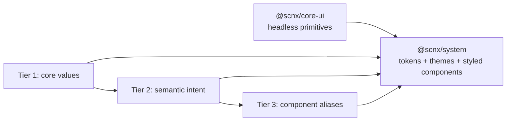

# UI Platform working consensus

Status: **proposal for the three principals**, 2026-09-28. This document describes the intended contract and the extracted baseline. It is not a claim of implementation conformance or an approved release.

For normative precedence and the full EAD → TDD chain, use the [architecture source-of-truth index](../ARCHITECTURE_SOT.md). This page is a review summary.

## Objective

Build a global reusable UI Platform whose package contracts, interaction behavior, themes, CSS, security, and compatibility can be verified by an external consumer. The three-tier model is a strong conceptual foundation. The current execution does not yet justify a “beyond FAANG” or global-ready claim. Product quality will be judged by repeatable consumer evidence, not an architectural label.

## Boundaries

- **Logical architecture:** Tier 1 core values → Tier 2 semantic tokens → Tier 3 component aliases. A theme changes mappings while preserving semantic meaning.
- **Physical architecture today:** `packages/core-ui` publishes `@scnx/core-ui`; `packages/design-system` publishes `@scnx/system`. Tokens are currently within the latter. There is no third token package yet.
- **Dependency direction:** `@scnx/system` may consume `@scnx/core-ui`. `@scnx/core-ui` must not import `@scnx/system`. Downstream products own business workflows and their own page-level conformance.
- **Delivery:** Static CSS and JS are package assets. Sass and Panda both exist today. A single token contract and explicit ownership of emitted rules are required. Whether to retain both engines is an open, measured decision.
- **Interactions:** Native elements keep native semantics; composite widgets have explicit keyboard/focus/state contracts. OFSM can organize transitions but does not itself prove usability or accessibility.

## Evidence model

| Level | What it proves | Required examples |
| --- | --- | --- |
| Source | Internal logic and behavior | OFSM transitions, focus/keyboard interaction, type checks, lint |
| Built artifact | Emitted outputs are coherent | CSS parsing and computed values per theme; font assets and variable references |
| Packed consumer | What another project installs | Exports, types, JS/CSS resolution, styled Button, no source aliases |
| Integration consumer | Host environment works | SSR/RSC, strict CSP, multiple providers, federation shell and remote |
| Product page | Actual user experience | WCAG 2.2 AA page audit in real context, viewport/theme/state matrix |

A CSS parser can catch malformed syntax; it cannot prove that every custom property resolves to a valid value after `var()` substitution. Test computed styles in a browser for representative uses. A component conformance report is evidence for product teams, not page certification.

## Known baseline gaps

The copied code retains the issues found in review. The first release gate must resolve and reproduce them: invalid `low`/`focus` shadow values and an achromatic color expression; drift between Panda font variables and Sass output; component CSS delivery and export ambiguity; a design-system placeholder test and declaration-build heap failure; `new Function` and a global theme callback; fragile RSC directive detection; federation share keys for subpaths; TOC duplicate IDs, unused `initialActiveId`, prop leakage, and widget keyboard gaps; render-path debug logging. In this standalone workspace, `core-ui` Vitest now runs (10 tests), which does not cover the remaining gaps. Suspected defects, including Disclosure registry timing, require tests before asserting a fix.

## Governance

No system governed by the UI Platform ADRs has reached production. Under GDC-010, accepted ADR wording may be edited in place before first production. Under GDC-007, a major STD rule change still requires ADR authorization. The canonical architecture repository holds proposed authorizing ADRs and review-draft standard revisions. No copied package is promoted by those drafts alone.

## Open decisions

The [decision register](DECISION_REGISTER.md) records React Aria scope, multi-brand isolation, styling-engine ownership, polymorphism, and a possible independent token package. Each choice requires alternatives and consumer evidence.

The implementation sequence is in [PLAN.md](../../PLAN.md); maturity gates are in [ROADMAP.md](../../ROADMAP.md).
