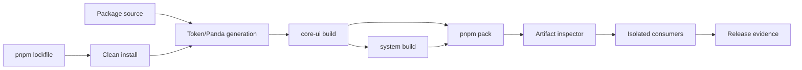

---
doc_meta:
  id: TDD-ui-platform-packaging-001
  title: Build and Published Package Contract
  owner: UI Platform Team
  version: 1.0.0
  status: approved
  classification: public
  parent_sad: SAD-003
  review_cycle_days: 30
  created_date: 2026-09-28
  last_reviewed: 2026-10-03
---

# TDD-ui-platform-packaging-001: Build and Published Package Contract

> **Revision pending exact-commit ratification.** The line-ending rule in
> decision V4 and the release-contract record RC1–RC6 are pending under
> GDC-000 section 2.6.7, and decisions S4 and V7 await ratification of their
> candidate `937c8b2`; the revision ratified on 2026-10-03 (`fb59328`) remains
> binding until the authorized human authority approves the exact commit
> containing these changes.

## Purpose

Turn the extracted workspace into two reproducible, independently installable
artifacts whose public entries, peer ranges, side effects, server/client
boundaries, provenance, and consumer behavior are verified outside the
workspace. A successful source build is not publication evidence.

Implementation is ready only when every requirement below has a named command,
fixture, binary assertion, and retained exact-artifact result.

## Scope

**In scope**

- deterministic installation and toolchain pinning;
- build order and generated-input ownership;
- explicit exports for `@scnx/core-ui` and `@scnx/system`;
- ESM, declaration, CSS, Sass, JSON-token, and font artifacts;
- React peer alignment and server-safe/client-only entries;
- packing, artifact inspection, isolated consumer installation, and release
  evidence;
- standalone, SSR/RSC, strict-CSP, and conditional federation fixtures.

**Out of scope**

- registry vendor configuration and credentials;
- authoring token values, primitive behavior, CSS rules, or provider logic;
- automatic publication before human release authority;
- product adoption of Module Federation, which remains `assess`.

## Technical Context

The baseline uses pnpm 10.23, TypeScript, tsdown (ADR-UIP-BLD-002; tsup until 2026-10-03), Sass, Panda, React, and Vitest.
Known defects are design inputs, not target behavior: clean install can fail in
the Panda `prepare` lifecycle; `system` has a placeholder test; wildcard exports
and `workspace:*` are present; React peers disagree; declaration generation has
exhausted the default heap; and post-build hook-name inference attempts to
restore ignored `"use client"` directives.

### Requirements

| ID      | Contract                                                                                                             |
| :------ | :------------------------------------------------------------------------------------------------------------------- |
| PKG-001 | Clean checkout passes `pnpm install --frozen-lockfile` with scripts enabled and no lockfile change.                  |
| PKG-002 | Generation has one owner and completes before compilation; generated output is reproducible.                         |
| PKG-003 | `core-ui` builds before `system`; reverse imports are rejected.                                                      |
| PKG-004 | `pnpm pack` tarballs contain no `workspace:` range, wildcard export, source-only path, or undeclared file.           |
| PKG-005 | Every public subpath resolves JS and declarations from an external consumer.                                         |
| PKG-006 | React/React DOM peers are aligned and verified at both supported-range boundaries.                                   |
| PKG-007 | Server-safe entries import in a server component; client entries retain an explicit emitted directive.               |
| PKG-008 | Importing any public JS entry causes no DOM, global, storage, timer, network, or stylesheet mutation.                |
| PKG-009 | Static assets resolve from documented paths and survive tree shaking according to `sideEffects`.                     |
| PKG-010 | Release evidence binds source SHA, tarball digest, manifest, SBOM, fixtures, and authority.                          |
| PKG-011 | The P0 federation fixture enforces strict singleton/version identity and records both offered and selected versions. |

## Component Design



| Component            | Responsibility                                                                 | Failure behavior                                     |
| :------------------- | :----------------------------------------------------------------------------- | :--------------------------------------------------- |
| `toolchain-guard`    | Assert Node/pnpm versions and frozen lockfile                                  | Fail before lifecycle scripts                        |
| `generation-guard`   | Generate once, compare clean-tree/digest, reject hand edits                    | Fail before build                                    |
| package builders     | Compile explicit source entries and declarations                               | No heap override fallback                            |
| `export-inventory`   | Resolve every condition/subpath to a packed file                               | Fail on wildcard, missing, duplicate, or source path |
| `artifact-inspector` | Inspect tarball files, manifests, licenses, SBOM, directives, and side effects | Quarantine artifact                                  |
| consumer matrix      | Install tarballs into fresh standalone/SSR/CSP/federation apps                 | Fail the affected supported scenario                 |
| evidence assembler   | Produce one immutable release record                                           | Publication prohibited when incomplete               |

Build products never feed back into source. Fixtures may consume only tarballs
and public entries; a source alias or workspace package link is a test failure.

## Data Model

The export inventory is generated from explicit package manifests:

```ts
type ExportRecord = {
  package: "@scnx/core-ui" | "@scnx/system";
  subpath: string;
  kind: "javascript" | "types" | "css" | "scss" | "json" | "font";
  environment: "server-safe" | "client-only" | "static";
  importTarget?: string;
  requireTarget?: string;
  typesTarget?: string;
  sideEffect: "none" | "declared-css";
};
```

The release record is immutable JSON:

```ts
type ReleaseEvidence = {
  schemaVersion: 1;
  sourceSha: string;
  nodeVersion: string;
  pnpmVersion: string;
  packages: Array<{
    name: string;
    version: string;
    tarballSha256: string;
    manifestSha256: string;
    sbomSha256: string;
  }>;
  supportMatrix: Array<{
    scenario: string;
    versions: Record<string, string>;
    result: "pass" | "fail";
  }>;
  gates: Array<{
    id: string;
    command: string;
    result: "pass" | "fail";
    report: string;
  }>;
  limitations: string[];
  authority: {
    decision: "promoted" | "withheld";
    actor: string;
    recordedAt: string;
  } | null;
};
```

`authority: null` is valid evidence for a candidate but cannot publish Stable.

## API / Interface

Target public families are explicit, generated lists—never `./*`:

| Package         | Public family                        | Contract                                       |
| :-------------- | :----------------------------------- | :--------------------------------------------- |
| `@scnx/core-ui` | `components/<name>`                  | Headless component JS and types                |
| `@scnx/core-ui` | `hooks/<name>`                       | Explicit client hook JS and types              |
| `@scnx/core-ui` | `providers/<name>`                   | Explicit client provider JS and types          |
| `@scnx/system`  | `components/<name>` and `components` | Styled JS/types without CSS side-effect import |
| `@scnx/system`  | `styles/components.css`              | One aggregate component stylesheet             |
| `@scnx/system`  | `tokens/css/<theme-id>.css`          | Scoped theme variables                         |
| `@scnx/system`  | `tokens/json/<theme-id>.json`        | Tool-neutral token output                      |
| `@scnx/system`  | `tokens/scss`                        | Supported Sass contract                        |
| `@scnx/system`  | `fonts/<asset>`                      | Declared font assets and license               |

Manifests provide `types` and ESM targets for JavaScript entries. CJS remains
only if an external fixture proves a named supported consumer. `system` declares
`core-ui`, React, and React DOM as peers plus dev dependencies with identical
tested React ranges across both packages.

## Algorithms / Logic

### Clean build and pack

1. Materialize a clean checkout at the candidate SHA.
2. Assert the pinned Node and pnpm versions.
3. Run `pnpm install --frozen-lockfile` with normal lifecycle scripts.
4. Fail if the lockfile or tracked generated inputs change.
5. Run token validation/generation once and compare the resulting digest.
6. Typecheck and test both packages with retries disabled.
7. Build `core-ui`, then `system`, with the default heap.
8. Run `pnpm pack --pack-destination <isolated-dir>` for each package.
9. Parse packed manifests and enumerate tarball contents.
10. Reject any unresolved export, wildcard, workspace range, absolute path,
    source map with private path leakage, missing license, or undeclared asset.
    Workshop files (`*.stories.*`, `.storybook/`, `storybook-static/`) and
    Storybook packages are never in a tarball or a package manifest; the
    workshop is a development dependency of the private workspace root
    (ADR-UIP-WKS-001).

### Entry classification

Entry classification is source metadata or an explicit inventory field. It is
not inferred from hook names or filenames. Client-only entries begin with
`"use client"` in the source entry and the emitted ESM. Server-safe entries are
loaded by a fixture that denies `window`, `document`, storage, and timers.

#### Decision record: entry environments

Each decision names its sources (References under Traceability) and the
tradeoff it accepts.

| ID  | Decision                                                                                                                                                                                                                                                                                                                                                           | Sources                                   | Tradeoff and residual risk                                                                                                                                                                                                                                                                                                                                                                                                                                                                                                                                                                                                                                                 |
| :-- | :----------------------------------------------------------------------------------------------------------------------------------------------------------------------------------------------------------------------------------------------------------------------------------------------------------------------------------------------------------------- | :---------------------------------------- | :------------------------------------------------------------------------------------------------------------------------------------------------------------------------------------------------------------------------------------------------------------------------------------------------------------------------------------------------------------------------------------------------------------------------------------------------------------------------------------------------------------------------------------------------------------------------------------------------------------------------------------------------------------------------- |
| K1  | An entry is `client-only` exactly when its source entry file begins with the `"use client"` directive; otherwise it is `server-safe`. The entry list records the environment from that directive.                                                                                                                                                                  | [1]; this section                         | The author states the boundary once, where React reads it. A missing directive on an entry that needs client features is caught by K4 and K5, not inferred.                                                                                                                                                                                                                                                                                                                                                                                                                                                                                                                |
| K2  | Each package builds its client-only entries and its server-safe entries as two separate builds. Each client-only entry keeps its own `"use client"`, which Rolldown outputs when "the module is a entry module" [39]; internal modules carry no directive, and the server-safe build emits none (ADR-UIP-BLD-002).                                                 | [1]; [2]; [3]; [4]; [39]; ADR-UIP-BLD-002 | Next.js warns that "some bundlers might strip out" the directive [2]. Its two cited references use an esbuild banner [3] and `treeshake: false` [4]; the tsup build until 2026-10-03 used both. Rolldown documents that it keeps an entry's directive and offers `output.banner` to add one to every file [39]; a banner would duplicate the entry's own directive, and K3 checks the emitted entry, so a builder change that drops it fails the gate. Inside a client entry an internal directive "has no effect" [1]. Stateless helpers shared by both environments are emitted twice; React contexts live only in client-only entries, so no context identity is split. |
| K3  | The packed-artifact inspector requires the directive as the first statement of every client-only entry's ESM and rejects it in every server-safe entry. The build fails on any "directive … was ignored" warning and on a Rolldown `MODULE_LEVEL_DIRECTIVE` warning for any module other than a client-only entry.                                                 | [1]; [39]; PKG-007                        | The directive must be "at the very beginning of a file, above any imports" [1]; checking the emitted file proves what a consumer bundler reads. Rolldown's scanner reports `MODULE_LEVEL_DIRECTIVE` for every top-level directive other than `"use strict"`, kept or not [39], so the client build ignores it for its own entries only.                                                                                                                                                                                                                                                                                                                                    |
| K4  | A server-safe fixture imports every server-safe entry and renders it with `react-dom/server` while `window`, `document`, `localStorage`, `sessionStorage`, and timers throw on access.                                                                                                                                                                             | this section                              | Proves no environment leakage at import and render; it does not prove RSC compatibility, which K5 covers.                                                                                                                                                                                                                                                                                                                                                                                                                                                                                                                                                                  |
| K5  | A Next.js App Router fixture installs the packed tarballs, renders every server-safe entry and every client-only entry from a Server Component page or from one client island imported by it, runs `next build` and `next start`, and in Chromium requires zero hydration errors and one working client interaction. The Next.js version is pinned in the fixture. | [1]; [2]; [5]; [6]                        | Next.js is the named App Router consumer for P0; other RSC frameworks are not covered. Props from a Server Component must be serializable [1], and a Server Component cannot read a static property of a client module (`Accordion.Trigger`) [6], so client entries with function props or static-property parts render inside the island. The fixture checks that every client-only entry is imported by the layout, the page, or the island, and a negative page with a server/client text mismatch must report a hydration error.                                                                                                                                       |

### Isolated consumer evaluation

Each fixture starts with an empty store and installs exact tarball paths with
declared peer versions. It imports all inventory records, builds production
output, and executes scenario assertions. Both lowest and highest supported
peer boundaries run. The fixture records artifact digests so a result cannot be
reused for a different tarball.

### Conditional federation evaluation

For the P0 evaluation fixture and for any separately authorized federation
scope, generate explicit share keys from the packed export inventory: the React
entries an application imports and every public JavaScript entry of both
packages (F2). `react`, `react-dom`, `@scnx/core-ui`, and `@scnx/system` are
singletons, so every context-bearing public entry resolves to one shared
identity. Each share uses strict compatible-range negotiation. Its
`requiredVersion` is read from the consuming host or remote's declared
dependency/peer range, never copied from a producer constant or silently
widened.

The host owns React, React DOM, shared UI context, CSS, and nonce/hash
propagation; it is the only provider of a shared module (F3). Remotes stay lazy
and cannot import UI CSS. Negotiation emits one versioned event per participant
and shared package with `schema`, `host_version`, `remote_name`,
`remote_version`, `shared_package`, `required_range`, `offered_versions`,
`selected_version`, `outcome`, and `reason` (F6). The event therefore preserves
both participating application versions, the versions offered, and the version
selected (PKG-011). An absent share, duplicate singleton identity, or
incompatible range produces a controlled route-local failure while the rest of
the host remains usable.

#### Decision record: federation evaluation

This record configures the P0 evaluation fixture (PLAN row 9) only. Module
Federation stays `assess`; nothing here authorizes adoption (ADR-GLB-FE-011
section 5). Strict-CSP nonce and hash propagation through the federation
runtime is PLAN row 10. Each decision names its sources (References under
Traceability) and the tradeoff it accepts.

| ID  | Decision                                                                                                                                                                                                                                                                                          | Sources                                                 | Tradeoff                                                                                                                                                                                                                                                                                                                                               |
| :-- | :------------------------------------------------------------------------------------------------------------------------------------------------------------------------------------------------------------------------------------------------------------------------------------------------ | :------------------------------------------------------ | :----------------------------------------------------------------------------------------------------------------------------------------------------------------------------------------------------------------------------------------------------------------------------------------------------------------------------------------------------- |
| F1  | Host and remotes compile with `@rspack/core` and its built-in `rspack.container.ModuleFederationPlugin` (Module Federation 1.5 runtime from `@module-federation/runtime-tools`), with both versions pinned in the fixture.                                                                        | ADR-GLB-FE-011 section 5 item 1; [7]; [8]; [16]         | ADR-GLB-FE-011 section 3 records that the existing federated applications use this plugin directly, and 1.5 already has runtime plugins [7]. Module Federation 2.0 extras (type hints, devtools, manifest) are not evaluated; switching to `@module-federation/enhanced` needs a rerun.                                                                |
| F2  | Share keys are `react`, `react/jsx-runtime`, `react-dom`, `react-dom/client`, and every public JavaScript subpath of both packages, generated from the pack report by `scripts/federation-share-map.mjs`.                                                                                         | ADR-GLB-FE-012 section 5 items 1–2; [11]                | A share key matches the request itself [11], so a bare package key misses every subpath. Sharing all public entries, stateless ones included, is a superset of "every context-bearing entry": no entry can be misclassified, at the cost of one negotiation per key.                                                                                   |
| F3  | Only the host provides shared modules, with `version` from its installed package. Remotes declare every key with `import: false`. The host build includes a generated module that references every key through a lazy `import()`.                                                                 | ADR-GLB-FE-012 section 5 item 5; [11]; [12]; [13]       | `import: false` removes the remote's local fallback [11], so a remote can never fall back to its own copy. A bundler provides a non-relative key only when the build resolves an import of it [12]; without the generated references the fixture failed with RUNTIME-012 [13]. A newly shared entry needs a host rebuild before any remote can use it. |
| F4  | Every key is `singleton: true` and `strictVersion: true`, and its `requiredVersion` is the range the consuming application declares in `peerDependencies` (else `dependencies`). A non-semver range such as `file:` is rejected.                                                                  | ADR-GLB-FE-012 section 5 items 1, 3, 5; [9]; [10]; [11] | Without `strictVersion`, an unsatisfied singleton only warns and still loads [9]; [10]; [11]. Strict mode fails a route when a remote needs a newer minor than the host offers; it does not degrade. Rspack describes `strictVersion` as an exact match [8], but the runtime checks range satisfaction [9].                                            |
| F5  | `shareStrategy: "loaded-first"`. The host bootstraps through an async `import()`, no share is eager, and each remote loads on first use of its route.                                                                                                                                             | ADR-GLB-FE-012 section 5 item 4; [8]                    | `version-first` loads every remote entry at startup to register its versions [8], which defeats lazy remotes. Because remotes provide nothing (F3), `version-first` would gain no candidate versions.                                                                                                                                                  |
| F6  | A runtime plugin wraps the `resolveShare` resolver and emits one `scnx.federation.share/1` event per participant, shared package, and outcome (`selected` or `rejected`). The fixture collects events in a page-global list and a `scnx:federation` DOM event; product transport is out of scope. | ADR-GLB-FE-012 section 5 item 5; [9]; [14]              | The hook receives the scope map, package name, selected version, and resolver, and its return value is used [9]; [14]. The plugin depends on that hook shape, which is why the runtime version is pinned (F1).                                                                                                                                         |
| F7  | Each remote route renders inside its own error boundary and `Suspense`. A rejected share, an unavailable remote, and a duplicate React each render that route's fallback, and the host stays usable.                                                                                              | ADR-GLB-FE-012 section 5 items 5–6                      | Errors are contained per route, not per component inside a remote.                                                                                                                                                                                                                                                                                     |
| F8  | Only the host imports `components.css` and the theme tokens. The fixture fails when a remote emits a stylesheet or when more than one applied stylesheet contains component rules.                                                                                                                | ADR-GLB-FE-012 section 5 item 7                         | The check counts stylesheets that contain a known component selector. A stylesheet injected some other way, without that selector, is not counted.                                                                                                                                                                                                     |
| F9  | Identity is proven by reference: every remote's React shared internals and `useState`, and its `@scnx/core-ui` ThemeProvider module, must be the host's. A negative-control remote that bundles its own React must be reported as split.                                                          | ADR-GLB-FE-012 section 5 item 1; [15]                   | `react` is CommonJS, so each `import * as React` gets its own interop namespace; the fixture compares what React shares instead, as React's own duplicate check compares `require('react')` results [15]. The negative control proves the check detects a duplicate.                                                                                   |

## Configuration

| Setting             | Source                                  | Rule                                             |
| :------------------ | :-------------------------------------- | :----------------------------------------------- |
| Node and pnpm       | root manifest/CI                        | Exact producer versions                          |
| React peer range    | package manifests                       | Identical across packages; every boundary tested |
| public exports      | package manifests + generated inventory | Explicit only                                    |
| build target        | shared build config                     | Declared per release                             |
| generated directory | producer config                         | Cleaned and recreated; not hand-edited           |
| release channel     | CI input                                | candidate, prerelease, or stable                 |
| CSP policy          | fixture                                 | No `unsafe-eval`/`unsafe-inline`                 |

Credentials are supplied only by the release environment and never enter
package contents, logs, source maps, or evidence payloads.

## Failure Handling

| Failure                              | Required response                                                    | Recovery                                                |
| :----------------------------------- | :------------------------------------------------------------------- | :------------------------------------------------------ |
| Install or generation nondeterminism | Stop before compilation                                              | Fix dependency/lifecycle ownership; rerun clean         |
| Declaration memory exhaustion        | Fail with peak-memory evidence                                       | Reduce graph/build design; no permanent heap override   |
| Ambiguous publication response       | Do not blindly republish                                             | Query version/digest, then resume or choose new version |
| Missing or invalid export            | Quarantine both coordinated artifacts when compatibility is affected | Correct manifest/build and repack                       |
| Unsupported peer combination         | Mark scenario unsupported or fix contract                            | No silent warning-only release                          |
| CSP or import-side-effect violation  | Block affected capability                                            | Remove effect/evaluation; never relax policy            |
| Federation-only failure              | Keep federation unsupported                                          | Standalone release may proceed if independently green   |

## Observability

The pipeline emits structured records with `source_sha`, `package`, `version`,
`tarball_sha256`, `stage`, `fixture`, `duration_ms`, `peak_memory_bytes`, and
`result`. Metrics include install/build/pack durations, artifact bytes by entry
and encoding, cache hit status, fixture result, CSP violations, and missing
evidence count. Main/release failures and digest mismatches alert the UI Platform
owner; candidate-branch failures remain pull-request feedback.

## Testing Strategy

| Layer                 | Required tests                                                                                                        |
| :-------------------- | :-------------------------------------------------------------------------------------------------------------------- |
| Unit                  | export inventory parsing, condition resolution, path containment, manifest normalization, evidence schema             |
| Negative              | wildcard export, `workspace:`, missing types, path traversal, absent directive, hidden side effect, lockfile mutation |
| Producer integration  | clean generation, build order, declaration build, package contents, reproducibility                                   |
| Packed consumer       | every entry, both peer boundaries, tree shaking, type resolution, font/Sass/JSON/CSS loading                          |
| SSR/RSC               | server-safe import, client boundary, render/hydrate, zero mismatch                                                    |
| Security              | SBOM/advisory/license/provenance/secret scan, strict CSP, source-map inspection                                       |
| Federation assessment | both remote orders, singleton identity, incompatible range, CSS uniqueness, CSP nonce/hash                            |

A required job that is absent, skipped, retried to green, or run against another
artifact is a failure. Fixture reports are retained with the release evidence.

## Performance Notes

Record install time, build time, declaration peak memory, tarball size, entry
size (raw/minified/gzip/Brotli), parse/evaluation cost, and fixture startup for
the exact toolchain and runner. Thresholds are approved per scenario; this TDD
defines no universal byte, percentage, or multiplier budget.

## Security Notes

The dependency gate evaluates the resolved lockfile/SBOM, including React,
framework, and `react-server-dom-*` advisories. Applicable high/critical findings
block. Every dependency and copied asset has license/provenance. Import-only
tests prove no evaluation, DOM/global/storage/network/style mutation. Strict CSP
applies equally to standalone and evaluated federation scenarios.

#### Decision record: strict CSP

PLAN row 10, first part. Dependency, license, SBOM/provenance, and import
side-effect gates follow in their own records. Each decision names its sources
(References under Traceability) and the tradeoff it accepts.

| ID  | Decision                                                                                                                                                                                                                                                                                                                                                                                                                                                                                                                                                                                                                                                                        | Sources                    | Tradeoff                                                                                                                                                                                                                                                                                                                                                                                                                                                                                                                                                                                                                                                                                                                                                             |
| :-- | :------------------------------------------------------------------------------------------------------------------------------------------------------------------------------------------------------------------------------------------------------------------------------------------------------------------------------------------------------------------------------------------------------------------------------------------------------------------------------------------------------------------------------------------------------------------------------------------------------------------------------------------------------------------------------ | :------------------------- | :------------------------------------------------------------------------------------------------------------------------------------------------------------------------------------------------------------------------------------------------------------------------------------------------------------------------------------------------------------------------------------------------------------------------------------------------------------------------------------------------------------------------------------------------------------------------------------------------------------------------------------------------------------------------------------------------------------------------------------------------------------------- |
| S1  | Fixture policies never contain `'unsafe-inline'` or `'unsafe-eval'`, and each fixture has a negative control that must record a violation. The standalone theme fixture uses `script-src 'self'; style-src 'self'`. The federation fixture uses a fresh random nonce per run, and the Next.js fixture one per response (S4), with `script-src 'nonce-…'; style-src 'nonce-…'` and neither `'self'` nor `'strict-dynamic'`.                                                                                                                                                                                                                                                      | [17]                       | Strict CSP is "nonce source-expression and/or hash source-expression with the `'strict-dynamic'` keyword-source", and `'strict-dynamic'` "should be avoided when possible" [17]. Without it, every script and stylesheet the runtime inserts must carry the nonce, which is what S2 must prove. That a `'strict-dynamic'` deployment then also passes is an inference: that keyword only adds trust. The Next.js fixture (K5) runs under the per-request nonce policy of S4.                                                                                                                                                                                                                                                                                         |
| S2  | Every federated application registers a nonce runtime plugin. It reads the consumer's nonce from the page's first nonced `<script>` through the `nonce` IDL attribute, assigns it to `import.meta.rspackNonce` for that build's chunk loading, and sets it on every script and stylesheet the federation runtime creates (`createScript`, `createLink`). The library never generates a nonce or reads a policy.                                                                                                                                                                                                                                                                 | [18]; [19]; [20]           | Rspack adds the nonce "to all scripts that it loads" once `import.meta.rspackNonce` is set (Rspack 2.1.2 or later) [18]. The runtime hooks let a plugin supply the element [19]. Browsers hide the content attribute but keep the IDL value for script [20], so any page script can read it already; the plugin adds no exposure. Without the plugin, the prototype's chunks and stylesheets were blocked.                                                                                                                                                                                                                                                                                                                                                           |
| S3  | Server markup carries no `style` attribute the library computes (TDD theme THM-009, T1–T3). The standalone theme fixture server-renders the behavior matrix under its policy instead of mounting it client-only.                                                                                                                                                                                                                                                                                                                                                                                                                                                                | TDD theme [2]              | A strict policy blocks style attributes in server markup. Computed values apply after hydration (TDD theme T1).                                                                                                                                                                                                                                                                                                                                                                                                                                                                                                                                                                                                                                                      |
| S4  | The Next.js App Router fixture (K5) runs every route under a policy that a Next.js `proxy` sets per request, `default-src 'self'; script-src 'nonce-…'; style-src 'nonce-…'; object-src 'none'; base-uri 'none'`, with 16 random bytes per nonce and dynamic rendering. It requires a different nonce on each response, the response nonce on every script in the server HTML, at least one framework stylesheet loaded, and zero violations through hydration and the Accordion interaction. Two negative routes, an inline script and a style attribute served without the nonce, must record `script-src-elem` and `style-src-attr` violations, and the script must not run. | [17]; [40]; [41]; [42]; K5 | Next.js applies a nonce it parses from the request's policy to its framework scripts, bundles, and inline styles, and "you **must use dynamic rendering to add nonces**" [40]; the fixture pays that cost, which a nonce consumer pays anyway. The guide's example also lists `'self'` and `'strict-dynamic'` [40]; the fixture omits both, as S1 does, because the nonce-only policy passes and `'strict-dynamic'` "should be avoided when possible" [17]. The guide derives the nonce from `crypto.randomUUID()` [40], a version 4 UUID with 122 random bits [42]; the fixture uses 128, the minimum CSP recommends [41]. Production builds only: development needs `'unsafe-eval'` [40]. Covers the pinned Next.js version; other RSC frameworks are not covered. |

#### Decision record: import side effects

PLAN row 10, second part (PKG-008). Each decision names its sources
(References under Traceability) and the tradeoff it accepts.

| ID  | Decision                                                                                                                                                                                                                                                                                                                                                                                                                                                                                                                                                          | Sources       | Tradeoff                                                                                                                                                                                                                                                                                                                                                                                                                                                                                                                                        |
| :-- | :---------------------------------------------------------------------------------------------------------------------------------------------------------------------------------------------------------------------------------------------------------------------------------------------------------------------------------------------------------------------------------------------------------------------------------------------------------------------------------------------------------------------------------------------------------------- | :------------ | :---------------------------------------------------------------------------------------------------------------------------------------------------------------------------------------------------------------------------------------------------------------------------------------------------------------------------------------------------------------------------------------------------------------------------------------------------------------------------------------------------------------------------------------------- |
| E1  | Every public JavaScript entry is imported alone in a fresh Chromium context under `default-src 'self'; script-src 'self'; style-src 'self'; object-src 'none'; base-uri 'none'`, after React and React DOM are loaded. The import fails the gate if it mutates the DOM, adds a global or a built-in prototype property, changes storage or cookies, requests anything but its own module chunks, schedules a timer, frame, idle callback, or microtask, adds an event listener, defines a custom element, adds or edits a stylesheet, or records a CSP violation. | [21]; PKG-008 | A side effect is code that "performs a special behavior when imported, other than exposing one or more exports" [21]; `"sideEffects": false` lets a bundler "safely prune" [21], so this gate is the evidence for that field. Only module evaluation and the macrotask after it are observed: work a component does when rendered is not an import effect. React and React DOM are peers loaded before the baseline, so their own effects are out of scope. Each entry is bundled by esbuild, which is assumed to keep module evaluation order. |
| E2  | In Node, importing any entry adds no global, at both React peer boundaries. Server-safe entries also render with browser globals trapped (K4).                                                                                                                                                                                                                                                                                                                                                                                                                    | PKG-008; K4   | Node has no DOM, so this covers globals only; the browser gate covers the rest.                                                                                                                                                                                                                                                                                                                                                                                                                                                                 |
| E3  | Twelve negative-control modules each perform one category of side effect (DOM, global, prototype, storage, cookie, network, timer, microtask, listener, custom element, stylesheet, eval), and each must be caught.                                                                                                                                                                                                                                                                                                                                               | this section  | A detector that cannot fail proves nothing. The controls cover the categories, not every API within them; an unlisted API (for example `BroadcastChannel`) is not wrapped.                                                                                                                                                                                                                                                                                                                                                                      |
| E4  | The driver receives each result through a console message and never polls inside the page. The browser's own `/favicon.ico` request is excluded.                                                                                                                                                                                                                                                                                                                                                                                                                  | [22]          | Playwright's `waitForFunction` defaults to polling "in `requestAnimationFrame` callback" [22]. In the prototype, that polling registered frames and listeners that were reported as the entry's effects.                                                                                                                                                                                                                                                                                                                                        |

#### Decision record: supply chain

PLAN row 10, third part: dependency advisories, licenses, SBOM, and
provenance. Each decision names its sources (References under Traceability) and
the tradeoff it accepts.

| ID  | Decision                                                                                                                                                                                                                                                                                                                                                                                                                                                                                                                                                                                                                                                                                                                                                                                                                                                                                                      | Sources                                       | Tradeoff                                                                                                                                                                                                                                                                                                                                                                                                                                                                                                                                                                                                                                                                                                                                                                                                                                                                                                                                         |
| :-- | :------------------------------------------------------------------------------------------------------------------------------------------------------------------------------------------------------------------------------------------------------------------------------------------------------------------------------------------------------------------------------------------------------------------------------------------------------------------------------------------------------------------------------------------------------------------------------------------------------------------------------------------------------------------------------------------------------------------------------------------------------------------------------------------------------------------------------------------------------------------------------------------------------------ | :-------------------------------------------- | :----------------------------------------------------------------------------------------------------------------------------------------------------------------------------------------------------------------------------------------------------------------------------------------------------------------------------------------------------------------------------------------------------------------------------------------------------------------------------------------------------------------------------------------------------------------------------------------------------------------------------------------------------------------------------------------------------------------------------------------------------------------------------------------------------------------------------------------------------------------------------------------------------------------------------------------------- |
| V1  | The advisory gate covers every resolved graph: the workspace lockfile (published runtime graph, development tools, build toolchain) and the lockfile of each consumer fixture (both React peer boundaries, the Next.js fixture, the federation fixture), so the resolved React, React DOM, `react-server-dom-*`, and meta-framework versions are audited as STD-GLB-FE-006 section 3.10 requires. A high or critical advisory fails CI on every pull request and push, and a daily scheduled run catches advisories published between changes. A moderate advisory against the React family or a meta-framework fails once it has been published for 30 days. A registry error fails the gate.                                                                                                                                                                                                                | STD-GLB-FE-006 section 3.10; [23]; [24]; [25] | SSDF asks for "automatic detection of known vulnerabilities in software components" in the toolchain and for tools to be updated "to address tool vulnerabilities" [23]; OpenSSF recommends running the audit "periodically, e.g., in a GitHub workflow" [24]. The 30-day clock starts at the advisory's publication, because the gate keeps no state between runs. A new advisory in a development tool can block an unrelated change. A registry outage blocks CI rather than passing silently (`--ignore-registry-errors` is not used [25]).                                                                                                                                                                                                                                                                                                                                                                                                  |
| V2  | Remediation order: upgrade or remove the direct dependency; otherwise override a pinned transitive dependency only within its vulnerable range, with a removal condition recorded beside the override. A remediation must leave published output byte-identical, or be reviewed as a change. Unused dependencies are removed.                                                                                                                                                                                                                                                                                                                                                                                                                                                                                                                                                                                 | [24]; [25]; [26]                              | npm documents overrides for "replacing the version of a dependency with a known security issue" [26], and `pnpm audit --fix` remediates by adding overrides [25]; OpenSSF recommends periodically removing unused dependencies [24]. An override runs a version the dependency's authors did not pin; the byte-identical build output is the evidence it is safe for this repository.                                                                                                                                                                                                                                                                                                                                                                                                                                                                                                                                                            |
| V3  | An advisory may be excepted only by a CISA VEX `not_affected` statement in `security/vex.json` with one of the five CISA justifications, an impact statement, an owner, and an expiry at most 90 days ahead. A malformed or expired statement fails the gate. No statement can except a high or critical advisory against React, React DOM, `react-server-dom-*`, or a meta-framework: those block until the resolved version is patched (STD-GLB-FE-006 section 3.10).                                                                                                                                                                                                                                                                                                                                                                                                                                       | STD-GLB-FE-006 section 3.10; [23]; [27]       | SSDF names risk acceptance as a risk response [23]; the CISA VEX minimum requirements define the status and justification values [27]. The 90-day limit is this project's policy, not a value from either source.                                                                                                                                                                                                                                                                                                                                                                                                                                                                                                                                                                                                                                                                                                                                |
| V4  | Every package in the lockfile declares a license expression whose identifiers are on the SPDX license list. The license is read from each installed package's own manifest; a lockfile package not installed on the build platform (another OS or CPU, or an optional dependency of one) is read from the registry's metadata for that exact version, and a failed lookup fails the gate. A missing or unknown license fails the gate, and the report counts packages by license. Each tarball carries its `license` field and `LICENSE` file (PKG-004); every copied file (the Inter font, the vendored CycloneDX schema) has a provenance record with its SHA-256 and license, checked before use. Digest-verified vendored files are exempt from end-of-line conversion (`-text`) and every other tracked file checks out with LF on every platform (`.gitattributes`), which the CI policy gate enforces. | [29]; [47]                                    | CISA lists License as a minimum SBOM element [29]. The package manager's own license listing reads its store index and failed on the CI runner, and it omitted packages not installed locally; reading manifests covers every lockfile package. No allow or deny list is enforced yet: which licenses are acceptable is an organizational legal decision (Open Questions). A checkout with `core.autocrlf=true`, the common Windows setting, rewrote the vendored schema to CRLF and failed its digest (reproduced 2026-10-03): unsetting `text` "tells Git not to attempt any end-of-line conversion upon checkin or checkout", and `eol=lf` "uses the same line endings in the working directory as in the index" [47].                                                                                                                                                                                                                        |
| V5  | Each tarball gets a CycloneDX 1.7 JSON SBOM, validated against the official 1.7.2 schema. It records the NTIA minimum elements and the CISA 2025 draft additions: SHA-256 component hash, license, tool name, and the `build` lifecycle phase as generation context. Peers are `isExternal` components with a `versionRange`; the bundled Inter font is a component, and so is third-party code compiled into `dist/` (V7).                                                                                                                                                                                                                                                                                                                                                                                                                                                                                   | [28]; [29]; [30]                              | CycloneDX 1.7 is ECMA-424 2nd edition [30]. The NTIA depth rule asks that "all top-level dependencies must be listed" [28]; the packages declare no runtime dependencies, so beside the peers the SBOM lists only the font and the compiled code of V7. The CISA 2025 document is a public comment draft [29].                                                                                                                                                                                                                                                                                                                                                                                                                                                                                                                                                                                                                                   |
| V6  | On every push to `main`, `actions/attest` signs SLSA build provenance for both tarballs and attests each SBOM. Consumers verify with `gh attestation verify`. Pull requests are not attested.                                                                                                                                                                                                                                                                                                                                                                                                                                                                                                                                                                                                                                                                                                                 | [23]; [31]; [32]; [33]                        | SLSA Build L1 provenance is "trivial to bypass or forge" [31]; SSDF asks for a way to "verify provenance data integrity" [23]. Artifact attestations provide SLSA v1.0 Build Level 2 [32]. For a public repository the signed bundle is written to an "immutable transparency log that is publicly readable on the internet" [32]: the entry names the repository, workflow, commit, and digests, all already public, and it cannot be removed. Build Level 3 needs an isolated reusable workflow and is not attempted.                                                                                                                                                                                                                                                                                                                                                                                                                          |
| V7  | Third-party code compiled into a tarball is recorded in the package's `third-party-code.json` (name, exact version, SPDX license, supplier, copyright, and the package-relative source prefix it occupies); today that is the Panda CSS runtime that `@pandacss/generator` emits into `src/styled-system/` and that `@scnx/system` ships. The packed `LICENSE` names each component and version and carries its license text verbatim, after the package's own terms. The license gate reads every published sourcemap and fails on a source under `node_modules`, on a source git does not track that no record covers, on a record that matches no shipped source or no installed version, and on a `LICENSE` without the component's name, version, or license text. The SBOM lists each record as a library component (V5).                                                                               | [43]; [44]; [45]; [46]                        | MIT requires that its notice "shall be included in all copies or substantial portions of the Software" [43]; 23 of the 27 functions in the shipped `helpers.js` are also defined in `@pandacss/shared`, and the generator's license is MIT [46]. Vite publishes the same arrangement, a "Licenses of bundled dependencies" section in its `LICENSE.md` [44], and ISO/IEC 5230 lists "Contains open source with attribution requirements" among the use cases a compliance program must handle [45]. A notice file of its own would need an export, since a tarball holds no undeclared file (PKG-004); the `LICENSE` is always packed. Detection rests on sourcemaps, which both packages publish (K2), and on git: generated code committed to the repository would escape the untracked-source rule, so `src/styled-system/` stays generated. A Panda upgrade changes the version and fails the gate until the record and `LICENSE` follow it. |

#### Decision record: P0 evidence and exit review

PLAN row 11. Each decision names its sources (References under Traceability)
and the tradeoff it accepts.

| ID  | Decision                                                                                                                                                                                                                                                                                                                                                                                                                                                                                                            | Sources                            | Tradeoff                                                                                                                                                                                                                                                                                                                                                                                                   |
| :-- | :------------------------------------------------------------------------------------------------------------------------------------------------------------------------------------------------------------------------------------------------------------------------------------------------------------------------------------------------------------------------------------------------------------------------------------------------------------------------------------------------------------------ | :--------------------------------- | :--------------------------------------------------------------------------------------------------------------------------------------------------------------------------------------------------------------------------------------------------------------------------------------------------------------------------------------------------------------------------------------------------------- |
| R1  | On every push to `main`, an `evidence` job that runs after every other job writes `p0-evidence.json`, validated against `scripts/evidence/schema.json`. It records the source commit; the run ID, attempt, and URL; every job's name and conclusion, read from the GitHub API; for each PLAN row (0–10, W1–W2) the jobs that evidence it and the SHA-256 of each report; and, per tarball, its `.tgz` digest, content digest (R3), SBOM digest, and attestation. A missing job, report, or digest fails the packet. | PKG-010; SAD-003 section 5.1; [23] | SSDF asks to "Securely archive the necessary files and supporting data (e.g., integrity verification information, provenance data) to be retained for each software release" (PS.3.1) [23]. The row-to-job map is kept in the script by hand; renaming a job fails the packet until the map is updated.                                                                                                    |
| R2  | The packet carries its evidence instead of pointing to it. It embeds each job's result, is attested by `actions/attest` (SLSA provenance with the packet as subject), and the exit-review record (R6) commits a copy to the repository under `evidence/p0/`. CI links are recorded but are not the evidence.                                                                                                                                                                                                        | [32]; [34]                         | GitHub retains artifacts, logs, workflow runs, checks, and commit statuses of a public repository for at most 90 days; from 1 October 2026 the limit also covers runs and checks [34]. Tarball bytes therefore outlive no CI run: until the Developer Platform supplies package storage (Open Questions), long-term evidence is the attested digest plus a rebuild (R3).                                   |
| R3  | Each tarball has a content digest, the SHA-256 of its uncompressed tar. The `build` job packs again on another runner, and the packet requires both content digests to match; the `.tgz` digest identifies the published bytes.                                                                                                                                                                                                                                                                                     | [35]; PKG-002                      | A build is reproducible when "any party can recreate bit-by-bit identical copies of all specified artifacts" [35]; the specified artifact here is the tar. In this repository, a local rebuild and the CI build of `84f0e2d` produced the same tar but different gzip streams, so `.tgz` digests are not reproducible across machines; that cause (the compressor) is an observation, not a quoted source. |
| R4  | The evidence job checks out `scnehaux-architecture` at `main`, records its commit, and copies verbatim the `doc_meta.status`, the version, and whether a pending-ratification notice is present for every architecture record SAD-003 lists as UI authority, plus the ring and the pending-ARB marker of every Technology Radar entry the UI Platform uses.                                                                                                                                                         | PLAN row 11; ROADMAP               | No status is inferred or upgraded: "Proposed/draft architecture remains proposed/draft until the authorized human transition is recorded in `scnehaux-architecture`" (ROADMAP). A record added to SAD-003 later is not reported until the job's list is updated.                                                                                                                                           |
| R5  | The packet lists every public entry with its stability from the behavior inventory, and fails if an entry is `stable` while a row it depends on failed. Unsupported capabilities (CJS output, federation adoption, a Next.js nonce CSP fixture, a license allow-list) are listed as known limits, and the packet checks that no export condition or entry provides them.                                                                                                                                            | PLAN row 11                        | P0 has no stable entry, so the first rule is vacuous until a stable channel exists; the check is kept so it binds then.                                                                                                                                                                                                                                                                                    |
| R6  | The exit review is a record `docs/reviews/YYYY-MM-DD-p0-exit-review.md` (audit record, non-normative) with one disposition per PLAN row against an exact packet digest, source commit, and attestation, plus every revision still pending exact-commit ratification in either repository. The P0 exit decision, and the ROADMAP phase-2 state, are recorded only after the authorized human states the decision for that packet digest.                                                                             | ROADMAP; GDC-000 section 2.6.7     | "CI, merge, and linter success are evidence, not human lifecycle approval" (ROADMAP): merging the review record does not decide the exit.                                                                                                                                                                                                                                                                  |

#### Decision record: CI topology

Where each CI job runs and which checks block a merge. Each decision names its
sources (References under Traceability) and the tradeoff it accepts.

| ID  | Decision                                                                                                                                                                                                                                                                                                                                                                                                                              | Sources               | Tradeoff                                                                                                                                                                                                                                                                                                                                                       |
| :-- | :------------------------------------------------------------------------------------------------------------------------------------------------------------------------------------------------------------------------------------------------------------------------------------------------------------------------------------------------------------------------------------------------------------------------------------ | :-------------------- | :------------------------------------------------------------------------------------------------------------------------------------------------------------------------------------------------------------------------------------------------------------------------------------------------------------------------------------------------------------- |
| C1  | The CI workflow runs on `pull_request`, on `push` to `main`, and on its daily schedule (V1). A push to another branch does not start it.                                                                                                                                                                                                                                                                                              | [36]                  | A pull request previously ran every job twice, once per event, and showed every main-only job as skipped twice. A skipped job "will report its status as "Success". It will not prevent a pull request from merging, even if it is a required check" [36], so a skipped entry looks like a pass while checking nothing.                                        |
| C2  | Chromatic runs in its own workflow on `push` to every branch, so a pull request's branch is still reviewed.                                                                                                                                                                                                                                                                                                                           | [37]; ADR-UIP-WKS-001 | Chromatic recommends "to run Chromatic's step on push events", warning that `pull_request` "can cause Chromatic's baselines to be lost in certain scenarios or lead to Chromatic using an unexpected baseline from the main branch" [37]. The workflow builds Storybook a second time.                                                                         |
| C3  | The evidence packet and its attestation (R1–R2) run in a separate workflow started by `workflow_run` when a CI run for a push to `main` completes, with any conclusion; a scheduled run attests no tarball and gets no packet. It reads the triggering run's jobs and artifacts by run ID, adds the Chromatic run of the same commit (C2), and records that run's head commit. The tarball attestations (V6) stay in the CI workflow. | [38]; [31]            | For `workflow_run`, "This is useful in cases where the previous workflow is intentionally not privileged, but you need to take a privileged action in a later workflow" [38]. SLSA provenance must describe "how the artifact was built" [31], so the tarballs are attested in the run that built them; that one job still shows as skipped on a pull request. |
| C4  | Every gate job is a required status check in the `protect-main` ruleset: Documentation gates, Clean install, CI policy, Source tests, Build with default heap, Packed consumer, Token gate, Storybook tests, Central governance linter, and Chromatic visual review. Main-only jobs are not required checks.                                                                                                                          | PLAN row 0; [36]      | PLAN row 0 requires "every implemented P0 gate required on pull requests and `main`"; on 2026-10-02 the ruleset required only the first seven. The ruleset is repository configuration that the repository owner changes; this record does not change it.                                                                                                      |

#### Decision record: release contract (PLAN P1)

How the release contract of STD-UIP-ENG-001 section 3.5 is produced and
enforced. Implementation follows ratification of that revision.

| ID  | Decision                                                                                                                                                                                                                                                                                                                                                                                                                                                                                                                                                                                    | Sources                                  | Tradeoff                                                                                                                                                                                                                                                                                                                                                                  |
| :-- | :------------------------------------------------------------------------------------------------------------------------------------------------------------------------------------------------------------------------------------------------------------------------------------------------------------------------------------------------------------------------------------------------------------------------------------------------------------------------------------------------------------------------------------------------------------------------------------------ | :--------------------------------------- | :------------------------------------------------------------------------------------------------------------------------------------------------------------------------------------------------------------------------------------------------------------------------------------------------------------------------------------------------------------------------ |
| RC1 | Each release carries a public-API report. For TypeScript, API Extractor (pinned) runs once per public JavaScript entry and writes `packages/<package>/api/<entry>.api.md`; for CSS, a generated `packages/<package>/api/css-contract.json` lists every token key per theme, the cascade layer names, and the `data-scnx-*` hooks the published CSS selects on. Both are committed; CI regenerates them from the packed tarballs and fails on any difference, so every public-API change is reviewed in its pull request. The release record holds the difference from the previous release. | STD-UIP-ENG-001 3.5 (1, 6); [48]         | API Extractor "can trace all exports from your project's main entry point and generate a report to be used as the basis for an API review workflow" [48]. Its released configuration takes one `mainEntryPointFilePath` [48], so the gate runs it once per entry. The CSS report covers what TypeScript cannot see; prose documentation of hooks remains a manual review. |
| RC2 | The behavior inventory is the only source of an entry's stability. A release lists every public entry with its stability (R5); an unclassified entry is published only as `candidate`, and the release notes label candidate entries. L4 classifies the 39 unclassified entries against this record.                                                                                                                                                                                                                                                                                        | STD-UIP-ENG-001 3.5 (2); R5              | Treating unclassified as candidate keeps them publishable without promising compatibility; the cost is that consumers of those entries get no guarantee until L4.                                                                                                                                                                                                         |
| RC3 | Both manifests carry one version. Until the first stable release is authorized, the version matches `1.0.0-beta.N`; the never-published `1.0.0` and `1.1.0` become `1.0.0-beta.0`. The packed-artifact inspector fails on unequal versions, and on a non-prerelease version without a recorded stable authorization (the evidence `authority`).                                                                                                                                                                                                                                             | STD-UIP-ENG-001 3.5 (3)                  | Lockstep versions keep the peer relation between `@scnx/system` and `@scnx/core-ui` exact and make a rollback target one pair. A change in one package bumps both.                                                                                                                                                                                                        |
| RC4 | A deprecation is source-level: the TSDoc `@deprecated` tag (visible in the declarations and the API report), a release-note entry naming the replacement, and a development-only warning guarded so that a consumer without a `process.env.NODE_ENV` replacement neither throws nor warns. The release record lists new deprecations and the earliest removal date (180 days after the deprecating release).                                                                                                                                                                                | STD-UIP-ENG-001 3.5 (4); E1              | The guard matters because entries load as plain browser ESM in the import gate (E1), where `process` is undefined.                                                                                                                                                                                                                                                        |
| RC5 | A root `support-matrix.json` records, for the release, the Baseline date (`baseline widely available on <date>`), the Node.js LTS lines, the TypeScript range, and the React peer range. CI reads it: the browser fixtures run in Chromium, Firefox, and WebKit; the packed consumer runs its server rendering on each listed Node.js line and type-checks against the lowest and highest listed TypeScript; the evidence packet records the browser versions the query resolves to.                                                                                                        | STD-UIP-ENG-001 3.5 (5); [49]            | Playwright "can run tests on Chromium, WebKit and Firefox browsers" [49]; the browser fixtures run Chromium only today, so the other two engines are new CI cost and may expose differences. One file keeps the declared matrix and the tested matrix the same.                                                                                                           |
| RC6 | The release record is part of the evidence packet: version, support matrix, stability per entry, the public-API difference (RC1), deprecations (RC4), and the rollback target. Before a stable release, the packed consumer installs the release, then the rollback target, and passes on both.                                                                                                                                                                                                                                                                                             | STD-UIP-ENG-001 3.5 (6); ROADMAP phase 4 | Rollback rehearses the previous immutable pair, never a rebuilt one; the first stable release has no previous stable pair, so its rollback target is the last beta.                                                                                                                                                                                                       |

## Operational Notes

Runbooks cover clean-install failure, build-memory regression, corrupt artifact,
ambiguous publication, dependency exposure, consumer regression, and rollback.
Rollback selects the previous immutable package pair and rebuilds the consumer;
published tarballs are never overwritten.

## Rollout and Compatibility

1. Repair deterministic installation and make it a required gate.
2. Introduce explicit inventory and manifests without publishing Stable.
3. Prove package pairs in isolated fixtures.
4. Publish a prerelease with evidence and rehearse install/rollback.
5. Promote an exact package pair only after human release approval.

Because no external stable consumer is recorded, removal of baseline wildcard
paths and malformed entries occurs before v1 without compatibility aliases. If
an external consumer is discovered, migration pauses and that surface is
classified before removal.

## Open Questions

- Which CJS consumers, if any, justify maintaining CJS output?
- What exact React peer range passes both package and SSR/RSC fixtures?
- Which registry/provenance implementation will Developer Platform provide?
- Is federation authorized by an owning system after its assessment passes?
- Which dependency licenses are acceptable, and which require legal review
  (V4)?

None of these questions may be answered implicitly by widening exports or peer
ranges. The affected capability remains unsupported until decided.

## Traceability

Architecture authority: SAD-003; ADR-GLB-FE-010 through -013;
ADR-UIP-PLT-001, ADR-UIP-BLD-001, and proposed ADR-UIP-WKS-001; STD-GLB-FE-002/003/006/007/008 and
STD-UIP-ENG-001. Lifecycle status in `scnehaux-architecture` determines whether
each record is binding or proposed. Execution: [PLAN](../../PLAN.md) P0 rows
0–3 and 8–11. Related designs: tokens, styled CSS, theme runtime, and primitives.

References (retrieved 2026-10-02):

1. React, `'use client'`: <https://react.dev/reference/rsc/use-client>. It
   "must be at the very beginning of a file, above any imports or other code";
   it marks "the module and its transitive dependencies as client code"; "When
   a `'use client'` module is imported from another client-rendered module, the
   directive has no effect"; "Prop values passed from a Server Component to
   Client Component must be serializable".
2. Next.js 16.3, Server and Client Components, "Advice for Library Authors":
   <https://nextjs.org/docs/app/getting-started/server-and-client-components>.
   "add the `"use client"` directive to entry points that rely on client-only
   features"; "some bundlers might strip out `"use client"` directives".
3. React Wrap Balancer `tsup.config.ts`, cited by [2]:
   <https://github.com/shuding/react-wrap-balancer/blob/main/tsup.config.ts>
   sets `options.banner = { js: '"use client"' }` in `esbuildOptions`.
4. Vercel Analytics `packages/web/tsup.config.js`, cited by [2]:
   <https://github.com/vercel/analytics/blob/main/packages/web/tsup.config.js>
   builds with `splitting: false` and `treeshake: false`.
5. npm registry, 2026-10-02: `next` 16.3.8 (MIT), peer `react` and
   `react-dom` `^18.2.0 || ^19.0.0`.
6. React `packages/react-server-dom-turbopack/src/ReactFlightTurbopackReferences.js`
   at commit `7c6ac13e19fef500b7f669a16bbd01ecc95965ca`:
   <https://github.com/facebook/react/blob/7c6ac13e19fef500b7f669a16bbd01ecc95965ca/packages/react-server-dom-turbopack/src/ReactFlightTurbopackReferences.js#L224-L229>.
   A client reference proxy throws "Cannot access ${expression} on the server.
   You cannot dot into a client module from a server component. You can only
   pass the imported name through." The webpack variant carries the same text.
7. Rspack guide, Module Federation, at commit
   `179a0934f3091463419827fc2767af07b2fd38ed`:
   <https://github.com/web-infra-dev/rspack/blob/179a0934f3091463419827fc2767af07b2fd38ed/website/docs/en/guide/advanced/module-federation.mdx#L34-L62>.
   v1.5 is the "Version built into Rspack" and "adds runtime plugin
   functionality"; v2.0 needs "the additional `@module-federation/enhanced`
   plugin"; v1.0 is "No longer being iterated".
8. Rspack `ModuleFederationPlugin`, same commit:
   <https://github.com/web-infra-dev/rspack/blob/179a0934f3091463419827fc2767af07b2fd38ed/website/docs/en/plugins/module-federation-plugin.mdx#L88-L181>.
   `version-first`: "all _remotes_ entry files will be automatically loaded and
   **register** the corresponding shared dependencies"; `loaded-first`: "the
   _remotes_ entry file will not be automatically loaded (it will only be
   loaded when needed)"; `strictVersion`: "If set to `true`, the shared module
   must match the version specified in requiredVersion exactly, otherwise an
   error will be reported and the module will not be loaded."
9. `@module-federation/runtime-core` 2.9.2 (npm tarball), `dist/utils/share.js`
   lines 188–192 and 221–231. For a singleton whose required range is not
   satisfied, it calls `error(msg)` (which throws) when
   `shareConfig.strictVersion` is set and `warn(msg)` otherwise. It then emits
   `resolveShare` with `shareScopeMap`, `scope`, `pkgName`, `version`,
   `shareInfo`, and `resolver`, and calls the returned `resolver()`.
10. Module Federation, Shared configuration, same commit as [13]:
    <https://github.com/module-federation/core/blob/8a9677f3ea8515a5d81d729a0381955624e1e72b/apps/website-new/docs/en/configure/shared.mdx#L63>. "a higher version will
    be loaded if the versions are inconsistent. A warning will be given for the
    party with the lower version."
11. webpack, ModuleFederationPlugin, sharing hints:
    <https://webpack.js.org/plugins/module-federation-plugin/>. `strictVersion`
    "defaults to `true` when local fallback module is available and shared
    module is not a singleton, otherwise `false`"; `import` "also acts as
    fallback module"; with `import: false` and `strictVersion: true`, "there is
    no local version provided" and "it will throw an error"; `shareKey` "defaults
    to the key you used in `shared`, i.e. the request itself".
12. webpack `lib/sharing/ProvideSharedPlugin.js` at commit
    `d37872d245f4d6bc21c36ee5297663d87452d51d`:
    <https://github.com/webpack/webpack/blob/d37872d245f4d6bc21c36ee5297663d87452d51d/lib/sharing/ProvideSharedPlugin.js#L183-L272>.
    A relative or absolute key is resolved up front; a module request goes to
    `matchProvides` and is provided only in `normalModuleFactory.hooks.module`,
    when the build resolves that request. That Rspack 2.2.8 behaves the same
    way is this fixture's observation, not a quoted source.
13. Module Federation troubleshooting, RUNTIME-012, at commit
    `8a9677f3ea8515a5d81d729a0381955624e1e72b`:
    <https://github.com/module-federation/core/blob/8a9677f3ea8515a5d81d729a0381955624e1e72b/apps/website-new/docs/en/guide/troubleshooting/runtime.mdx>.
    "`import: false` is set for the shared module in one of the applications …
    In this case the host app **must** provide the module".
14. Module Federation runtime hooks, same commit as [13] (lines 242 and 472):
    <https://github.com/module-federation/core/blob/8a9677f3ea8515a5d81d729a0381955624e1e72b/apps/website-new/docs/en/guide/runtime/runtime-hooks.mdx#L242>.
    `resolveShare` "Allows overriding the final shared module selection
    result"; `errorLoadRemote` is "Called if loading remotes fails".
15. React, Invalid Hook Call Warning, "Duplicate React":
    <https://react.dev/warnings/invalid-hook-call-warning>. "the `react` import
    from your application code needs to resolve to the same module as the
    `react` import from inside the `react-dom` package"; the suggested check is
    `console.log(window.React1 === window.React2)`.
16. npm registry, 2026-10-02: `@rspack/core` 2.2.8 (MIT), optional peer
    `@module-federation/runtime-tools` `^0.24.1 || ^2.0.0`;
    `@module-federation/runtime-tools` 2.9.2 (MIT).
17. W3C, Content Security Policy Level 3, Editor's Draft, 16 September 2026,
    section 8.5 "Strict CSP": <https://w3c.github.io/webappsec-csp/#strict-csp>.
    "script-src: Only use nonce source-expression and/or hash
    source-expression with the 'strict-dynamic' keyword-source. Note: While
    'strict-dynamic' allows ease of deployment …, it should be avoided when
    possible."
18. Rspack, module variables, `import.meta.rspackNonce` (added in 2.1.2), at
    commit `179a0934f3091463419827fc2767af07b2fd38ed`:
    <https://github.com/web-infra-dev/rspack/blob/179a0934f3091463419827fc2767af07b2fd38ed/website/docs/en/api/runtime-api/module-variables.mdx#L526-L545>.
    "Rspack is capable of adding a nonce to all scripts that it loads. To
    activate this feature, set `import.meta.rspackNonce` in your entry script."
19. Module Federation runtime hooks, `createScript` and `createLink`, same
    commit as [13]:
    <https://github.com/module-federation/core/blob/8a9677f3ea8515a5d81d729a0381955624e1e72b/apps/website-new/docs/en/guide/runtime/runtime-hooks.mdx#L774-L925>.
    `createScript` is "Used to modify the script when loading resources" and may
    return an `HTMLScriptElement`.
20. WHATWG HTML, Nonce attributes:
    <https://html.spec.whatwg.org/multipage/urls-and-fetching.html#nonce-attributes>.
    The cryptographic nonce is "only exposed to script (and not to side-channels
    like CSS attribute selectors) by taking the value from the content
    attribute, moving it into an internal slot … exposing it to script via the
    HTMLOrSVGOrMathMLElement interface mixin, and setting the content attribute
    to the empty string."
21. webpack, Tree Shaking: <https://webpack.js.org/guides/tree-shaking/>. "A
    'side effect' is defined as code that performs a special behavior when
    imported, other than exposing one or more exports. An example of this are
    polyfills, which affect the global scope"; with `"sideEffects": false`,
    webpack "can safely prune unused exports".
22. Playwright 1.63.0, `PageWaitForFunctionOptions.polling`
    (`playwright-core/types/types.d.ts`): "If `polling` is `'raf'`, then
    `pageFunction` is constantly executed in `requestAnimationFrame` callback.
    … Defaults to `raf`."
23. NIST SP 800-218, Secure Software Development Framework (SSDF) Version 1.1:
    <https://doi.org/10.6028/NIST.SP.800-218>. PW.4.4 Example 2: "Build into
    the toolchain automatic detection of known vulnerabilities in software
    components." PO.3.2 Example 5: "Update, upgrade, or replace tools as needed
    to address tool vulnerabilities". RV.2.2 Example 1: "Make a risk-based
    decision as to whether each vulnerability will be remediated or if the risk
    will be addressed through other means (e.g., risk acceptance, risk
    transference)". PS.3.2: "Collect, safeguard, maintain, and share provenance
    data for all components of each software release (e.g., in a software bill
    of materials [SBOM])"; Example 3: "Protect the integrity of provenance
    data, and provide a way for recipients to verify provenance data
    integrity."
24. OpenSSF, npm Best Practices Guide, "Maintenance", at commit
    `f51988aee8a9a1ab0436bbba61c1e94d7270683a`:
    <https://github.com/ossf/package-manager-best-practices/blob/f51988aee8a9a1ab0436bbba61c1e94d7270683a/published/npm.md#maintenance>.
    "run npm-audit periodically, e.g., in a GitHub workflow"; "To remove
    dependencies, periodically run `npm prune`".
25. pnpm 10.23.0, `pnpm audit --help`: `--fix` "Add overrides to the
    package.json file in order to force non-vulnerable versions of the
    dependencies"; `--ignore-registry-errors` "Use exit code 0 if the registry
    responds with an error."
26. npm, `package.json` "overrides":
    <https://docs.npmjs.com/cli/v11/configuring-npm/package-json#overrides>.
    "If you need to make specific changes to dependencies of your dependencies,
    for example replacing the version of a dependency with a known security
    issue … then you may add an override." pnpm documents the same setting,
    including range and parent selectors:
    <https://pnpm.io/settings/dependency-resolution>.
27. CISA, Minimum Requirements for Vulnerability Exploitability eXchange
    (VEX), April 2023:
    <https://www.cisa.gov/resources-tools/resources/minimum-requirements-vulnerability-exploitability-exchange-vex>.
    Status values `not_affected`, `affected`, `fixed`,
    `under_investigation`; for `not_affected`, the justification "MUST be one
    of" `Component_not_present`, `Vulnerable_code_not_present`,
    `Vulnerable_code_not_in_execute_path`,
    `Vulnerable_code_cannot_be_controlled_by_adversary`,
    `Inline_mitigations_already_exist`.
28. NTIA, The Minimum Elements For a Software Bill of Materials (SBOM), July
    2021:
    <https://www.ntia.doc.gov/files/ntia/publications/sbom_minimum_elements_report.pdf>.
    Fields: "Supplier, Component Name, Version of the Component, Other Unique
    Identifiers, Dependency Relationship, Author of SBOM Data, and Timestamp";
    depth: "At a minimum, all top-level dependencies must be listed with enough
    detail to seek out the transitive dependencies recursively."
29. CISA, 2025 Minimum Elements for a Software Bill of Materials, Public
    Comment Draft, August 2025:
    <https://www.cisa.gov/resources-tools/resources/2025-minimum-elements-software-bill-materials-sbom>.
    "Additions introduced in this document (Component Hash, License, Tool
    Name, and Generation Context)"; "This is a pre-decisional draft for public
    comment."
30. Ecma International, ECMA-424 2nd edition, December 2025: "This Standard
    defines the CycloneDX v1.7 Bill of materials specification":
    <https://ecma-international.org/publications-and-standards/standards/ecma-424/>.
    Schema: CycloneDX specification tag 1.7.2, commit
    `349314a9d7671d7d2ca5b711a725f49a73979da6`, `schema/bom-1.7.schema.json`.
    `isExternal`: "An external component is one that is not part of an
    assembly, but is expected to be provided by the environment";
    `versionRange`: "For an external component, this specifies the accepted
    version range."
31. SLSA, Build: Track Basics, at commit
    `82b296d49e4c8301e7db565f23620ffe89092a0c`:
    <https://github.com/slsa-framework/slsa/blob/82b296d49e4c8301e7db565f23620ffe89092a0c/spec/build-track-basics.md>.
    Build L1: "Can be used to prevent mistakes but is trivial to bypass or
    forge"; "Provenance may be incomplete and/or unsigned at L1". Build L2:
    "Signed provenance, generated by a hosted build platform".
32. GitHub Docs, Artifact attestations, at commit
    `0b8c768bf0d5a13560ec82fd3daa414137e2e436`
    (`content/actions/concepts/security/artifact-attestations.md`,
    `data/reusables/gated-features/attestations.md`): "Artifact attestations by
    itself provides SLSA v1.0 Build Level 2"; public repositories use the
    Sigstore Public Good Instance, and the bundle "is also written to an
    immutable transparency log that is publicly readable on the internet"; on
    Free, Pro, or Team plans "artifact attestations are only available for
    public repositories".
33. `actions/attest` v4.2.2 README:
    <https://github.com/actions/attest/blob/v4.2.2/README.md>. With no
    `sbom-path` or predicate input it "Auto-generates SLSA build provenance";
    with `sbom-path` it "Creates attestation from SPDX or CycloneDX SBOM";
    requires `id-token: write` and `attestations: write`.
34. GitHub Docs, artifact and log retention, at commit
    `0b8c768bf0d5a13560ec82fd3daa414137e2e436`
    (`data/reusables/actions/about-artifact-log-retention.md`): artifacts,
    logs, workflow runs, checks, and commit statuses "are retained for 90 days
    before they are automatically deleted"; "Starting October 1, 2026, these
    policies will apply to checks, workflow runs, and commit statuses in
    addition to artifacts and logs"; for public repositories the period can be
    set "anywhere between 1 day or 90 days".
35. Reproducible Builds, Definitions:
    <https://reproducible-builds.org/docs/definition/>. "A build is
    reproducible if given the same source code, build environment and build
    instructions, any party can recreate bit-by-bit identical copies of all
    specified artifacts."
36. GitHub Docs, skipped job status, at commit
    `0b8c768bf0d5a13560ec82fd3daa414137e2e436`
    (`data/reusables/actions/workflows/skipped-job-status-checks-passing.md`):
    "A job that is skipped will report its status as "Success". It will not
    prevent a pull request from merging, even if it is a required check."
37. Chromatic, GitHub Actions: <https://www.chromatic.com/docs/github-actions/>.
    "Our recommendation is to run Chromatic's step on push events. While the
    pull_request event also works, it can cause Chromatic's baselines to be
    lost in certain scenarios or lead to Chromatic using an unexpected
    baseline from the main branch."
38. GitHub Docs, Events that trigger workflows, `workflow_run`, same commit as
    [36] (`content/actions/reference/workflows-and-actions/events-that-trigger-workflows.md`):
    "The workflow started by the `workflow_run` event is able to access
    secrets and write tokens, even if the previous workflow was not. This is
    useful in cases where the previous workflow is intentionally not
    privileged, but you need to take a privileged action in a later
    workflow."
39. Rolldown, Directive, at commit `ffb6509cfd37eb14be3e952626ad8ce310e9a279`
    (retrieved 2026-10-03):
    <https://github.com/rolldown/rolldown/blob/ffb6509cfd37eb14be3e952626ad8ce310e9a279/docs/in-depth/directives.md>.
    For directives other than `"use strict"`, "Rolldown will output the
    directive for any of the following cases: [...] The directive is in the
    top-level scope and the module is a entry module"; "If you want to append
    custom directive to all files, you can use the `output.banner` option".
    The scanner, `crates/rolldown/src/ast_scanner/impl_visit.rs` at the same
    commit, pushes `module_level_directive` for every top-level directive that
    is not `use strict`, without regard to whether the module is an entry.
40. Next.js 16.3.8, How to set a Content Security Policy, App Router, at tag
    `v16.3.8` (commit `b0fad0d45eb4c4430fda5eeeb442e8a5af08a5f6`, retrieved
    2026-10-03):
    <https://github.com/vercel/next.js/blob/b0fad0d45eb4c4430fda5eeeb442e8a5af08a5f6/docs/01-app/02-guides/content-security-policy.mdx>.
    "Every time a page is viewed, a fresh nonce should be generated. This
    means that you **must use dynamic rendering to add nonces**"; "Next.js
    parses the `Content-Security-Policy` header and extracts the nonce using
    the `'nonce-{value}'` pattern"; it "attaches the nonce to: Framework
    scripts (React, Next.js runtime); Page-specific JavaScript bundles; Inline
    styles and scripts generated by Next.js"; "In development, `'unsafe-eval'`
    is required"; the example proxy uses
    `Buffer.from(crypto.randomUUID()).toString('base64')` and
    `script-src 'self' 'nonce-${nonce}' 'strict-dynamic'`.
41. W3C, Content Security Policy Level 3, section "Nonce Reuse", at commit
    `b1bad631b091cdca904138d6947a16b89edfd2b4` (retrieved 2026-10-03):
    <https://github.com/w3c/webappsec-csp/blob/b1bad631b091cdca904138d6947a16b89edfd2b4/index.bs>.
    "the server MUST generate a unique value each time it transmits a policy.
    The generated value SHOULD be at least 128 bits long (before encoding),
    and SHOULD be generated via a cryptographically secure random number
    generator".
42. IETF RFC 9562, Universally Unique IDentifiers (UUIDs), section 5.4
    "UUID Version 4": <https://www.rfc-editor.org/rfc/rfc9562#section-5.4>.
    An implementation "MAY choose to randomly generate the exact required
    number of bits for random_a, random_b, and random_c (122 bits total) and
    then concatenate the version and variant".
43. SPDX License List, MIT License, `text/MIT.txt` in
    <https://github.com/spdx/license-list-data> (retrieved 2026-10-03): "The
    above copyright notice and this permission notice shall be included in all
    copies or substantial portions of the Software."
44. Vite `packages/vite/LICENSE.md` at commit
    `10033218d239c927cdc375970b5741cce408e81b` (retrieved 2026-10-03):
    <https://github.com/vitejs/vite/blob/10033218d239c927cdc375970b5741cce408e81b/packages/vite/LICENSE.md>.
    "# Licenses of bundled dependencies / The published Vite artifact
    additionally contains code with the following licenses", followed by each
    bundled package's name, license, and license text.
45. OpenChain ISO/IEC 5230:2020, English text at commit
    `968092c97da81a750f03c7b1becbd25bd088b2cb` (retrieved 2026-10-03):
    <https://github.com/OpenChain-Project/License-Compliance-Specification/blob/968092c97da81a750f03c7b1becbd25bd088b2cb/ISO-5230-2020/en/ISO-5230-2020.md>.
    Section 3.1.1: "A written open source policy shall exist that governs open
    source license compliance of the supplied software." Section 3.3.2: the
    program "shall be capable of managing common open source license use cases
    [...]: Distributed in binary form; Distributed in source form; [...]
    Contains open source with attribution requirements."
46. npm registry, `@pandacss/generator` 1.12.1 and `@pandacss/shared` 1.12.1,
    `LICENSE.md` (retrieved 2026-10-03): "MIT License / Copyright (c) 2023
    Segun Adebayo". Repository <https://github.com/chakra-ui/panda>.
47. Git, gitattributes(5), `text` and `eol`, at commit
    `c46c1e37724f0478939de636ab8ea5a89086d532` (retrieved 2026-10-03):
    <https://github.com/git/git/blob/c46c1e37724f0478939de636ab8ea5a89086d532/Documentation/gitattributes.adoc>.
    "Unsetting the `text` attribute on a path tells Git not to attempt any
    end-of-line conversion upon checkin or checkout"; `eol` set to "lf" "uses
    the same line endings in the working directory as in the index"; with
    `text` set but no `eol`, "the default is `eol=crlf` on Windows".
48. API Extractor documentation, `overview/intro.md` and
    `setup/configure_api_report.md`, at microsoft/rushstack-websites commit
    `31a9e7c1c9fa32f660e1b51b8aac012a6b76d149` (retrieved 2026-10-03):
    <https://github.com/microsoft/rushstack-websites/tree/31a9e7c1c9fa32f660e1b51b8aac012a6b76d149/websites/api-extractor.com/docs/pages>.
    "API Extractor can trace all exports from your project's main entry point
    and generate a report to be used as the basis for an API review
    workflow." The configuration schema of `@microsoft/api-extractor` 7.59.3
    (MIT) requires one `mainEntryPointFilePath`.
49. Playwright, Browsers, `docs/src/browsers.md`:
    <https://github.com/microsoft/playwright/blob/main/docs/src/browsers.md>
    (retrieved 2026-10-02, cited in the P0 exit review): "Playwright can run
    tests on Chromium, WebKit and Firefox browsers".
