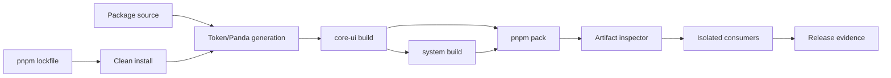

---
doc_meta:
  id: TDD-ui-platform-packaging-001
  title: Build and Published Package Contract
  owner: UI Platform Team
  version: 1.0.0
  status: approved
  classification: public
  parent_sad: SAD-003
  review_cycle_days: 30
  created_date: 2026-09-28
  last_reviewed: 2026-09-29
---

# TDD-ui-platform-packaging-001: Build and Published Package Contract

> **Revision pending exact-commit ratification.** The component-workshop
> additions (proposed ADR-UIP-WKS-001), the entry-environment decision
> record (K1–K5), and the federation-evaluation decision record (F1–F9) are
> pending under GDC-000 section 2.6.7;
> the previously ratified revision remains binding until the authorized human
> authority approves the exact commit containing them.

## Purpose

Turn the extracted workspace into two reproducible, independently installable
artifacts whose public entries, peer ranges, side effects, server/client
boundaries, provenance, and consumer behavior are verified outside the
workspace. A successful source build is not publication evidence.

Implementation is ready only when every requirement below has a named command,
fixture, binary assertion, and retained exact-artifact result.

## Scope

**In scope**

- deterministic installation and toolchain pinning;
- build order and generated-input ownership;
- explicit exports for `@scnx/core-ui` and `@scnx/system`;
- ESM, declaration, CSS, Sass, JSON-token, and font artifacts;
- React peer alignment and server-safe/client-only entries;
- packing, artifact inspection, isolated consumer installation, and release
  evidence;
- standalone, SSR/RSC, strict-CSP, and conditional federation fixtures.

**Out of scope**

- registry vendor configuration and credentials;
- authoring token values, primitive behavior, CSS rules, or provider logic;
- automatic publication before human release authority;
- product adoption of Module Federation, which remains `assess`.

## Technical Context

The baseline uses pnpm 10.23, TypeScript, tsup, Sass, Panda, React, and Vitest.
Known defects are design inputs, not target behavior: clean install can fail in
the Panda `prepare` lifecycle; `system` has a placeholder test; wildcard exports
and `workspace:*` are present; React peers disagree; declaration generation has
exhausted the default heap; and post-build hook-name inference attempts to
restore ignored `"use client"` directives.

### Requirements

| ID      | Contract                                                                                                             |
| :------ | :------------------------------------------------------------------------------------------------------------------- |
| PKG-001 | Clean checkout passes `pnpm install --frozen-lockfile` with scripts enabled and no lockfile change.                  |
| PKG-002 | Generation has one owner and completes before compilation; generated output is reproducible.                         |
| PKG-003 | `core-ui` builds before `system`; reverse imports are rejected.                                                      |
| PKG-004 | `pnpm pack` tarballs contain no `workspace:` range, wildcard export, source-only path, or undeclared file.           |
| PKG-005 | Every public subpath resolves JS and declarations from an external consumer.                                         |
| PKG-006 | React/React DOM peers are aligned and verified at both supported-range boundaries.                                   |
| PKG-007 | Server-safe entries import in a server component; client entries retain an explicit emitted directive.               |
| PKG-008 | Importing any public JS entry causes no DOM, global, storage, timer, network, or stylesheet mutation.                |
| PKG-009 | Static assets resolve from documented paths and survive tree shaking according to `sideEffects`.                     |
| PKG-010 | Release evidence binds source SHA, tarball digest, manifest, SBOM, fixtures, and authority.                          |
| PKG-011 | The P0 federation fixture enforces strict singleton/version identity and records both offered and selected versions. |

## Component Design



| Component            | Responsibility                                                                 | Failure behavior                                     |
| :------------------- | :----------------------------------------------------------------------------- | :--------------------------------------------------- |
| `toolchain-guard`    | Assert Node/pnpm versions and frozen lockfile                                  | Fail before lifecycle scripts                        |
| `generation-guard`   | Generate once, compare clean-tree/digest, reject hand edits                    | Fail before build                                    |
| package builders     | Compile explicit source entries and declarations                               | No heap override fallback                            |
| `export-inventory`   | Resolve every condition/subpath to a packed file                               | Fail on wildcard, missing, duplicate, or source path |
| `artifact-inspector` | Inspect tarball files, manifests, licenses, SBOM, directives, and side effects | Quarantine artifact                                  |
| consumer matrix      | Install tarballs into fresh standalone/SSR/CSP/federation apps                 | Fail the affected supported scenario                 |
| evidence assembler   | Produce one immutable release record                                           | Publication prohibited when incomplete               |

Build products never feed back into source. Fixtures may consume only tarballs
and public entries; a source alias or workspace package link is a test failure.

## Data Model

The export inventory is generated from explicit package manifests:

```ts
type ExportRecord = {
  package: "@scnx/core-ui" | "@scnx/system";
  subpath: string;
  kind: "javascript" | "types" | "css" | "scss" | "json" | "font";
  environment: "server-safe" | "client-only" | "static";
  importTarget?: string;
  requireTarget?: string;
  typesTarget?: string;
  sideEffect: "none" | "declared-css";
};
```

The release record is immutable JSON:

```ts
type ReleaseEvidence = {
  schemaVersion: 1;
  sourceSha: string;
  nodeVersion: string;
  pnpmVersion: string;
  packages: Array<{
    name: string;
    version: string;
    tarballSha256: string;
    manifestSha256: string;
    sbomSha256: string;
  }>;
  supportMatrix: Array<{
    scenario: string;
    versions: Record<string, string>;
    result: "pass" | "fail";
  }>;
  gates: Array<{
    id: string;
    command: string;
    result: "pass" | "fail";
    report: string;
  }>;
  limitations: string[];
  authority: {
    decision: "promoted" | "withheld";
    actor: string;
    recordedAt: string;
  } | null;
};
```

`authority: null` is valid evidence for a candidate but cannot publish Stable.

## API / Interface

Target public families are explicit, generated lists—never `./*`:

| Package         | Public family                        | Contract                                       |
| :-------------- | :----------------------------------- | :--------------------------------------------- |
| `@scnx/core-ui` | `components/<name>`                  | Headless component JS and types                |
| `@scnx/core-ui` | `hooks/<name>`                       | Explicit client hook JS and types              |
| `@scnx/core-ui` | `providers/<name>`                   | Explicit client provider JS and types          |
| `@scnx/system`  | `components/<name>` and `components` | Styled JS/types without CSS side-effect import |
| `@scnx/system`  | `styles/components.css`              | One aggregate component stylesheet             |
| `@scnx/system`  | `tokens/css/<theme-id>.css`          | Scoped theme variables                         |
| `@scnx/system`  | `tokens/json/<theme-id>.json`        | Tool-neutral token output                      |
| `@scnx/system`  | `tokens/scss`                        | Supported Sass contract                        |
| `@scnx/system`  | `fonts/<asset>`                      | Declared font assets and license               |

Manifests provide `types` and ESM targets for JavaScript entries. CJS remains
only if an external fixture proves a named supported consumer. `system` declares
`core-ui`, React, and React DOM as peers plus dev dependencies with identical
tested React ranges across both packages.

## Algorithms / Logic

### Clean build and pack

1. Materialize a clean checkout at the candidate SHA.
2. Assert the pinned Node and pnpm versions.
3. Run `pnpm install --frozen-lockfile` with normal lifecycle scripts.
4. Fail if the lockfile or tracked generated inputs change.
5. Run token validation/generation once and compare the resulting digest.
6. Typecheck and test both packages with retries disabled.
7. Build `core-ui`, then `system`, with the default heap.
8. Run `pnpm pack --pack-destination <isolated-dir>` for each package.
9. Parse packed manifests and enumerate tarball contents.
10. Reject any unresolved export, wildcard, workspace range, absolute path,
    source map with private path leakage, missing license, or undeclared asset.
    Workshop files (`*.stories.*`, `.storybook/`, `storybook-static/`) and
    Storybook packages are never in a tarball or a package manifest; the
    workshop is a development dependency of the private workspace root
    (ADR-UIP-WKS-001).

### Entry classification

Entry classification is source metadata or an explicit inventory field. It is
not inferred from hook names or filenames. Client-only entries begin with
`"use client"` in the source entry and the emitted ESM. Server-safe entries are
loaded by a fixture that denies `window`, `document`, storage, and timers.

#### Decision record: entry environments

Each decision names its sources (References under Traceability) and the
tradeoff it accepts.

| ID  | Decision                                                                                                                                                                                                                                                                                                                                                           | Sources            | Tradeoff and residual risk                                                                                                                                                                                                                                                                                                                                                                                                                                                                                                           |
| :-- | :----------------------------------------------------------------------------------------------------------------------------------------------------------------------------------------------------------------------------------------------------------------------------------------------------------------------------------------------------------------- | :----------------- | :----------------------------------------------------------------------------------------------------------------------------------------------------------------------------------------------------------------------------------------------------------------------------------------------------------------------------------------------------------------------------------------------------------------------------------------------------------------------------------------------------------------------------------- |
| K1  | An entry is `client-only` exactly when its source entry file begins with the `"use client"` directive; otherwise it is `server-safe`. The entry list records the environment from that directive.                                                                                                                                                                  | [1]; this section  | The author states the boundary once, where React reads it. A missing directive on an entry that needs client features is caught by K4 and K5, not inferred.                                                                                                                                                                                                                                                                                                                                                                          |
| K2  | Each package builds its client-only entries and its server-safe entries as two separate builds. The client build adds `"use client"` as an output banner; the server-safe build adds none. Rollup tree shaking is off, so no directive is dropped; esbuild still tree-shakes.                                                                                      | [2]; [3]; [4]      | Next.js warns that "some bundlers might strip out" the directive [2]. Its two cited references use an esbuild banner [3] and `treeshake: false` [4]. Stateless helpers shared by both environments are emitted twice; React contexts live only in client-only entries, so no context identity is split.                                                                                                                                                                                                                              |
| K3  | The packed-artifact inspector requires the directive as the first statement of every client-only entry's ESM and rejects it in every server-safe entry. The build fails on any "directive … was ignored" warning.                                                                                                                                                  | [1]; PKG-007       | The directive must be "at the very beginning of a file, above any imports" [1]; checking the emitted file proves what a consumer bundler reads.                                                                                                                                                                                                                                                                                                                                                                                      |
| K4  | A server-safe fixture imports every server-safe entry and renders it with `react-dom/server` while `window`, `document`, `localStorage`, `sessionStorage`, and timers throw on access.                                                                                                                                                                             | this section       | Proves no environment leakage at import and render; it does not prove RSC compatibility, which K5 covers.                                                                                                                                                                                                                                                                                                                                                                                                                            |
| K5  | A Next.js App Router fixture installs the packed tarballs, renders every server-safe entry and every client-only entry from a Server Component page or from one client island imported by it, runs `next build` and `next start`, and in Chromium requires zero hydration errors and one working client interaction. The Next.js version is pinned in the fixture. | [1]; [2]; [5]; [6] | Next.js is the named App Router consumer for P0; other RSC frameworks are not covered. Props from a Server Component must be serializable [1], and a Server Component cannot read a static property of a client module (`Accordion.Trigger`) [6], so client entries with function props or static-property parts render inside the island. The fixture checks that every client-only entry is imported by the layout, the page, or the island, and a negative page with a server/client text mismatch must report a hydration error. |

### Isolated consumer evaluation

Each fixture starts with an empty store and installs exact tarball paths with
declared peer versions. It imports all inventory records, builds production
output, and executes scenario assertions. Both lowest and highest supported
peer boundaries run. The fixture records artifact digests so a result cannot be
reused for a different tarball.

### Conditional federation evaluation

For the P0 evaluation fixture and for any separately authorized federation
scope, generate explicit share keys from the packed export inventory: the React
entries an application imports and every public JavaScript entry of both
packages (F2). `react`, `react-dom`, `@scnx/core-ui`, and `@scnx/system` are
singletons, so every context-bearing public entry resolves to one shared
identity. Each share uses strict compatible-range negotiation. Its
`requiredVersion` is read from the consuming host or remote's declared
dependency/peer range, never copied from a producer constant or silently
widened.

The host owns React, React DOM, shared UI context, CSS, and nonce/hash
propagation; it is the only provider of a shared module (F3). Remotes stay lazy
and cannot import UI CSS. Negotiation emits one versioned event per participant
and shared package with `schema`, `host_version`, `remote_name`,
`remote_version`, `shared_package`, `required_range`, `offered_versions`,
`selected_version`, `outcome`, and `reason` (F6). The event therefore preserves
both participating application versions, the versions offered, and the version
selected (PKG-011). An absent share, duplicate singleton identity, or
incompatible range produces a controlled route-local failure while the rest of
the host remains usable.

#### Decision record: federation evaluation

This record configures the P0 evaluation fixture (PLAN row 9) only. Module
Federation stays `assess`; nothing here authorizes adoption (ADR-GLB-FE-011
section 5). Strict-CSP nonce and hash propagation through the federation
runtime is PLAN row 10. Each decision names its sources (References under
Traceability) and the tradeoff it accepts.

| ID  | Decision                                                                                                                                                                                                                                                                                          | Sources                                                 | Tradeoff                                                                                                                                                                                                                                                                                                                                               |
| :-- | :------------------------------------------------------------------------------------------------------------------------------------------------------------------------------------------------------------------------------------------------------------------------------------------------ | :------------------------------------------------------ | :----------------------------------------------------------------------------------------------------------------------------------------------------------------------------------------------------------------------------------------------------------------------------------------------------------------------------------------------------- |
| F1  | Host and remotes compile with `@rspack/core` and its built-in `rspack.container.ModuleFederationPlugin` (Module Federation 1.5 runtime from `@module-federation/runtime-tools`), with both versions pinned in the fixture.                                                                        | ADR-GLB-FE-011 section 5 item 1; [7]; [8]; [16]         | ADR-GLB-FE-011 section 3 records that the existing federated applications use this plugin directly, and 1.5 already has runtime plugins [7]. Module Federation 2.0 extras (type hints, devtools, manifest) are not evaluated; switching to `@module-federation/enhanced` needs a rerun.                                                                |
| F2  | Share keys are `react`, `react/jsx-runtime`, `react-dom`, `react-dom/client`, and every public JavaScript subpath of both packages, generated from the pack report by `scripts/federation-share-map.mjs`.                                                                                         | ADR-GLB-FE-012 section 5 items 1–2; [11]                | A share key matches the request itself [11], so a bare package key misses every subpath. Sharing all public entries, stateless ones included, is a superset of "every context-bearing entry": no entry can be misclassified, at the cost of one negotiation per key.                                                                                   |
| F3  | Only the host provides shared modules, with `version` from its installed package. Remotes declare every key with `import: false`. The host build includes a generated module that references every key through a lazy `import()`.                                                                 | ADR-GLB-FE-012 section 5 item 5; [11]; [12]; [13]       | `import: false` removes the remote's local fallback [11], so a remote can never fall back to its own copy. A bundler provides a non-relative key only when the build resolves an import of it [12]; without the generated references the fixture failed with RUNTIME-012 [13]. A newly shared entry needs a host rebuild before any remote can use it. |
| F4  | Every key is `singleton: true` and `strictVersion: true`, and its `requiredVersion` is the range the consuming application declares in `peerDependencies` (else `dependencies`). A non-semver range such as `file:` is rejected.                                                                  | ADR-GLB-FE-012 section 5 items 1, 3, 5; [9]; [10]; [11] | Without `strictVersion`, an unsatisfied singleton only warns and still loads [9]; [10]; [11]. Strict mode fails a route when a remote needs a newer minor than the host offers; it does not degrade. Rspack describes `strictVersion` as an exact match [8], but the runtime checks range satisfaction [9].                                            |
| F5  | `shareStrategy: "loaded-first"`. The host bootstraps through an async `import()`, no share is eager, and each remote loads on first use of its route.                                                                                                                                             | ADR-GLB-FE-012 section 5 item 4; [8]                    | `version-first` loads every remote entry at startup to register its versions [8], which defeats lazy remotes. Because remotes provide nothing (F3), `version-first` would gain no candidate versions.                                                                                                                                                  |
| F6  | A runtime plugin wraps the `resolveShare` resolver and emits one `scnx.federation.share/1` event per participant, shared package, and outcome (`selected` or `rejected`). The fixture collects events in a page-global list and a `scnx:federation` DOM event; product transport is out of scope. | ADR-GLB-FE-012 section 5 item 5; [9]; [14]              | The hook receives the scope map, package name, selected version, and resolver, and its return value is used [9]; [14]. The plugin depends on that hook shape, which is why the runtime version is pinned (F1).                                                                                                                                         |
| F7  | Each remote route renders inside its own error boundary and `Suspense`. A rejected share, an unavailable remote, and a duplicate React each render that route's fallback, and the host stays usable.                                                                                              | ADR-GLB-FE-012 section 5 items 5–6                      | Errors are contained per route, not per component inside a remote.                                                                                                                                                                                                                                                                                     |
| F8  | Only the host imports `components.css` and the theme tokens. The fixture fails when a remote emits a stylesheet or when more than one applied stylesheet contains component rules.                                                                                                                | ADR-GLB-FE-012 section 5 item 7                         | The check counts stylesheets that contain a known component selector. A stylesheet injected some other way, without that selector, is not counted.                                                                                                                                                                                                     |
| F9  | Identity is proven by reference: every remote's React shared internals and `useState`, and its `@scnx/core-ui` ThemeProvider module, must be the host's. A negative-control remote that bundles its own React must be reported as split.                                                          | ADR-GLB-FE-012 section 5 item 1; [15]                   | `react` is CommonJS, so each `import * as React` gets its own interop namespace; the fixture compares what React shares instead, as React's own duplicate check compares `require('react')` results [15]. The negative control proves the check detects a duplicate.                                                                                   |

## Configuration

| Setting             | Source                                  | Rule                                             |
| :------------------ | :-------------------------------------- | :----------------------------------------------- |
| Node and pnpm       | root manifest/CI                        | Exact producer versions                          |
| React peer range    | package manifests                       | Identical across packages; every boundary tested |
| public exports      | package manifests + generated inventory | Explicit only                                    |
| build target        | shared build config                     | Declared per release                             |
| generated directory | producer config                         | Cleaned and recreated; not hand-edited           |
| release channel     | CI input                                | candidate, prerelease, or stable                 |
| CSP policy          | fixture                                 | No `unsafe-eval`/`unsafe-inline`                 |

Credentials are supplied only by the release environment and never enter
package contents, logs, source maps, or evidence payloads.

## Failure Handling

| Failure                              | Required response                                                    | Recovery                                                |
| :----------------------------------- | :------------------------------------------------------------------- | :------------------------------------------------------ |
| Install or generation nondeterminism | Stop before compilation                                              | Fix dependency/lifecycle ownership; rerun clean         |
| Declaration memory exhaustion        | Fail with peak-memory evidence                                       | Reduce graph/build design; no permanent heap override   |
| Ambiguous publication response       | Do not blindly republish                                             | Query version/digest, then resume or choose new version |
| Missing or invalid export            | Quarantine both coordinated artifacts when compatibility is affected | Correct manifest/build and repack                       |
| Unsupported peer combination         | Mark scenario unsupported or fix contract                            | No silent warning-only release                          |
| CSP or import-side-effect violation  | Block affected capability                                            | Remove effect/evaluation; never relax policy            |
| Federation-only failure              | Keep federation unsupported                                          | Standalone release may proceed if independently green   |

## Observability

The pipeline emits structured records with `source_sha`, `package`, `version`,
`tarball_sha256`, `stage`, `fixture`, `duration_ms`, `peak_memory_bytes`, and
`result`. Metrics include install/build/pack durations, artifact bytes by entry
and encoding, cache hit status, fixture result, CSP violations, and missing
evidence count. Main/release failures and digest mismatches alert the UI Platform
owner; candidate-branch failures remain pull-request feedback.

## Testing Strategy

| Layer                 | Required tests                                                                                                        |
| :-------------------- | :-------------------------------------------------------------------------------------------------------------------- |
| Unit                  | export inventory parsing, condition resolution, path containment, manifest normalization, evidence schema             |
| Negative              | wildcard export, `workspace:`, missing types, path traversal, absent directive, hidden side effect, lockfile mutation |
| Producer integration  | clean generation, build order, declaration build, package contents, reproducibility                                   |
| Packed consumer       | every entry, both peer boundaries, tree shaking, type resolution, font/Sass/JSON/CSS loading                          |
| SSR/RSC               | server-safe import, client boundary, render/hydrate, zero mismatch                                                    |
| Security              | SBOM/advisory/license/provenance/secret scan, strict CSP, source-map inspection                                       |
| Federation assessment | both remote orders, singleton identity, incompatible range, CSS uniqueness, CSP nonce/hash                            |

A required job that is absent, skipped, retried to green, or run against another
artifact is a failure. Fixture reports are retained with the release evidence.

## Performance Notes

Record install time, build time, declaration peak memory, tarball size, entry
size (raw/minified/gzip/Brotli), parse/evaluation cost, and fixture startup for
the exact toolchain and runner. Thresholds are approved per scenario; this TDD
defines no universal byte, percentage, or multiplier budget.

## Security Notes

The dependency gate evaluates the resolved lockfile/SBOM, including React,
framework, and `react-server-dom-*` advisories. Applicable high/critical findings
block. Every dependency and copied asset has license/provenance. Import-only
tests prove no evaluation, DOM/global/storage/network/style mutation. Strict CSP
applies equally to standalone and evaluated federation scenarios.

## Operational Notes

Runbooks cover clean-install failure, build-memory regression, corrupt artifact,
ambiguous publication, dependency exposure, consumer regression, and rollback.
Rollback selects the previous immutable package pair and rebuilds the consumer;
published tarballs are never overwritten.

## Rollout and Compatibility

1. Repair deterministic installation and make it a required gate.
2. Introduce explicit inventory and manifests without publishing Stable.
3. Prove package pairs in isolated fixtures.
4. Publish a prerelease with evidence and rehearse install/rollback.
5. Promote an exact package pair only after human release approval.

Because no external stable consumer is recorded, removal of baseline wildcard
paths and malformed entries occurs before v1 without compatibility aliases. If
an external consumer is discovered, migration pauses and that surface is
classified before removal.

## Open Questions

- Which CJS consumers, if any, justify maintaining CJS output?
- What exact React peer range passes both package and SSR/RSC fixtures?
- Which registry/provenance implementation will Developer Platform provide?
- Is federation authorized by an owning system after its assessment passes?

None of these questions may be answered implicitly by widening exports or peer
ranges. The affected capability remains unsupported until decided.

## Traceability

Architecture authority: SAD-003; ADR-GLB-FE-010 through -013;
ADR-UIP-PLT-001, ADR-UIP-BLD-001, and proposed ADR-UIP-WKS-001; STD-GLB-FE-002/003/006/007/008 and
STD-UIP-ENG-001. Lifecycle status in `scnehaux-architecture` determines whether
each record is binding or proposed. Execution: [PLAN](../../PLAN.md) P0 rows
0–3 and 8–11. Related designs: tokens, styled CSS, theme runtime, and primitives.

References (retrieved 2026-10-02):

1. React, `'use client'`: <https://react.dev/reference/rsc/use-client>. It
   "must be at the very beginning of a file, above any imports or other code";
   it marks "the module and its transitive dependencies as client code"; "When
   a `'use client'` module is imported from another client-rendered module, the
   directive has no effect"; "Prop values passed from a Server Component to
   Client Component must be serializable".
2. Next.js 16.3, Server and Client Components, "Advice for Library Authors":
   <https://nextjs.org/docs/app/getting-started/server-and-client-components>.
   "add the `"use client"` directive to entry points that rely on client-only
   features"; "some bundlers might strip out `"use client"` directives".
3. React Wrap Balancer `tsup.config.ts`, cited by [2]:
   <https://github.com/shuding/react-wrap-balancer/blob/main/tsup.config.ts>
   sets `options.banner = { js: '"use client"' }` in `esbuildOptions`.
4. Vercel Analytics `packages/web/tsup.config.js`, cited by [2]:
   <https://github.com/vercel/analytics/blob/main/packages/web/tsup.config.js>
   builds with `splitting: false` and `treeshake: false`.
5. npm registry, 2026-10-02: `next` 16.3.8 (MIT), peer `react` and
   `react-dom` `^18.2.0 || ^19.0.0`.
6. React `packages/react-server-dom-turbopack/src/ReactFlightTurbopackReferences.js`
   at commit `7c6ac13e19fef500b7f669a16bbd01ecc95965ca`:
   <https://github.com/facebook/react/blob/7c6ac13e19fef500b7f669a16bbd01ecc95965ca/packages/react-server-dom-turbopack/src/ReactFlightTurbopackReferences.js#L224-L229>.
   A client reference proxy throws "Cannot access ${expression} on the server.
   You cannot dot into a client module from a server component. You can only
   pass the imported name through." The webpack variant carries the same text.
7. Rspack guide, Module Federation, at commit
   `179a0934f3091463419827fc2767af07b2fd38ed`:
   <https://github.com/web-infra-dev/rspack/blob/179a0934f3091463419827fc2767af07b2fd38ed/website/docs/en/guide/advanced/module-federation.mdx#L34-L62>.
   v1.5 is the "Version built into Rspack" and "adds runtime plugin
   functionality"; v2.0 needs "the additional `@module-federation/enhanced`
   plugin"; v1.0 is "No longer being iterated".
8. Rspack `ModuleFederationPlugin`, same commit:
   <https://github.com/web-infra-dev/rspack/blob/179a0934f3091463419827fc2767af07b2fd38ed/website/docs/en/plugins/module-federation-plugin.mdx#L88-L181>.
   `version-first`: "all _remotes_ entry files will be automatically loaded and
   **register** the corresponding shared dependencies"; `loaded-first`: "the
   _remotes_ entry file will not be automatically loaded (it will only be
   loaded when needed)"; `strictVersion`: "If set to `true`, the shared module
   must match the version specified in requiredVersion exactly, otherwise an
   error will be reported and the module will not be loaded."
9. `@module-federation/runtime-core` 2.9.2 (npm tarball), `dist/utils/share.js`
   lines 188–192 and 221–231. For a singleton whose required range is not
   satisfied, it calls `error(msg)` (which throws) when
   `shareConfig.strictVersion` is set and `warn(msg)` otherwise. It then emits
   `resolveShare` with `shareScopeMap`, `scope`, `pkgName`, `version`,
   `shareInfo`, and `resolver`, and calls the returned `resolver()`.
10. Module Federation, Shared configuration, same commit as [13]:
    <https://github.com/module-federation/core/blob/8a9677f3ea8515a5d81d729a0381955624e1e72b/apps/website-new/docs/en/configure/shared.mdx#L63>. "a higher version will
    be loaded if the versions are inconsistent. A warning will be given for the
    party with the lower version."
11. webpack, ModuleFederationPlugin, sharing hints:
    <https://webpack.js.org/plugins/module-federation-plugin/>. `strictVersion`
    "defaults to `true` when local fallback module is available and shared
    module is not a singleton, otherwise `false`"; `import` "also acts as
    fallback module"; with `import: false` and `strictVersion: true`, "there is
    no local version provided" and "it will throw an error"; `shareKey` "defaults
    to the key you used in `shared`, i.e. the request itself".
12. webpack `lib/sharing/ProvideSharedPlugin.js` at commit
    `d37872d245f4d6bc21c36ee5297663d87452d51d`:
    <https://github.com/webpack/webpack/blob/d37872d245f4d6bc21c36ee5297663d87452d51d/lib/sharing/ProvideSharedPlugin.js#L183-L272>.
    A relative or absolute key is resolved up front; a module request goes to
    `matchProvides` and is provided only in `normalModuleFactory.hooks.module`,
    when the build resolves that request. That Rspack 2.2.8 behaves the same
    way is this fixture's observation, not a quoted source.
13. Module Federation troubleshooting, RUNTIME-012, at commit
    `8a9677f3ea8515a5d81d729a0381955624e1e72b`:
    <https://github.com/module-federation/core/blob/8a9677f3ea8515a5d81d729a0381955624e1e72b/apps/website-new/docs/en/guide/troubleshooting/runtime.mdx>.
    "`import: false` is set for the shared module in one of the applications …
    In this case the host app **must** provide the module".
14. Module Federation runtime hooks, same commit as [13] (lines 242 and 472):
    <https://github.com/module-federation/core/blob/8a9677f3ea8515a5d81d729a0381955624e1e72b/apps/website-new/docs/en/guide/runtime/runtime-hooks.mdx#L242>.
    `resolveShare` "Allows overriding the final shared module selection
    result"; `errorLoadRemote` is "Called if loading remotes fails".
15. React, Invalid Hook Call Warning, "Duplicate React":
    <https://react.dev/warnings/invalid-hook-call-warning>. "the `react` import
    from your application code needs to resolve to the same module as the
    `react` import from inside the `react-dom` package"; the suggested check is
    `console.log(window.React1 === window.React2)`.
16. npm registry, 2026-10-02: `@rspack/core` 2.2.8 (MIT), optional peer
    `@module-federation/runtime-tools` `^0.24.1 || ^2.0.0`;
    `@module-federation/runtime-tools` 2.9.2 (MIT).
