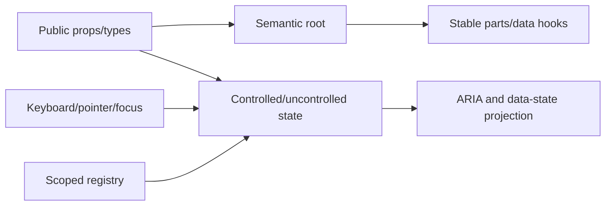

---
doc_meta:
  id: TDD-ui-platform-primitives-002
  title: Primitive Behavior and Polymorphism
  owner: UI Platform Team
  version: 1.0.0
  status: approved
  classification: public
  parent_sad: SAD-003
  review_cycle_days: 30
  created_date: 2026-09-28
  last_reviewed: 2026-10-02
---

# TDD-ui-platform-primitives-002: Primitive Behavior and Polymorphism

## Purpose

Define an implementation-ready, style-agnostic contract for `@scnx/core-ui`:
semantic DOM, state ownership, keyboard/focus behavior, composition,
accessibility, cleanup, and stable styling hooks. Third-party behavior remains
private and Product business meaning remains outside the package.

## Scope

In scope: layout/typography primitives, Button/link behavior, Disclosure and
Accordion, navigation/TOC/sidebar structures, context/registry lifecycles,
Slot/`asChild`, closed `as` polymorphism, public types, refs, and behavior
evidence. Theme state and generic transition mechanics belong to the theme TDD;
visual variants belong to the styled TDD. Complex widgets not present in the
baseline remain Candidate until their own behavior matrices pass.

## Technical Context

The baseline mixes fixed elements, unrestricted generic `as`, and `asChild`;
has limited source tests; treats an anchor as `role=button`; may reuse a TOC
link ID as a heading target; exposes internal registry overrides; and has
unproven registration/remount races. These are findings to repair, not v1 API.

| ID      | Contract                                                                                                               |
| :------ | :--------------------------------------------------------------------------------------------------------------------- |
| PRM-001 | Native semantic elements are the default; ARIA never replaces available native behavior.                               |
| PRM-002 | Every stable interactive primitive has a versioned behavior matrix.                                                    |
| PRM-003 | Controlled and uncontrolled modes never switch silently and emit one callback per accepted change.                     |
| PRM-004 | Public IDs uniquely identify their own DOM node; references target a different matching ID.                            |
| PRM-005 | Component-only props are consumed and never leaked to DOM.                                                             |
| PRM-006 | Interactive composition uses approved `asChild`; layout/typography use a closed `as` union; no component exposes both. |
| PRM-007 | Consumer handler runs first; `preventDefault` cancels library action; refs are composed.                               |
| PRM-008 | Registration, listeners, observers, frames, and timers clean up under unmount and React Strict Mode.                   |

## Component Design

### Stable-candidate inventory

| Family                    | Semantic contract                                             | State/interaction owner             |
| :------------------------ | :------------------------------------------------------------ | :---------------------------------- |
| Box/Flex/Grid/Container   | `div` or closed semantic layout tag; no interaction           | consumer                            |
| Heading/Text/List/Divider | heading/text/list/separator semantics                         | consumer                            |
| Button                    | native `button`; link mode remains a semantic `a`             | native element + consumer           |
| Disclosure/Collapsible    | button controls one region; independent open state            | item/provider                       |
| Accordion                 | single/multiple disclosure orchestration                      | registry                            |
| Navigation/Navbar/Sidebar | `nav`/list/link/landmark structure                            | consumer except explicit disclosure |
| Table of Contents         | navigation links reference document headings; active tracking | TOC provider/tracker                |
| Transition                | generic lifecycle only                                        | theme TDD                           |

Combobox, Select, Menu, Dialog, Popover, Listbox, and Tabs require separate
matrix rows inside this TDD before promotion. Selected React Aria hooks may
implement them only after behavior, AT, provenance/license, and consumer-cost
evidence passes. Vendor types never cross the public boundary.

### Internal modules



Registries are scoped to the nearest provider and split state from imperative
API contexts to avoid unrelated rerenders. Internal advanced registry mutation
is not public v1 API.

### Decision record

Each decision names its sources (see References under Traceability) and the
tradeoff it accepts. A statement marked _inference_ has no normative source.

| ID  | Decision                                                                                                                                                                                                                                                                                                                                                                              | Sources                      | Tradeoff and residual risk                                                                                                                                                                                       |
| :-- | :------------------------------------------------------------------------------------------------------------------------------------------------------------------------------------------------------------------------------------------------------------------------------------------------------------------------------------------------------------------------------------ | :--------------------------- | :--------------------------------------------------------------------------------------------------------------------------------------------------------------------------------------------------------------- |
| P1  | Layout primitives (Box, Flex, Grid, Container) render one tag of `LayoutTag`: `div`, `section`, `article`, `aside`, `header`, `footer`, `main`, `nav`, `span`. Headings use `HeadingTag` (`h1`–`h6`, `p`, `span`, `div`); text uses `TextTag` (`p`, `span`, `div`, `label`, `strong`, `em`, `small`, `figcaption`, `blockquote`, `cite`, `time`). No interactive tag is in any union. | PRM-006; [3]                 | A consumer needing another tag nests an element; no layout primitive can acquire button or link semantics.                                                                                                       |
| P2  | `asChild` takes exactly one element child; child props win, `className` joins slot-then-child, style keys merge child-last, refs compose. For a handler on both, the consumer's runs first and `preventDefault` skips the library's.                                                                                                                                                  | PRM-007; [6]                 | No Slottable placeholder: a child cannot receive extra wrapper structure. The handler order matches Radix's `composeEventHandlers` [6].                                                                          |
| P3  | Button link mode is a native `a href` with no `role="button"`. Disabled, it drops `href`, sets `aria-disabled`, leaves sequential focus, and cancels activation without stopping propagation.                                                                                                                                                                                         | [3]; API / Interface: Button | A disabled link is not reachable by Tab; its reason must be visible elsewhere.                                                                                                                                   |
| P4  | `CollapsibleBase` defaults to `type="multiple"`, `AccordionBase` to `type="single"`; `collapsible` defaults to `true`.                                                                                                                                                                                                                                                                | [7]; baseline behavior       | Radix requires an explicit `type` and defaults `collapsible` to `false` [7]. The defaults here keep the baseline behavior; a consumer who expects Radix semantics passes both props. Disposes review finding D4. |
| P5  | `AccordionBase.Header` wraps each trigger in a heading, `h3` by default, with a closed `HeadingTag` `as`.                                                                                                                                                                                                                                                                             | [2]                          | Radix sets the level through `asChild` [7]; a closed `as` keeps the header structural (PRM-006). The page owner chooses the level that fits its outline.                                                         |
| P6  | Accordion content is `role="region"` labelled by its trigger by default; `region={false}` removes the role.                                                                                                                                                                                                                                                                           | [2]                          | APG advises against regions when more than about six panels can be open at once [2]. That case needs the opt-out, so landmark proliferation stays possible if the opt-out is not used.                           |
| P7  | Accordion keyboard support is the native button (Enter, Space) and the Tab sequence. Arrow-key focus movement between headers is not implemented.                                                                                                                                                                                                                                     | [2]; [7]                     | APG lists Enter, Space, and Tab only [2]; Radix adds ArrowUp/ArrowDown/Home/End [7]. Long accordions need more Tab presses. Candidate for a later revision.                                                      |
| P8  | A navigation item with a sub-group renders a native `button` with `aria-expanded` and `aria-controls`; a leaf renders a native `a href` with `aria-current="page"` when active. No `menu` role and no `aria-haspopup`. Router links compose through `asChild`.                                                                                                                        | [1]; [5]                     | The disclosure-navigation pattern [1] is not a menu, so arrow-key menu navigation is not offered. Disposes review finding D5 except arrow-key roving, which stays consumer-owned.                                |
| P9  | No redundant role on native elements (`nav`, `ul`, `li`, `aside`). The styled `List` adds `role="list"` only to its `unstyled` variant, outside a `nav`.                                                                                                                                                                                                                              | [3]; [4]                     | ARIA in HTML marks redundant roles NOT RECOMMENDED [3]. Safari/VoiceOver drops list semantics under `list-style: none` except inside `nav` [4], so the unstyled list keeps an explicit role.                     |
| P10 | A TOC item names its target heading by `targetId`; its link has `href="#<targetId>"` and its own optional `id`, never the heading's. The active link carries `aria-current="location"`.                                                                                                                                                                                               | [8]; [5]                     | IDs must be unique in a tree [8]. `location` follows the MDN definition [5]; no normative TOC guidance exists (_inference_).                                                                                     |
| P11 | The sidebar toggle controls its sidebar (`aria-controls`) and takes a required accessible name; the flyout is non-modal: Escape closes it and returns focus to the item that opened it, and focus is not trapped.                                                                                                                                                                     | [1]; STD-UIP-PRM-001         | The toggle's name is localized by the consumer; no built-in English label remains.                                                                                                                               |
| P12 | Every stable-candidate interactive primitive has a versioned record in `packages/core-ui/behavior-inventory.json` (the PrimitiveContract shape). Source and packed tests read it.                                                                                                                                                                                                     | PRM-002                      | The inventory is maintained with the component; a missing record fails the contract test rather than passing silently.                                                                                           |

## Data Model

```ts
type PrimitiveContract = {
  name: string;
  stability: "candidate" | "stable";
  root: string;
  parts: Array<{ name: string; element: string }>;
  controlledProps: string[];
  states: string[];
  keys: Array<{ key: string; condition: string; effect: string }>;
  focus: { initial: string; movement: string; restoration: string };
  accessibleName: string;
  dataHooks: string[];
};

type DisclosureItemState = {
  id: string;
  open: boolean;
  phase: "closed" | "opening" | "open" | "closing";
  disabled: boolean;
  revision: number;
};
```

Registry state is keyed by explicit item value or `useId`-derived instance ID.
DOM IDs derive separately as `<instance>-trigger` and `<instance>-content`.
Unmount deletes state/listeners for that registration generation; a stale
cleanup cannot remove a rapidly remounted item with a newer generation.

## API / Interface

### Button

Button mode renders `<button type="button">` by default and exposes native
button props plus optional `pressed`. Link mode renders `<a href>` and preserves
link semantics; it never adds `role="button"`. Disabled link mode removes
navigation, sets `aria-disabled`, is omitted from sequential focus unless the
contract explicitly documents otherwise, and cancels activation from pointer
and keyboard without swallowing unrelated events.

### Disclosure and Accordion

```ts
type DisclosureItemProps = {
  value?: string;
  open?: boolean;
  defaultOpen?: boolean;
  onOpenChange?: (open: boolean) => void;
  disabled?: boolean;
  children: React.ReactNode;
};

type AccordionRootProps = {
  type?: "single" | "multiple";
  value?: string | string[];
  defaultValue?: string | string[];
  onValueChange?: (value: string | string[]) => void;
  collapsible?: boolean;
  disabled?: boolean;
};
```

Trigger is a native button with `aria-expanded` and `aria-controls`; content has
the paired ID and an appropriate region/label relationship where the behavior
matrix requires it. Disabled items do not change state.

### Polymorphism

- `asChild` accepts exactly one valid, ref-capable element at approved
  interactive composition points.
- Layout/typography `as` accepts a component-specific closed tag union, not any
  `ElementType`.
- Child props win for `className` suffix and style keys; refs compose.
- Consumer event handler runs first. If it calls `preventDefault`, the library
  handler does not execute. A child exception propagates and prevents library
  action.
- Invalid child count/type throws a deterministic development diagnostic.

### Navigation and Sidebar

`NavigationBase.Item` with a nested group renders a disclosure `button`
(`aria-expanded`, `aria-controls` = the group's ID); without one, it renders an
`a href` or, with `asChild`, its single child link (P8). `isActive` sets
`aria-current="page"`; a disabled item follows Button link mode (P3). The
sidebar toggle requires `label` and sets `aria-controls` to the sidebar root;
the collapsed flyout closes on Escape and outside click and restores focus to
its opener (P11).

### TOC

Items identify target heading IDs; links get their own optional DOM ID and
`href="#<targetId>"`. `initialActiveId` is honored during server and first client
render. Custom link composition preserves consumer navigation when default is
prevented. Observer and smooth-scroll behavior are client-only.

## Algorithms / Logic

### Controlled-state reducer

1. Derive `isControlled` once from the value prop and warn/fail tests on mode
   switching.
2. Validate intent against disabled/mode constraints.
3. Compute next state without mutating current state.
4. In uncontrolled mode commit it; in controlled mode wait for the prop.
5. Emit one `onChange` for accepted user intent.
6. Project state into ARIA/data hooks; animation phase does not redefine logical
   open state.

### Single Accordion update

Opening item B marks the currently open item A as closing, opens B, and prevents
stale transition completion for A from mutating B. When `collapsible=false`, an
activation of the only open item is ignored. Multiple mode updates only the
target item.

### Event and prop pipeline

Partition library props before DOM spread; compute required semantics; merge
consumer props according to the documented precedence; compose handlers and
refs; render one semantic root. Required accessibility props cannot be removed
silently—an invalid override produces a diagnostic and test failure.

### TOC tracking

Flatten the declared item tree, observe unique existing target headings, choose
the nearest visible target using deterministic document order, and suspend
observer updates only while a library-initiated scroll generation is active.
Cleanup disconnects observer/listener/timeout. Missing targets are reported but
do not crash the navigation tree.

## Configuration

The behavior inventory declares stability, semantic root, parts, state modes,
keyboard pattern, focus rules, AT matrix, and supported React range per
primitive. It is `packages/core-ui/behavior-inventory.json` (P12): one
PrimitiveContract record per stable-candidate interactive primitive, with a
schema version. Runtime environment variables do not alter behavior. Optional motion
uses the theme TDD contract and respects reduced motion.

## Failure Handling

| Failure                  | Behavior                                                                          |
| :----------------------- | :-------------------------------------------------------------------------------- |
| Missing provider/context | Throw named development error; never use silent global state                      |
| Duplicate item value     | Reject registration with component/value diagnostic                               |
| Controlled-mode switch   | Warn in development and fail contract test                                        |
| Invalid `asChild`        | Deterministic error before cloning                                                |
| Missing TOC target       | Skip observation, retain navigation, emit diagnostic                              |
| Observer API unavailable | Keep links functional; disable active tracking                                    |
| Transition failure       | Logical state remains authoritative; bounded transition fallback settles presence |
| Vendor hook failure      | Keep widget outside Stable export or use proven alternative                       |

## Observability

The package has no built-in network telemetry. Development diagnostics carry
component, contract version, instance/item ID, invariant, and remediation.
Fixtures record registry/listener counts, callback counts, leaked DOM props,
duplicate IDs, observer cleanup, focus outcomes, accessibility violations, and
render commits for named scenarios.

## Testing Strategy

- Contract matrix: semantic element, accessible name, ARIA/state hooks, mouse,
  touch, keyboard, focus order/restoration, disabled, controlled/uncontrolled.
- Unit/state: reducers, single/multiple orchestration, registration generation,
  duplicate IDs, listener disposal, event/ref merge.
- Type: accepted/rejected polymorphic props, exact refs, router link composition,
  forbidden `as`+`asChild`, vendor-type absence.
- Integration: disclosure/accordion rapid reversal, TOC dynamic items/targets,
  nested providers, Strict Mode mount/unmount/remount.
- Accessibility: axe plus manual NVDA/VoiceOver for promoted complex widgets;
  forced colors, zoom/reflow, reduced motion, high contrast.
- Packed/SSR: public subpaths/types, server-safe imports, client hydration and
  interaction, one context identity.
- Negative/adversarial: injected attributes, invalid children, duplicate values,
  stale cleanup, prevented/default/throwing handlers, disabled activation.

## Performance Notes

Measure render commits, subscription fanout, event-listener count, observer
work, DOM nodes, and incremental JS/parse cost for Button, one disclosure, one
overlay, and one composite widget. Evidence names the scenario and runner; a
clone, ref callback, or layout read is not rejected by name alone.

## Security Notes

Primitives contain no authorization. Text uses React escaping; rich HTML is
absent unless separately designed. Prop filtering prevents internal configuration
from reaching DOM. Link behavior preserves browser security semantics; external
links are not silently rewritten. Copied Slot/vendor logic requires recorded
license and provenance.

## Operational Notes

A primitive with unresolved required behavior remains Candidate or unexported.
Each Stable complex widget has a Component ACR, known-limitations entry, owner,
and regression runbook. A behavior regression rolls back the package version;
published artifacts are immutable.

## Rollout and Compatibility

Inventory the baseline exports, classify Candidate versus v1 Stable, repair the
reference slice first, then promote additional families only when their full
matrix passes. Pre-v1 changes remove unrestricted polymorphism, internal registry
props, incorrect link role, and ambiguous IDs without compatibility shims unless
an external consumer is proven.

## Open Questions

- Which exact primitives comprise the first Stable v1 set beyond the reference
  slice?
- Which complex widget first justifies React Aria behind the private boundary?
- Which router integrations require an explicit adapter rather than `asChild`?

## Traceability

Architecture authority: SAD-003; ADR-UIP-PLT-001; STD-GLB-FE-006/008/009 and
STD-UIP-PRM-001.

References (retrieved 2026-10-02):

1. W3C WAI-ARIA APG, Example Disclosure Navigation Menu:
   <https://www.w3.org/WAI/ARIA/apg/patterns/disclosure/examples/disclosure-navigation/>.
   It "does not use the WAI-ARIA menu role" because site navigation "does not
   provide the complex functionality that assistive technologies expect"; the
   button has `aria-expanded` and `aria-controls`, the current link
   `aria-current="page"`, and "Escape … closes it and sets focus on the button
   that controls that dropdown".
2. W3C WAI-ARIA APG, Accordion Pattern:
   <https://www.w3.org/WAI/ARIA/apg/patterns/accordion/>. The header button
   "is wrapped in an element with role heading"; `aria-disabled` is true when
   "the accordion does not permit the panel to be collapsed"; keyboard support
   is Enter, Space, and Tab; "Avoid using the region role … in an accordion
   that contains more than approximately 6 panels that can be expanded at the
   same time".
3. W3C, ARIA in HTML: <https://www.w3.org/TR/html-aria/>. "It is NOT
   RECOMMENDED for authors to set the ARIA role and aria-\* attributes to values
   that match the implicit ARIA semantics"; `nav`, `ul`, `li`, and `aside` list
   their implicit roles as "allowed, but NOT RECOMMENDED".
4. Scott O'Hara, "Fixing" Lists (2019):
   <https://www.scottohara.me/blog/2019/01/12/lists-and-safari.html>.
   "VoiceOver and Safari (Webkit) … remove list element semantics when
   `list-style: none` is used"; `role="list"` restores them; "if a list is a
   descendant of a `<nav>` element … Safari/VoiceOver will expose this as a
   list".
5. MDN, `aria-current`:
   <https://developer.mozilla.org/en-US/docs/Web/Accessibility/ARIA/Reference/Attributes/aria-current>.
   `page` "represents the current page within a set of pages"; `location`
   "represents the current location within an environment or context".
6. Radix UI, Composition guide
   (<https://www.radix-ui.com/primitives/docs/guides/composition>): the child
   "must spread props" and accept a `ref`. Radix `composeEventHandlers`
   source (MIT, © 2022 WorkOS,
   <https://github.com/radix-ui/primitives/blob/main/packages/core/primitive/src/primitive.tsx>)
   calls the original handler first and its own only if
   `!event.defaultPrevented`.
7. Radix UI, Accordion: <https://www.radix-ui.com/primitives/docs/components/accordion>.
   `type` is required with "No default value"; `collapsible` defaults to
   `false`; Header uses `asChild` for the heading level; the keyboard table adds
   ArrowDown, ArrowUp, Home, and End.
8. WHATWG HTML Standard, the `id` attribute:
   <https://html.spec.whatwg.org/multipage/dom.html#the-id-attribute>. The
   value "must be unique amongst all the IDs in the element's tree". Lifecycle status in `scnehaux-architecture` controls authority.
   Execution: [PLAN](../../PLAN.md) P0 rows 7, 8, and 11. Related designs: theme
   runtime, styled CSS, and packaging.
