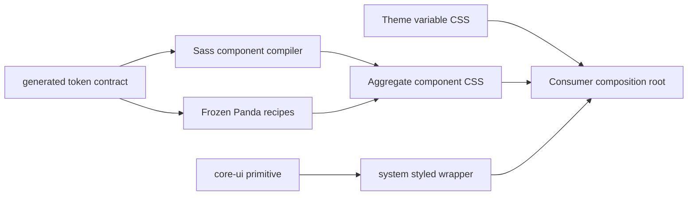

---
doc_meta:
  id: TDD-ui-platform-styled-004
  title: Styled Components and CSS Delivery
  owner: UI Platform Team
  version: 1.0.0
  status: approved
  classification: public
  parent_sad: SAD-003
  review_cycle_days: 30
  created_date: 2026-09-28
  last_reviewed: 2026-09-29
---

# TDD-ui-platform-styled-004: Styled Components and CSS Delivery

## Purpose

Define the exact seam between headless behavior, styled wrappers, token usage,
theme variables, cascade ownership, and the static CSS a consumer loads. The
design must render correctly from packed artifacts without consumer-side Panda
execution or implicit JavaScript side effects.

## Scope

In scope: `@scnx/system` styled entries, Sass component rules, the frozen Panda
recipe set, aggregate component CSS, theme CSS composition, cascade layers,
selector scoping, portal styling, forced-colors behavior, and packed-consumer
verification. Primitive state logic and token generation are owned by their
respective TDDs. Per-component CSS exports and Shadow DOM are outside v1.

## Technical Context

The baseline combines Sass and Panda, but JS import does not prove CSS delivery;
theme bundles may omit component rules; some rules sit outside declared layers;
and global `:root`/reset selectors can leak across co-located brands/remotes.

| ID      | Contract                                                                                                                     |
| :------ | :--------------------------------------------------------------------------------------------------------------------------- |
| STY-001 | Every styled component composes a public primitive and adds no independent behavior state machine.                           |
| STY-002 | Stable declarations consume Tier-2 tokens or justified Tier-3 aliases; raw-value exceptions are linted.                      |
| STY-003 | One aggregate component asset and one instance of each selected theme asset are loaded by the composition root exactly once. |
| STY-004 | Component JS has no CSS side-effect import; remotes never inject UI Platform CSS.                                            |
| STY-005 | All public rules participate in the canonical layer order and remain under an allowed scope.                                 |
| STY-006 | Portaled UI remains inside the originating theme root.                                                                       |
| STY-007 | Dual Sass/Panda ownership continues only if correctness, security, accessibility, and approved scenario budgets pass.        |

## Component Design



| Module                | Owns                                                                  | Prohibited                                           |
| :-------------------- | :-------------------------------------------------------------------- | :--------------------------------------------------- |
| styled wrapper        | visual variant props, primitive composition, stable parts/state hooks | duplicating focus/keyboard/state logic               |
| Sass component source | skinned component declarations                                        | global unlayered reset or raw Tier-1 consumption     |
| Panda adapter         | existing structural recipes only during P0                            | expanding recipe surface before dual-engine decision |
| CSS assembler         | deterministic layers and asset order                                  | source-order dependence outside layers               |
| consumer root         | importing component/theme assets once                                 | remote/component-level reinjection                   |

Canonical layer order is `reset, tokens, base, components, recipes, utilities,
overrides`. Layers determine priority;
`[data-scnx-theme][data-scnx-resolved-mode]` and component roots provide
isolation.

## Data Model

```ts
type StyledComponentRecord = {
  publicEntry: string;
  primitiveEntry: string;
  rootPart: string;
  parts: string[];
  states: string[];
  variants: Record<string, string[]>;
  tokenReferences: string[];
  tier3Aliases: Array<{ token: string; justification: string }>;
  cssOwner: "sass" | "panda";
  cssArtifact: "styles/components.css";
  themeCoverage: string[];
  stability: "candidate" | "stable";
};
```

The generated style manifest maps every stable component/part/state/variant to
its owner and artifact. Duplicate ownership of the same public selector/property
pair is rejected unless an explicit layer-ordered override is recorded.

## API / Interface

Public styling consists of:

- documented component props and visual variants;
- stable `data-part`, `data-state`, and accessibility-derived selectors;
- `[data-scnx-theme="<theme-id>"][data-scnx-resolved-mode="<mode>"]` roots;
- `@scnx/system/styles/components.css`;
- `@scnx/system/tokens/css/<theme-id>.css`; and
- documented token variables.

Private Sass class structure and generated Panda class names are not public.
Consumers may override through the final `overrides` layer and documented
tokens/parts only. A single-brand `:root` compatibility asset is a separate
entry and excluded from multi-brand/federated support.

## Algorithms / Logic

### Compile and assemble

1. Load the validated normalized token contract.
2. Compile Sass components into the `components` layer.
3. Build only the frozen Panda recipe inventory into the `recipes` layer.
4. Parse both outputs and reject undeclared layers, selectors outside allowed
   scopes, undefined variables, raw-value violations, and duplicate ownership.
5. Assemble deterministic aggregate CSS in canonical layer order.
6. Pack CSS independently from JavaScript.
7. Install tarballs and import component plus selected theme CSS once at the
   composition root.
8. Render the supported set and assert computed properties and isolation.

### Portal and scope resolution

Overlay components receive a portal container from the active theme provider.
The container is a descendant of the originating theme root. If no valid portal
container exists, a portal-dependent component fails with a development
diagnostic and remains outside Stable support; it does not silently mount under
unscoped `document.body`.

### Dual-engine eligibility

Measure both engines in the same packed scenario. If both pass all mandatory
gates and the approved scenario budgets, retain the bounded split. If one fails,
consolidate on the eligible engine through an ADR/TDD revision. If neither
passes, block Stable promotion. Measurements do not create universal policy.

## Configuration

The versioned style manifest declares stable components, CSS owner, public
parts/states, theme coverage, aggregate entry, canonical layers, allowed root
selectors, raw-value allowlist, and frozen Panda recipes. Configuration is build
input, validated against actual source and output, and cannot vary by runtime
environment.

## Failure Handling

| Failure                                   | Response                                                     |
| :---------------------------------------- | :----------------------------------------------------------- |
| Missing CSS for stable component/state    | Block package pair                                           |
| Undefined token or invalid computed value | Block affected theme/component                               |
| Undeclared/global selector leak           | Reject output before packing                                 |
| Duplicate stylesheet instance             | Fail consumer fixture; root/remote loading must be corrected |
| Portal outside theme root                 | Fail component scenario; no global fallback                  |
| Forced-colors focus loss                  | Block affected focusable component                           |
| Dual-engine budget/correctness failure    | Execute documented consolidation branch                      |

## Observability

The CSS report records source/artifact digests, rule/declaration counts by
layer and owner, undefined variables, raw-value exceptions, duplicate selector
pairs, asset bytes by encoding, computed-style failures, stylesheet instance
counts, and portal/scope failures. Visual diffs are retained as evidence but do
not replace computed-style and behavior assertions.

## Testing Strategy

- Static: token usage, allowed selectors, layer membership, ownership, raw-value
  exceptions, output parse, deterministic order.
- Unit: wrapper prop consumption, primitive delegation, variant/state-to-hook
  mapping, absence of behavior duplication.
- Packed browser: supported component/state matrix under every theme/mode,
  aggregate/theme path resolution, tree shaking, no JS CSS side effect.
- Isolation: two differently themed roots, nested root, portal, host plus two
  remotes in both load orders, and consumer override layer.
- Accessibility: visible `:focus-visible` outline, forced colors, contrast,
  reduced motion, disabled and selected states.
- Visual: stable reference scenarios across declared browsers and densities.
- Negative: missing theme asset, duplicate component asset, global reset,
  unlayered rule, invalid variable, unauthorized Tier-1 value.

## Performance Notes

Measure aggregate and theme CSS bytes, unused declarations for the reference
slice, style recalculation, generated variant count, build duration, and
incremental consumer impact. Each result records browser, device/runner, build
mode, tool, baseline, and encoding. There is no universal 10% or 2x rule.

## Security Notes

Style generation is build-time and performs no runtime evaluation. Strict CSP
requires no `unsafe-inline`; static stylesheet loading follows consumer policy.
CSS input is repository-owned, and any future external theme input must be
validated as data rather than interpolated into selectors/declarations.

## Operational Notes

Runbooks cover missing styling, token resolution, leakage, duplicate assets,
visual regression, and rollback. A public selector/token/asset change requires
compatibility classification, migration notes, and a new immutable version.

## Rollout and Compatibility

First generate the style manifest from the current inventory, close all missing
and duplicate ownership, introduce canonical layers/scopes, assemble the
aggregate asset, and prove packed consumers. Then run the dual-engine decision
gate before Stable promotion. Baseline private class names receive no aliases;
documented parts and assets become the v1 compatibility boundary.

## Open Questions

- Does the dual-engine gate retain both Sass and Panda after the reference slice?
- Which components, if any, need per-component CSS in a future major version?
- Is the single-brand `:root` compatibility asset required by a named consumer?

## Traceability

Architecture authority: SAD-003; ADR-GLB-FE-013 and ADR-UIP-PLT-001;
STD-GLB-FE-003/005/008/009 and STD-UIP-STY-001/ENG-001. Lifecycle status in
`scnehaux-architecture` controls authority. Execution:
[PLAN](../../PLAN.md) P0 rows 5, 9–11. Related designs: tokens, theme runtime,
primitives, and packaging.
