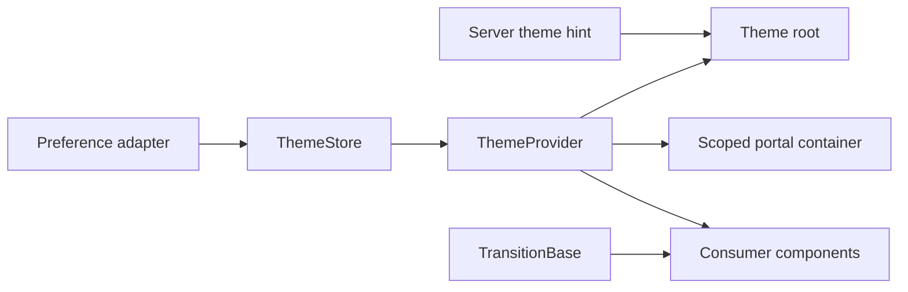

---
doc_meta:
  id: TDD-ui-platform-theme-005
  title: Theme Provider and Transition Runtime
  owner: UI Platform Team
  version: 1.0.0
  status: approved
  classification: public
  parent_sad: SAD-003
  review_cycle_days: 30
  created_date: 2026-09-28
  last_reviewed: 2026-09-29
---

# TDD-ui-platform-theme-005: Theme Provider and Transition Runtime

## Purpose

Specify the client-runtime infrastructure for scoped theme state, SSR-safe
initialization, preference persistence, portal inheritance, and interruptible
transitions under strict CSP. Disclosure/Accordion behavior uses this transition
engine but its registry and interaction semantics belong to the primitives TDD.

## Scope

In scope: ThemeProvider/store,
`[data-scnx-theme][data-scnx-resolved-mode]` roots, controlled/uncontrolled
state, system preference, persistence adapter, prepaint bootstrap, portal root,
hydration, TransitionBase finite state machine, reduced motion, cleanup, and
failure telemetry. Theme token values and disclosure orchestration are out of
scope.

## Technical Context

The baseline executes generated text with `new Function`, writes singleton
callbacks to `window`, injects an inline script/style, targets the document root,
and can let multiple providers overwrite each other. Transition completion
depends on an event that may never arrive and performs synchronous layout reads.

| ID      | Contract                                                                                                |
| :------ | :------------------------------------------------------------------------------------------------------ |
| THM-001 | Provider state is scoped to its root or explicit host-owned store; no implicit global singleton.        |
| THM-002 | Server markup and first client render agree; initialization causes no hydration mismatch.               |
| THM-003 | Prepaint behavior is an external asset or uses a consumer-controlled nonce/hash; no dynamic evaluation. |
| THM-004 | Multiple providers/stores coexist and clean all subscriptions/listeners.                                |
| THM-005 | Portals mount under the originating theme root.                                                         |
| THM-006 | Transition callbacks fire at most once per completed intent, including interruption and timeout.        |
| THM-007 | Reduced motion and disabled animation settle synchronously without layout work.                         |
| THM-008 | Missing completion events settle through a bounded timeout derived from computed timing.                |

## Component Design



| Component           | Responsibility                                                               |
| :------------------ | :--------------------------------------------------------------------------- |
| `ThemeStore`        | Bounded state, subscriptions, controlled updates, monotonic revision         |
| `ThemeProvider`     | Bind store to a root, context, persistence, preference, and portal container |
| `ThemeBootstrap`    | Apply validated initial root attributes before paint under consumer CSP      |
| `PreferenceAdapter` | Read/write allowed storage key and subscribe to system preference            |
| `TransitionBase`    | Execute one element-local, interruptible transition FSM                      |
| timeout resolver    | Parse computed duration/delay lists and provide bounded completion fallback  |

The provider does not own every provider in a document. A host may pass one
explicit store to providers that intentionally share state; otherwise instances
are isolated.

## Data Model

```ts
type ThemeId = string;
type ThemeMode = "light" | "dark" | "system";
type ResolvedMode = "light" | "dark";

type ThemeSnapshot = {
  themeId: ThemeId;
  mode: ThemeMode;
  resolvedMode: ResolvedMode;
  source: "server" | "controlled" | "persisted" | "system" | "default";
  revision: number;
};

type TransitionPhase = "closed" | "entering" | "settled" | "exiting";
type TransitionIntent = "open" | "close";
type TransitionRecord = {
  phase: TransitionPhase;
  intent: TransitionIntent;
  generation: number;
  interrupted: boolean;
  completion: "event" | "timeout" | "instant" | null;
};
```

State precedence is controlled value, valid server hint, valid persisted
preference, system preference, then declared default. Persistence failures do
not change in-memory state. Unknown theme IDs/modes are rejected before DOM
mutation.

## API / Interface

```ts
type ThemeProviderProps = {
  children: React.ReactNode;
  themeId: string;
  mode?: ThemeMode;
  defaultMode?: ThemeMode;
  onModeChange?: (mode: ThemeMode, snapshot: ThemeSnapshot) => void;
  store?: ThemeStore;
  storage?: ThemePreferenceAdapter | false;
  root?: HTMLElement | null;
  portalContainer?: HTMLElement | null;
  nonce?: string;
};

type ThemeContextValue = ThemeSnapshot & {
  root: HTMLElement | null;
  portalContainer: HTMLElement | null;
  setMode(mode: ThemeMode): void;
};
```

The rendered root carries exactly the CSS identity attributes
`data-scnx-theme="<theme-id>"` and
`data-scnx-resolved-mode="<light|dark>"`. The requested `mode`, including
`system`, remains in the store snapshot and is not duplicated as a CSS selector
attribute. No undocumented `window.__theme` API exists.

TransitionBase keeps element props plus `open` (positive intent),
`disabled?: boolean`, optional style/keyframe contract, and `onOpened`/
`onClosed`. The misleading baseline `smoothClose` polarity is removed before
v1. Public `data-state` values match `TransitionPhase`; `data-interrupted` is
diagnostic and not a style authority.

## Algorithms / Logic

### Theme initialization and update

1. Validate theme ID/mode against the packaged manifest.
2. Render server markup with the declared hint and matching root attributes.
3. Optional prepaint bootstrap reads only the configured storage key and
   `matchMedia`, validates values, then updates that root; it runs as an external
   asset or with the supplied nonce/hash.
4. Hydration reads the same snapshot without changing element structure.
5. Provider subscribes to the explicit store and preference source.
6. A mode update commits one new revision, applies attributes, persists on a
   best-effort basis, and notifies a snapshot copy.
7. Unmount removes store/media/storage listeners and owned portal nodes.

### Transition finite state machine

```text
closed --open--> entering --complete--> settled
settled --close--> exiting --complete--> closed
entering --close--> exiting
exiting --open--> entering
```

Each intent increments `generation`. Scheduled frames, events, and timeouts
capture that generation; stale completions do nothing. Opening with `height:
auto` reads current pixels once, writes the start frame, then writes measured
target on the next frame. Closing snapshots current pixels before targeting the
closed value. Completion listens only to the owned element/property set.

The fallback is `max(transition-duration + transition-delay,
animation-duration + animation-delay) + safetyMargin`, capped by a configured
maximum. Zero duration, reduced motion, or disabled animation takes the instant
branch and performs no forced layout. Completion cancels frames/timeouts and
fires the matching callback once.

## Configuration

Versioned configuration contains allowed theme IDs/modes, default mode,
storage key/version, system-preference policy, bootstrap asset path, timeout
safety margin/cap, animatable properties, and portal policy. The consumer owns
CSP headers and may supply a nonce; the library never discovers or weakens CSP.

## Failure Handling

| Failure                           | Behavior                                                              |
| :-------------------------------- | :-------------------------------------------------------------------- |
| Invalid persisted value           | Ignore, record diagnostic, use next precedence source                 |
| Storage unavailable               | Continue in memory; no render failure                                 |
| System preference API unavailable | Use declared default/control value                                    |
| Unknown theme                     | Reject update; retain last valid snapshot                             |
| Missing portal root               | Development error; portal capability remains unsupported              |
| Missing completion event          | Settle via bounded timeout                                            |
| Rapid intent reversal             | Cancel stale generation and continue from current pixels              |
| Unmount mid-transition            | Cancel all frames/listeners/timeouts; no callback after unmount       |
| Bootstrap/CSP failure             | Render server/default theme and report; never use `unsafe-*` fallback |

## Observability

Development diagnostics identify provider/store ID, revision, invalid value,
fallback source, and transition generation/reason. Consumer hooks may receive
sanitized events: `theme_initialized`, `theme_changed`, `theme_fallback`,
`transition_completed`, and `transition_timeout`. No global telemetry transport
is built into the package. Fixture metrics count hydration mismatches, leaked
subscriptions, CSP violations, timeout completions, forced-layout reads, and
callback duplicates.

## Testing Strategy

- Unit: precedence, validation, controlled/uncontrolled updates, subscription
  snapshots, storage errors, media changes, cleanup, transition FSM/generation.
- SSR/hydration: all valid server/client source combinations, zero mismatch,
  no module-evaluation effect, streamed/delayed hydration.
- Isolation: two independent providers, shared explicit store, nested roots,
  two brands, portal inheritance, mount/unmount cycles.
- CSP: external bootstrap and nonce path, zero violations, no eval/inline style,
  invalid/missing nonce negative cases.
- Transition: event completion, timeout, zero duration, reduced motion,
  interruption both directions, content resize, unmount, Strict Mode.
- Packed/federated: one context identity, both remote orders, host-owned nonce
  propagation when federation is authorized.
- Property/boundary: duration list parsing, negative/NaN values, timeout cap,
  revision ordering, stale generation events.

## Performance Notes

Measure prepaint execution, provider update render count, subscription fanout,
style recalculation, layout reads per transition, frame task duration, and theme
switch interaction latency on declared devices. The design promises bounded
work, not zero reflow or a universal millisecond target.

## Security Notes

Remove `new Function`, inline text generation, mutable window callbacks, and
unowned style injection. Stored values are untrusted and allowlisted. Theme
identifiers never become arbitrary selectors/URLs. Consumer-controlled nonce or
hash is propagated only through an explicit API. No secret or Product data is
stored.

## Operational Notes

Runbooks cover CSP failure, hydration mismatch, invalid persisted preference,
portal leakage, transition timeout regression, and rollback. A broken provider
blocks Stable promotion. Federation-specific failure keeps federation
unsupported and never relaxes standalone policy.

## Rollout and Compatibility

Introduce the store and explicit root behind candidate exports, remove global
callbacks/eval, add SSR/CSP/isolation fixtures, migrate provider callsites, then
replace the transition prop polarity before v1. Rehearse persistence-key
migration and rollback. No compatibility shim recreates the insecure global API.

## Open Questions

- Which prepaint delivery path (external asset or nonce script) is required by
  the first named consumer?
- Does a host-owned shared ThemeStore need a stable public package entry?
- Which animatable property set is supported for v1 beyond height/opacity?

## Traceability

Architecture authority: SAD-003; ADR-GLB-FE-012/013 and ADR-UIP-PLT-001;
STD-GLB-FE-003/008/009 and STD-UIP-ENG-001/STY-001/PRM-001. Lifecycle status in
`scnehaux-architecture` controls authority. Execution:
[PLAN](../../PLAN.md) P0 rows 6, 9–11. Related designs: tokens, styled CSS,
primitives, and packaging.
