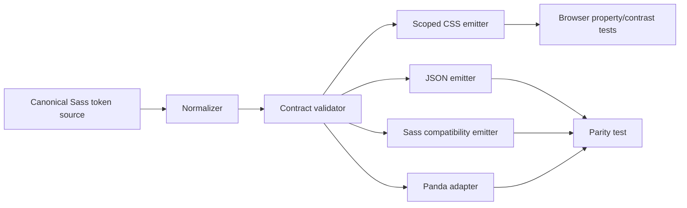

---
doc_meta:
  id: TDD-ui-platform-tokens-003
  title: Theme and Token Output
  owner: UI Platform Team
  version: 1.0.0
  status: proposed
  classification: public
  parent_sad: SAD-003
  review_cycle_days: 30
  created_date: 2026-09-28
  last_reviewed: 2026-09-29
---

# TDD-ui-platform-tokens-003: Theme and Token Output

## Purpose

Define one deterministic token pipeline that implements the centrally governed
three-tier language and emits complete, type-correct, scoped, and equivalent
CSS, JSON, Sass, and Panda-facing contracts for every supported theme.

## Scope

In scope: core values, semantic mappings, justified component aliases, default
and achromatic themes, light/dark modes, font metadata, CSS custom properties,
stable `@scnx/system/tokens/*` entries, validation, migration, and release
evidence. DTCG interchange is a target output only after its generator passes
parity. Product tokens and component CSS rules are out of scope.

## Technical Context

Sass maps are the baseline source. The baseline has undefined Panda references,
malformed shadow serialization, unequal public shadow sets, legacy names, and
an invalid achromatic expression. OKLCH does not by itself prove contrast, and
alpha results depend on their actual backgrounds.

| ID      | Contract                                                                                 |
| :------ | :--------------------------------------------------------------------------------------- |
| TKN-001 | Every token has one canonical logical name, type, tier, and owner.                       |
| TKN-002 | Tier 2 never references Tier 3; Tier 3 resolves to Tier 2.                               |
| TKN-003 | Every supported theme/mode exposes the identical public Tier-2 key set and types.        |
| TKN-004 | CSS, JSON, Sass, and Panda outputs derive from one normalized dictionary and agree.      |
| TKN-005 | Every reference resolves; every substituted CSS value parses for its consuming property. |
| TKN-006 | Actual foreground/background and non-text pairs pass applicable WCAG 2.2 gates.          |
| TKN-007 | A focus shadow supplements but never replaces a visible outline.                         |
| TKN-008 | Generated artifacts are reproducible and never hand-edited.                              |

## Component Design



| Component          | Responsibility                                                                                            |
| :----------------- | :-------------------------------------------------------------------------------------------------------- |
| normalizer         | Convert source maps into ordered typed records; reject duplicate logical names                            |
| contract validator | Enforce central grammar, legal type, tier direction, references, theme coverage, and alias review records |
| emitters           | Serialize the same normalized record set into target formats                                              |
| browser verifier   | Load packed CSS and verify computed values, pairs, roots, and coexistence                                 |
| migration reporter | Map removed baseline names to canonical names and enumerate affected source callsites                     |

The canonical grammar remains owned by STD-UIP-TKN-001. This TDD implements it
and does not fork its vocabulary.

## Data Model

```ts
type TokenRecord = {
  name: string; // canonical dotted name
  cssName: `--ds-${string}`;
  tier: 1 | 2 | 3;
  type:
    | "color"
    | "dimension"
    | "duration"
    | "cubicBezier"
    | "fontFamily"
    | "fontWeight"
    | "number"
    | "shadow"
    | "strokeStyle";
  purpose: string;
  value?: string | number | string[];
  reference?: string;
  component?: string; // required only for Tier 3
  themes: Record<string, Record<string, string | number | string[]>>;
  lifecycle: "candidate" | "stable" | "deprecated";
  replacement?: string;
};
```

Canonical public examples include
`color.primary.surface.solid.default`, `effect.shadow.low`,
`dimension.z-index.modal`, and `dialog.root.z-index.default`. The exact grammar,
allowed vocabularies, role/emphasis/state compatibility, and required alias
review fields are read from the central standards rather than restated locally.

Theme identity is a URL-safe `<theme-id>` identifying the brand; mode is the
separate `light` or `dark` dimension. A public theme is a complete mapping over
the public semantic key set for every declared mode; inheritance may be used in
source only when the resolved output is complete and its parent is explicit.

## API / Interface

| Entry                                      | Content                                                            |
| :----------------------------------------- | :----------------------------------------------------------------- |
| `@scnx/system/tokens/css/<theme-id>.css`   | Scoped public CSS variables for one brand across declared modes    |
| `@scnx/system/tokens/json/<theme-id>.json` | Typed normalized token records for one brand across declared modes |
| `@scnx/system/tokens/scss`                 | Supported Sass variables/functions generated from the same records |

CSS variables use `--ds-` plus the canonical kebab-case path. Public variables
are emitted under
`[data-scnx-theme="<theme-id>"][data-scnx-resolved-mode="<mode>"]`. The theme
ID and resolved mode are separate selector dimensions; `system` is a preference
resolved by the provider and never an emitted CSS mode. A separately exported
single-brand compatibility asset may use `:root` and is excluded from
multi-brand/federated support. Raw Tier-1 scales and internal generator helpers
are not public compatibility contracts.

## Algorithms / Logic

### Normalize and resolve

1. Parse source without coercing quoted keys or units.
2. Create a record for every leaf and reject duplicate canonical/css names.
3. Validate tier, type, grammar, legal vocabulary, and alias justification.
4. Build a directed reference graph; reject cycles and invalid tier direction.
5. Resolve each theme/mode to a complete public semantic map.
6. Reject missing, extra, or differently typed public keys across themes.
7. Serialize typed values with property-aware functions; never use
   `meta.inspect` as a general CSS serializer.
8. Emit all formats from the same ordered records and hash them.

### CSS and visual validation

Parse every stylesheet, collect declarations, and reject syntax errors,
duplicate conflicting declarations, undefined references, or selectors outside
the allowed root. In a browser, substitute each public token into representative
properties (`color`, `background`, `border`, `box-shadow`, typography, spacing,
motion, and z-index) and require a valid computed value.

Contrast evaluates named semantic pairs and all interaction states against
their actual resolved background. Alpha colors are composited before contrast
calculation. P3 values include a declared fallback and are tested on both paths.

## Configuration

Versioned configuration declares theme IDs, modes, public token families,
browser support, color fallback policy, font assets, alias review records, and
selector roots. An alias review records semantic purpose, Tier-2 fallback,
theme/state coverage, and migration impact; no numerical alias cap is implied.
Unknown configuration keys fail. Environment variables cannot alter public
token values during a release build.

## Failure Handling

| Failure                          | Disposition                                                           |
| :------------------------------- | :-------------------------------------------------------------------- |
| Parse/type/reference/cycle error | Stop generation; emit source path and reference chain                 |
| Theme key-set mismatch           | Block all theme artifacts from that coordinated release               |
| Invalid CSS substitution         | Block affected theme and component promotion                          |
| Contrast failure                 | Block affected semantic pair/state; do not silently adjust at runtime |
| Missing font/license             | Remove reference or supply governed asset before packing              |
| Emitter parity mismatch          | Treat normalized dictionary as unshippable                            |
| Unexpected generated diff        | Fail reproducibility gate and investigate producer ownership          |

## Observability

The token report records source SHA, normalized-root hash, record count by tier
and type, theme/mode key counts, unresolved reference count, alias count,
contrast-case count/failures, CSS parse failures, output sizes, and each output
digest. Logs identify token and source path but never dump the entire palette on
success. Main/release alerts fire on any previously green contract regression.

## Testing Strategy

- Unit: grammar adapter, name conversion, type serializer, reference graph,
  inheritance, alias review validation, alpha compositing, contrast calculation.
- Property/boundary: empty maps, quoted numeric keys, deep paths, cycle chains,
  zero values, multi-shadow lists, font stacks, wide-gamut fallback.
- Negative fixtures: legacy names, unknown roles/states, Tier-3 back-reference,
  missing theme key, wrong type, invalid CSS, duplicate CSS name.
- Golden/parity: stable ordered JSON, Sass/Panda/CSS name/value equivalence,
  reproducible hashes.
- Packed browser: every theme/mode, two roots together, computed properties,
  focus/forced-colors, font loading, no selector leakage.
- Accessibility: WCAG 2.2 SC 1.4.3 and 1.4.11 pairs for default, hover,
  pressed, selected, disabled, and focus states where applicable.

## Performance Notes

Record normalization/build time, peak memory, token count, CSS/JSON bytes by
theme and encoding, unused generated variants in named consumer scenarios, and
style-recalculation cost for theme changes. Budgets are scenario-specific.

## Security Notes

Token input is data, never executable code. Emitters reject strings capable of
escaping declarations or selectors. Outputs contain no secrets or user data.
Font assets carry license and digest records. No runtime string evaluation,
network fetch, or arbitrary consumer-supplied token execution is permitted.

## Operational Notes

Generated-output ownership, token migration, contrast triage, missing-asset
repair, and release rollback have runbooks. A released token set is immutable.
Supported prior themes remain available for their compatibility window.

## Rollout and Compatibility

Before v1, generate a complete baseline inventory, replace malformed/legacy
names, update all repository callsites atomically, and publish no compatibility
aliases unless an external consumer is proven. Then enable validation in report
mode once, fix all findings, switch to blocking mode, pack outputs, rehearse a
consumer migration, and promote an exact digest with human authority.

## Open Questions

- Does an independent token-only consumer justify a third package after v1?
- Which DTCG version and resolver behavior passes full output parity?
- Which P3 fallback policy meets the declared browser support matrix?

These are bounded future decisions; v1 remains Sass-source with generated
multi-format outputs until evidence closes them.

## Traceability

Architecture authority: SAD-003; ADR-UIP-PLT-001 and ADR-UIP-TKN-001/002/003;
STD-GLB-FE-005/009 and STD-UIP-TKN-001/002. Lifecycle status in
`scnehaux-architecture` controls authority. Execution:
[PLAN](../../PLAN.md) P0 rows 4 and 11. Related designs: packaging, CSS delivery,
and theme runtime.
