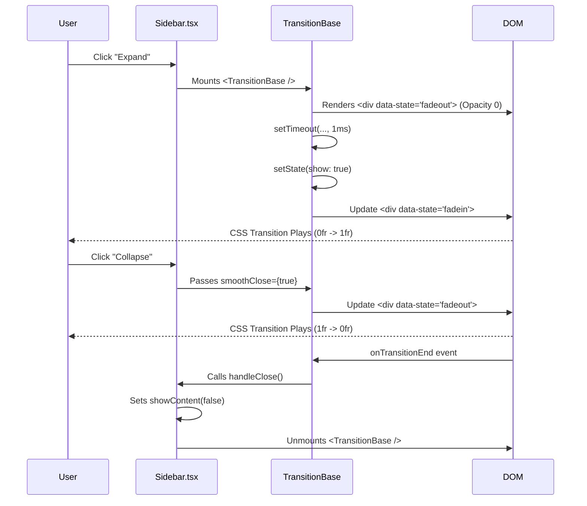

# Transition System Architecture

> **Scope**: `@scnx/core-ui/atoms/transition-base` & `@scnx/design-system`

## 1. Architectural Philosophy

We adhere to a strict **Headless vs. Stylized** separation to ensure "Enterprise-Grade" reusability.

- **`core-ui` (The Brain)**: Handles _Lifecycle Management_. It answers "When should this exist in the DOM?" and "What state is it in?". It knows nothing about pixels or colors.
- **`design-system` (The Skin)**: Handles _Visual Execution_. It answers "How does it look?" (Fade, Slide, Grid Expand).

## 2. Core Constraints & Solutions

### A. The React Unmount Paradox

**Problem**: React removes elements from the DOM _immediately_ when a conditional renders `false` (e.g., `{isOpen && <Menu />}`). Browser CSS transitions cannot run on creating/destroying elements instantly.
**Solution**: `TransitionBase` Acts as a "Death Row" Warden.

- It intercepts the unmount request.
- Instead of unmounting, it signals `data-state="fadeout"`.
- It waits for the browser's `transitionend` event.
- Only _then_ does it execute the actual unmount callback.

### B. The "Height: Auto" Anomaly

**Problem**: CSS cannot transition `height` from `0` to `auto` because the browser calculates `auto` _after_ layout.
**Solution**: **The Grid Rows Technique**.
Instead of animating height, we animate the grid track size.

```scss
.scnx-transition {
  display: grid;
  grid-template-rows: 0fr; // Collapsed
  transition: grid-template-rows 200ms;

  &[data-state="entered"] {
    grid-template-rows: 1fr; // Expanded (Fractional unit adapts to content)
  }
}
```

_Why this works_: `fr` units are animatable values, where `1fr` effectively means "100% of the available content space" (auto-like behavior).

### C. The Race Condition (Rendering vs. Painting)

**Problem**: When mounting a component and immediately setting an "Enter" state, React batches these updates too fast. The browser sees the final state immediately and skips the transition frame.
**Solution**: **The 1ms Tick**.

```ts
// TransitionBase.tsx
useEffect(() => {
  const timeoutId = setTimeout(() => fadeIn(), 1); // <--- CRITICAL
}, []);
```

- **Why 0ms/Immediate fails**: React 18+ automatic batching merges the "Mount" and "Update State" into the same paint frame.
- **Why 1ms works**: It pushes the state update to the _next_ capability of the event loop, forcing the browser to paint the initial "Exit" state first. This creates the delta needed for CSS transitions to trigger.

### D. Prop Pollution (The `isNested` Warning)

**Problem**: `NavigationBase` injects context props (like `isNested`) into its children. If `TransitionBase` blindly spreads `...props` to the underlying `div`, React throws "Invalid DOM Property" warnings.
**Solution**: **Prop Filtering**.
We explicitly destructure and discard internal logic props before spreading `rest` to the DOM.

```ts
const { isNested: _discard, ...domProps } = props;
return <div {...domProps} />;
```

## 3. Implementation Flow Reference



## 4. Why This Stack is "Battle-Tested"

1.  **Zero Layout Thrashing**: Uses CSS Grid/Opacity (GPU friendly) instead of JS-calculated pixel heights.
2.  **Framework Agnostic CSS**: The visual logic resides in SCSS, meaning the logic can be ported or swapped without breaking animations.
3.  **Robust Cleanup**: The `transitionend` listener ensures we never leave "zombie" transparent nodes blocking clicks in the DOM.

## 5. Performance Optimization: Persistent Mode (Sidebar Specific)

**Analysis**: For the Sidebar, we opted for a **Persistent DOM Strategy**.
Instead of unmounting content on collapse, we keep the React Fiber alive but hidden.
**Code**: `if (isExpanded || !showContent || !isClosing) return;` (in handleClose)
**Benefit**:

- **Zero Re-Mount Cost**: Opening the accordion is purely a CSS class change (Instant).
- **Race Condition Immunity**: Rapid toggles don't need to wait for `useEffect` cleanup cycles.
  **Trade-off**: Higher memory usage (DOM nodes stay in memory), but acceptable for a static sidebar menu.
