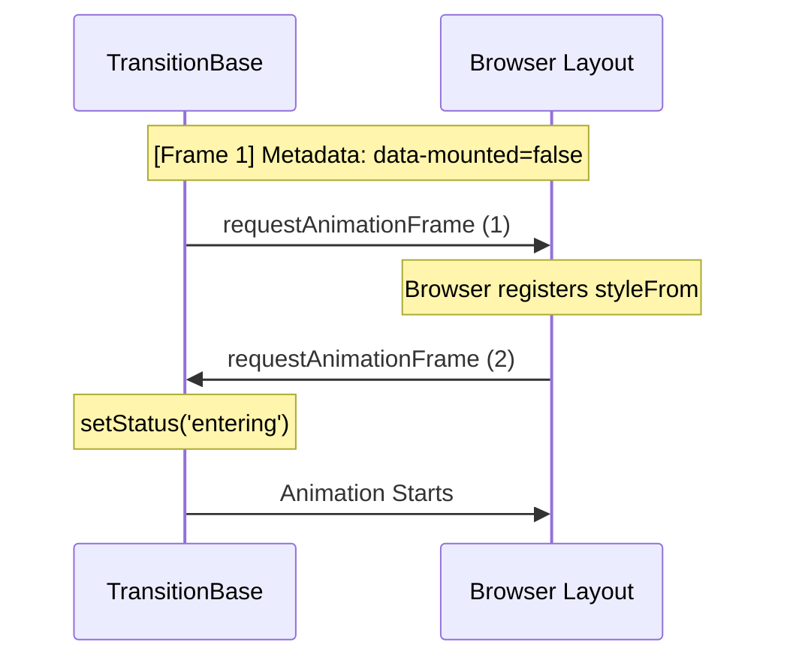

# TransitionBase

> A high-performance, frame-sanitized animation engine specifically designed for complex layout transitions (height: auto, momentum reversal).

**Package**: `@scnx/core-ui`
**Status**: Stable
**Source**: [TransitionBase.tsx](./TransitionBase.tsx)

---

## Table of Contents

1. [Overview](#1-overview)
2. [When to Use](#2-when-to-use)
3. [Quick Start](#3-quick-start)
4. [Components](#4-components)
5. [Usage](#5-usage)
   - 5.1. [Basic Transition](#51-basic-transition)
   - 5.2. [Auto-Height Orchestration](#52-auto-height-orchestration)
6. [API Reference](#6-api-reference)
   - 6.1. [TransitionBase Prop Definitions](#61-transitionbase-prop-definitions)
   - 6.2. [Metadata Export](#62-metadata-export)
7. [Advanced](#7-advanced)
   - 7.1. [Momentum Reversal](#71-momentum-reversal)
   - 7.2. [The "Expert" Double-RAF Flow](#72-the-expert-double-raf-flow)
8. [Internal](#8-internal)
   8- .1. [Frame-Sanitization (The Zero-Stack Mechanism)](#81-frame-sanitization-the-zero-stack-mechanism)
   8- .2. [The 4-Status Finite State Machine (FSM)](#82-the-4-status-finite-state-machine-fsm)
9. [Accessibility (A11y)](#9-accessibility-a11y)
10. [Best Practices](#10-best-practices)
    - 10.1. [Governance: The "Zero-Frame" Rule](#101-governance-the-zero-frame-rule)
    - 10.2. [Initial Lifecycle Integrity](#102-initial-lifecycle-integrity)
11. [Related](#11-related)
12. [Imports](#12-imports)
13. [Changelog](#13-changelog)

---

## 1. Overview

`TransitionBase` is a specialized primitive designed to **orchestrate visual transitions during mount/unmount lifecycles** ensuring reliable layout stability and high-performance state management. It solves the core React limitation where transitions are typically bypassed during the initial mount or the abrupt unmount phase.

### Key Features

- **Rich State Matrix**: Manages complex transition states (step, history and interrupts) within an Orthogonal FSM.
- **Dynamic Reconciliation**: Resolves `height: auto` by injecting fixed pixel measurements during active transitions.
- **Momentum Reversal**: Enables reactive interrupts (e.g., closing while opening) via current-pixel capture and smooth direction swaps.
- **Frame Sanitized**: Employs a Double-RAF pattern and Zero-Stack frame purification to eliminate animation frame stacking.

---

## 2. When to Use

### ✅ Use TransitionBase When

- **Height-Auto Transitions** — Smoothly animating containers from `0` to their natural (dynamic) content height.
- **Mount or Unmount Animations** — Orchestrating entrance transitions (fading in) or exit transitions (fading out) before the component leaves the DOM.
- **Surgical Performance** — Avoiding layout thrashing via forced reflow management in a lightweight engine.

### ❌ Don't Use When

- **Simple Hover Effects** — Use standard CSS transitions for basic property changes.
- **High Frequency** — For 60fps game loops or physics. Use a dedicated engine like Framer Motion.

---

## 3. Quick Start

**Installation:**

```bash
pnpm add @scnx/core-ui
```

**Basic Implementation:**

```tsx
import { TransitionBase } from "@scnx/core-ui/transition-base";

export function FadeIn({ isOpen, children }) {
  return (
    <TransitionBase
      smoothClose={!isOpen}
      styleFrom={{ opacity: 0 }}
      styleTo={{ opacity: 1 }}
    >
      {children}
    </TransitionBase>
  );
}
```

---

## 4. Components

| Standalone       | Description                                                |
| :--------------- | :--------------------------------------------------------- |
| `TransitionBase` | The core OFSM (Orthogonal Finite State Machine) primitive. |

---

## 5. Orchestration Patterns

Bagian ini mendokumentasikan pola integrasi tingkat tinggi untuk mengelola integritas visual selama transisi siklus hidup (*lifecycle transitions*).

### 5.1. The Atomic Mounting Invariant (Double-Sync Flow)
`TransitionBase` memecahkan masalah klasik React di mana animasi sering terlewatkan saat komponen pertama kali di-mount. Engine menggunakan pola **Double-RAF Orchestration** untuk menjamin pendaftaran gaya sebelum transisi dimulai:

1.  **Mounting Phase**: `useEffect` mendeteksi status awal dan memicu `executeFadeIn`.
2.  **RAF 1 (Style Registration)**: Browser mendaftarkan `styleFrom` ke dalam Render Tree sebagai keadaan awal (initial state).
3.  **RAF 2 (Transition Commitment)**: Browser menerapkan `styleTo`. Karena ada jeda satu frame, mesin CSS Transition mengenali adanya perbedaan nilai dari frame sebelumnya dan memulai interpolasi secara mulus.

```tsx
/**
 * Pola Dasar: Fading Presence
 * Menjamin animasi berjalan bahkan saat mount pertama kali.
 */
<TransitionBase
  smoothClose={!isOpen}
  styleFrom={{ opacity: 0 }}
  styleTo={{ opacity: 1 }}
>
  <div className="content">Visual Determinism</div>
</TransitionBase>
```

### 5.2. Layout Reconciliation (The Handshake)
Mekanisme ini merupakan perluasan dari pola Double-Sync di atas untuk menangani `height: auto`. Di dalam RAF kedua (Commitment), engine melakukan **Forced Reflow** untuk mendapatkan `scrollHeight` yang jujur dari konten yang baru saja dirender.

**Handshake Flow:**
- **Pixel Injection**: Engine menyuntikkan nilai pixel tetap (misal: `height: 142px`) untuk memicu transisi dari `0`.
- **Auto Handover**: Setelah transisi selesai (`onTransitionEnd`), engine mengembalikan nilai ke `auto` agar elemen tetap responsif terhadap perubahan konten di masa depan.

```tsx
/**
 * Pola Utama: Accordion/Collapsible
 * Menangani transisi ke tinggi dinamis secara otomatis via Handshake.
 */
<TransitionBase
  smoothClose={!isOpen}
  styleFrom={{ height: 0, opacity: 0, overflow: 'hidden' }}
  styleTo={{ height: 'auto', opacity: 1 }}
>
  <div className="dynamic-panel">
    <p>Konten dengan tinggi dinamis.</p>
  </div>
</TransitionBase>
```

### 5.3. Interrupted Momentum Awareness
`TransitionBase` mendukung interupsi asinkron. Jika properti `smoothClose` berubah di tengah-tengah transisi (misal: user menutup saat baru 40% terbuka), engine melakukan **Reactive Pivot**:
- Membatalkan frame tertunda via `clearPendingFrames` (mencegah *frame stacking*).
- **Rapid-Click Protection**: Secara otomatis membersihkan antrean animasi lama jika user melakukan klik cepat berulang kali, menjamin stabilitas meskipun dalam kondisi stres UI tinggi.
- Menangkap posisi terakhir via `getComputedStyle`.
- Melakukan kalkulasi ulang lintasan dari titik interupsi tanpa *visual snap*.

### 5.4. Managed Side-Effects (Lifecycle Hooks)
Jangan pernah melakukan manipulasi DOM manual di dalam transisi. Gunakan sinkronisasi asinkron melalui callback yang disediakan untuk menjamin stabilitas FSM.

| Callback | Fase FSM | Rekomendasi Penggunaan |
| :--- | :--- | :--- |
| `onOpened` | `settled` | Fokus manajemen (A11y), Inisialisasi Chart/Data heavy. |
| `onClosed` | `closed` | Pembersihan memori, unmounting state eksternal, log audit trail. |

---

## 6. API Reference

### 6.1. TransitionBase Prop Definitions

| Prop               | Type            | Required | Default | Description                                                |
| :----------------- | :-------------- | :------- | :------ | :--------------------------------------------------------- |
| `smoothClose`      | `boolean`       | Yes      | -       | Control the open/closed state for transition.              |
| `styleFrom`        | `CSSProperties` | Yes      | -       | Initial hidden styles.                                     |
| `styleTo`          | `CSSProperties` | Yes      | -       | Final visible styles.                                      |
| `disableAnimation` | `boolean`       | No       | `false` | Bypasses all logic.                                        |
| `onOpened`         | `() => void`    | No       | -       | Callback fired when the transition to `settled` completes. |
| `onClosed`         | `() => void`    | No       | -       | Callback fired when the transition to `closed` completes.  |

### 6.2. Metadata Export

| Attribute          | Value                   | Description               |
| :----------------- | :---------------------- | :------------------------ | ---------- | ----------- |
| `data-state`       | `"closed" \| "entering" | "settled"                 | "exiting"` | FSM Status. |
| `data-mounted`     | `"true" \| undefined`   | Staggering baseline.      |
| `data-interrupted` | `"true" \| undefined`   | Tracks momentum reversal. |

---

## 7. Advanced

### 7.1. Momentum Reversal

When an animation is interrupted (e.g., closing while opening), the engine performs **Capture Live Height**. It captures the exact pixel height at the moment of interruption and reverses from there, preventing the "Visual Snap" bug.

### 7.2. The "Expert" Double-RAF Flow



---

## 8. Internal

### 8.1. The Orthogonal Finite State Machine (OFSM)

The `TransitionBase` engine operates as an **Orthogonal Finite State Machine**. This means it doesn't just track a single linear status, but manages multiple independent state dimensions (Regions) that synchronize to form the final visual output.

**State Regions:**

1. **Primary Phase** (`status`): `closed` → `entering` → `settled` → `exiting`.
2. **Mount Lifecycle** (`isSettled`): Tracks if the component has finished its initial entry.
3. **Interaction Intent** (`isResuming`): Signals if a transition was interrupted mid-flight.

#### 8.1.1. Metadata Attributes

These states are reflected directly in the DOM as `data-*` attributes for styling and observability:

| Attribute          | Logic        | Description                                          |
| :----------------- | :----------- | :--------------------------------------------------- |
| `data-state`       | `status`     | The current phase of the FSM.                        |
| `data-mounted`     | `isSettled`  | Set to `true` once the entry transition is complete. |
| `data-interrupted` | `isResuming` | Set to `true` when a momentum reversal is active.    |

---

### 8.2. Atomic Transition Orchestration (Double-RAF)

React's render cycle is decoupled from the browser's paint cycle. To ensure styles like `height: 0` are registered _before_ the transition to `height: auto` begins, we use the **Double-RAF Sync Invariant**.

#### 8.2.1. The Zero-Stack Mechanism

To prevent "Frame Stacking" (where multiple animation frames fight for the same property), the engine employs a strict sanitization routine:

```tsx
const clearPendingFrames = useCallback(() => {
  animFrameIds.current.forEach(cancelAnimationFrame);
  animFrameIds.current = [];
}, []);
```

#### 8.2.2. The Execution Flow

When a transition is triggered via `applyAtomicTransition`:

1. **Frame Sanitization**: All pending RAF IDs are cancelled.
2. **Reactive Pivot**: The component snaps to its current computed pixel values.
3. **Frame 1 (Setup)**: Browser registers the "Hidden/Initial" styles.
4. **Frame 2 (Commit)**: Browser applies the "Target" styles, triggering the CSS transition.

---

### 8.3. Layout Reconciliation (Height: auto)

CSS cannot natively animate to `height: auto`. `TransitionBase` solves this by performing **Just-In-Time (JIT) Measurement**.

#### 8.3.1. Forced Reflow

Before measuring, the engine forces the layout engine to "wake up" using the `offsetHeight` trick:

```tsx
void nodeRef.current.offsetHeight; // Forces synchronous layout calculation
```

#### 8.3.2. The Pixel-to-Auto Handshake

1. **Capture**: Measures `scrollHeight` of the content.
2. **Transition**: Injects the fixed pixel value (e.g., `142px`) into the inline styles.
3. **Settle**: Once `onTransitionEnd` fires, the engine swaps the fixed pixels for `auto`. This ensures the container remains responsive if the content size changes after the animation.

---

### 8.4. Momentum Reversal (The Surgical Pivot)

One of the most complex challenges in web animation is handling **Interruptions** (e.g., the user clicks "Close" while the "Open" animation is only 40% complete).

#### 8.4.1. Snap-to-Current

Instead of jumping to the end or snapping back to the start, the engine performs a **Surgical Snap**:

1. It reads the `window.getComputedStyle` of the element.
2. It captures the _exact_ pixel height at that microsecond.
3. It sets the local state to that value.

#### 8.4.2. Momentum Kickstart

To bypass browser compositor optimizations that might coalesce frames, we apply a `+/- 1px` adjustment in the direction of the new intent. This "kickstarts" the animation engine, ensuring a smooth direction reversal without a visual "pop".

---

### 8.5. Implementation Patterns

#### 8.5.1. Prop-Ref Pattern

To ensure high-performance handlers like `applyAtomicTransition` remain referentially stable (preventing unnecessary re-renders of the logic), we store volatile props in a ref:

```tsx
const propsRef = useRef({ styleTo, styleFrom, ... });
```

#### 8.5.2. Absolute Reality Tracking

While React state (`status`) is used for rendering, we maintain a `statusRef` for **Synchronous Logic**. This allows effects and handlers to read the "Absolute Reality" of the FSM phase without becoming reactive dependencies or suffering from closure staleness.

#### 8.5.3. Bi-Directional Reconciliation Gate

To handle live prop mutations (e.g., `styleTo` or `styleFrom` changing while the component is mounted or animating), the engine uses a `prevStylesSnapshot.current` gate. It serializes the styles (`JSON.stringify`) to detect actual deltas before the React render phase commits, ensuring that **Reactive Target Selection** safely pivots the layout without triggering redundant animations or double-snapping.

#### 8.5.4. Professional Guard (Short-Circuit)

The engine optimizes for edge-cases where the transition is unnecessary:

- If `disableAnimation` is `true`, it bypasses the entire Double-RAF queue for an instant update.
- If `scrollHeight === 0` (content is empty) or the target is reached instantly during the RAF check, it short-circuits the transition phase and directly lands on `settled`, saving GPU and layout cycles.

---

## 9. Accessibility (A11y)

Ensure child components use appropriate ARIA attributes for hidden state (e.g., `aria-hidden`).

---

## 10. Best Practices

### 10.1. Governance: The "Zero-Frame" Rule

All instances must start at `status="closed"` and `isSettled: false`. This ensures the browser records the "Hidden" state before the React lifecycle triggers the transition.

### 10.2. Initial Lifecycle Integrity

User controls the **Intent** via `smoothClose`, but the component controls the **Lifecycle**. Never manually force `isSettled` outside of the provided internal functions.

---

## 11. Related

- `DisclosureBase`

## 12. Imports

```tsx
import { TransitionBase } from "@scnx/core-ui/transition-base";
```

## 13. Changelog

- **v1.2.0**: Implementation of Atomic Surgical Re-renders and Lifecycle Governance.

---

© 2026 SCNX UI System. All Rights Reserved.
