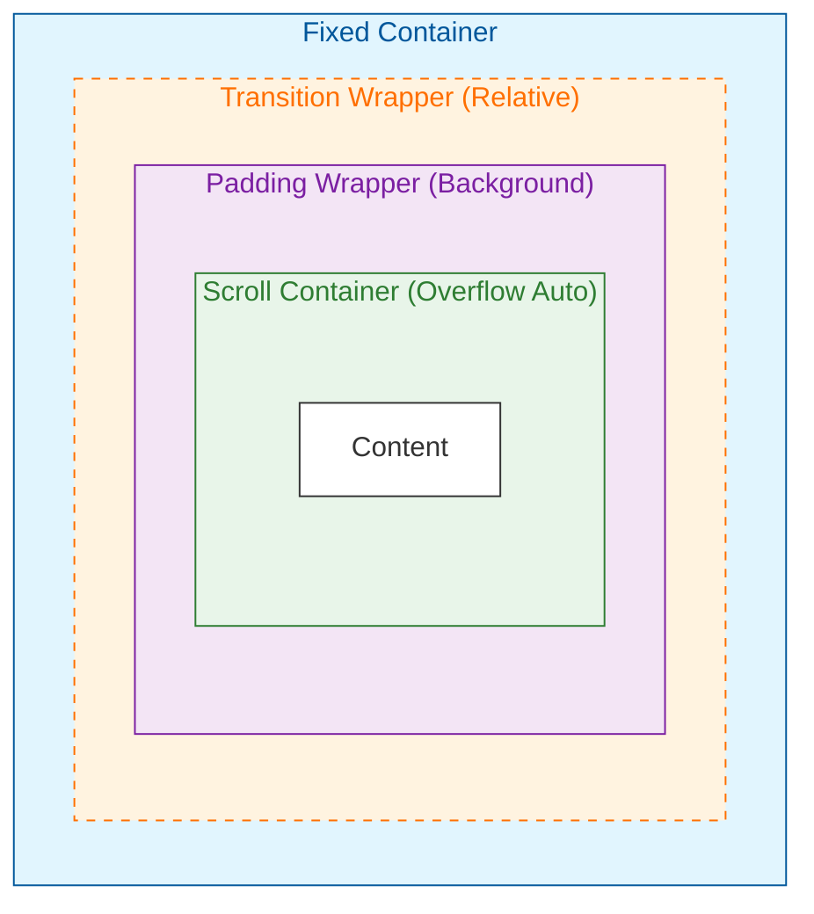

# Sidebar

> Opinionated, feature-rich sidebar component that composes [SidebarBase](../../../../../core-ui/src/components/sidebar-base/README.md) and [NavigationBase](../../../../../core-ui/src/components/navigation-base/README.md).

**Package**: `@scnx/system`
**Status**: Stable
**Source**: [Sidebar.tsx](./Sidebar.tsx)

---

## Table of Contents

1. [Overview](#1-overview)
2. [When to Use](#2-when-to-use)
3. [Quick Start](#3-quick-start)
4. [Components](#4-components)
   - 4.1. [Core Components](#41-core-components)
   - 4.2. [Sub-Components (Internal)](#42-sub-components-internal)
   - 4.3. [Context (Public)](#43-context-public)
   - 4.4. [Context (Internal)](#44-context-internal)
5. [Usage](#5-usage)
   - 5.1. [Basic Usage](#51-basic-usage)
   - 5.2. [Controlled Mode](#52-controlled-mode)
6. [API Reference](#6-api-reference)
   - 6.1. [Components](#61-components)
   - 6.1.1. [SidebarRoot / Sidebar](#611-sidebarroot--sidebar)
   - 6.1.2. [SidebarToggle / Sidebar.Toggle](#612-sidebartoggle--sidebartoggle)
   - 6.1.3. [SidebarHeader / Sidebar.Header](#613-sidebarheader--sidebarheader)
   - 6.1.4. [SidebarNav / Sidebar.Nav](#614-sidebarnav--sidebarnav)
   - 6.1.5. [SidebarFooter / Sidebar.Footer](#615-sidebarfooter--sidebarfooter)
   - 6.1.6. [SidebarFlyout](#616-sidebarflyout)
   - 6.2. [Context & Hooks](#62-context--hooks)
   - 6.2.1. [useSidebarContextValue](#621-usesidebarcontextvalue)
   - 6.2.2. [useSidebar](#622-usesidebar)
   - 6.2.3. [SidebarProvider](#623-sidebarprovider)
   - 6.2.4. [useFlyoutContextValue](#624-useflyoutcontextvalue)
   - 6.2.5. [useFlyout](#625-useflyout)
   - 6.2.6. [useInsideFlyout](#626-useinsideflyout)
   - 6.2.7. [FlyoutProvider](#627-flyoutprovider)
   - 6.2.8. [InsideFlyoutProvider](#628-insideflyoutprovider)
7. [Advanced](#7-advanced)
   - 7.1. [Controlled State & State Bypass](#71-controlled-state--state-bypass)
     - 7.1.1. [Sync Strategies](#711-sync-strategies)
     - 7.1.2. [Props Priority](#712-props-priority)
     - 7.1.3. [Global State (Sidebar)](#713-global-state-sidebar)
     - 7.1.4. [Item State (SidebarNav.Item or Sidebar.Nav.Item)](#714-item-state-sidebarnavitem-or-sidebarnavitem)
8. [Internal](#8-internal)
   - 8.1. [SidebarContext](#81-sidebarcontext)
     - 8.1.1. [SidebarContext Usage in SidebarRoot / Sidebar](#811-sidebarcontext-usage-in-sidebarroot--sidebar)
     - 8.1.2. [SidebarContext Usage in SidebarToggle / Sidebar.Toggle](#812-sidebarcontext-usage-in-sidebartoggle--sidebartoggle)
     - 8.1.3. [SidebarContext Usage in (SidebarNav.Item / Sidebar.Nav.Item)](#813-sidebarcontext-usage-in-sidebarnavitem--sidebarnavitem)
   - 8.2. [FlyoutContext](#82-flyoutcontext)
     - 8.2.1. [FlyoutContext Usage in SidebarFlyout](#821-flyoutcontext-usage-in-sidebarflyout)
   - 8.3. [Styling](#83-styling)
     - 8.3.1. [State Attributes Strategy](#831-state-attributes-strategy)
     - 8.3.2. [Advanced Stagger & Transition Logic](#832-advanced-stagger--transition-logic)
   - 8.4. [Overall Behaviour](#84-overall-behaviour)
     - 8.4.1. [Sidebar Behaviour](#841-sidebar-behaviour)
     - 8.4.2. [Flyout Behaviour](#842-flyout-behaviour)
9. [Accessibility (A11y)](#9-accessibility-a11y)
10. [Best Practices](#10-best-practices)
    - 10.1. [Collapsed State Visuals](#101-collapsed-state-visuals)
    - 10.2. [Deterministic ID Generation](#102-deterministic-id-generation)
    - 10.3. [State Management Discipline (Hybrid Mode)](#103-state-management-discipline-hybrid-mode)
    - 10.4. [Portal Architecture & Context Propagation](#104-portal-architecture--context-propagation)
    - 10.5. [Event Propagation & Inversion of Control](#105-event-propagation--inversion-of-control)
    - 10.6. [Performance & Component Granularity](#106-performance--component-granularity)
    - 10.7. [Child Structure Validation](#107-child-structure-validation)
11. [Related](#11-related)
12. [Imports](#12-imports)
13. [Changelog](#13-changelog)

---

## 1. Overview

An opinionated, feature-rich sidebar implementation that **composes [SidebarBase](../../../../../core-ui/src/components/sidebar-base/README.md) and [Navigation](../../../organisms/navigation/README.md) components**. It facilitates a complete application shell with integrated state management and polished UI behaviors.

### Key Features

- **Collapsible Sidebar**: Smooth width transitions and synchronized content fading.
- **Staggered Animations**: Coordinated staggered nav item animations on sidebar expansion and group expansion, fade-in group transitions with ancestor synchronization, and pre-expanded subtree timing alignment for visual cohesion.
- **Integrated Context State**: Built-in state to control state reflection from `NavigationBase` and `SidebarBase` (e.g. `isOpen`, `isActive`, `isExpanded`, etc.). Supports controlled mode.
- **Root-Level Flyout Menus**: Converts nested children of root-level `Sidebar.Nav.Item` (level 0) into floating flyouts when sidebar is collapsed, allowing access to nested navigation without expanding the sidebar.
- **Smart Flyout Positioning**: Portal-based rendering with intelligent anchor detection (top vs bottom based on available space), sticky behavior when nav item scrolls out of sidebar bounds, and continuous position tracking via RAF loop.
- **Responsive Transitions**: Smooth CSS width transitions between expanded/collapsed states with coordinated content visibility animations.

---

## 2. When to Use

### ✅ Use Sidebar When

- **Rich Interaction** — Need collapsible behavior with flyout menus for nested items.
- **Integrated State** — Need automatic active item tracking, routing synchronization, and auto-expand capabilities.
- **Exclusive Design** — Want a polished, non-generic sidebar with unique collapsible animations and premium interactions.

### ❌ Don't Use When

- **Custom Behavior** — You need a sidebar that behaves completely differently (e.g., push content instead of overlay shrinking). Use `SidebarBase`.
- **Headless** — You want full control over styling. Use `SidebarBase` + `NavigationBase`.
- **Static Navigation** — You just need a simple vertical list of links without collapse/flyout. Use `Navigation`.
- **Mobile Drawer** — This component is optimized for desktop (collapsing). For mobile, consider a separate Drawer pattern.

---

## 3. Quick Start

**Installation:**

```bash
pnpm add @scnx/system
```

**Style Setup:**

Import the base styles and theme in your app entry point (e.g., `main.tsx`). These are required for the design system to render correctly:

```tsx
// Required: Base styles (CSS reset, typography, utilities)
import "@scnx/system/styles/base/_index.scss";

// Required: Theme styles (injects CSS variable tokens for colors, spacing, etc.)
import "@scnx/system/styles/themes/_index.scss";
```

> **[IMPORTANT]**
> Without these imports, components will render without proper styling. The base styles provide foundational CSS reset and utilities, while themes inject CSS variable tokens for colors and theming.

**Basic Implementation:**

```tsx
import { Link, useLocation } from "react-router-dom";
import { Sidebar, SidebarProvider } from "@scnx/system/organisms/sidebar";
import {
  HiOutlineHome,
  HiOutlineCog6Tooth,
  HiChevronRight,
} from "react-icons/hi2";

export function AppShell() {
  const location = useLocation();

  return (
    <div style={{ display: "flex", height: "100vh" }}>
      <SidebarProvider activePath={location.pathname}>
        <Sidebar>
          <Sidebar.Toggle>
            <HiChevronRight />
          </Sidebar.Toggle>
          <Sidebar.Header>MyApp</Sidebar.Header>

          <Sidebar.Nav>
            <Sidebar.Nav.Group>
              <Sidebar.Nav.Item
                as={Link}
                to="/"
                label="Home"
                icon={<HiOutlineHome size={20} />}
              />
              <Sidebar.Nav.Item
                label="Settings"
                icon={<HiOutlineCog6Tooth size={20} />}
                trailingIcon={<HiChevronRight size={18} />}
              >
                <Sidebar.Nav.Group>
                  <Sidebar.Nav.Item
                    as={Link}
                    to="/settings/profile"
                    label="Profile"
                  />
                  <Sidebar.Nav.Item
                    as={Link}
                    to="/settings/account"
                    label="Account"
                  />
                </Sidebar.Nav.Group>
              </Sidebar.Nav.Item>
            </Sidebar.Nav.Group>
          </Sidebar.Nav>

          <Sidebar.Footer>
            <span>John Doe</span>
          </Sidebar.Footer>
        </Sidebar>
      </SidebarProvider>

      <main style={{ flex: 1 }}>{/* Content */}</main>
    </div>
  );
}
```

---

## 4. Components

### 4.1. Core Components

The package provides two usage patterns: **Compound** (recommended) and **Standalone**.

| Compound (Recommended) | Standalone (Internal) | Description                                           |
| :--------------------- | :-------------------- | :---------------------------------------------------- |
| `Sidebar`              | `SidebarRoot`         | Root wrapper. Provides structural slots for children. |
| `Sidebar.Toggle`       | `SidebarToggle`       | Collapse/expand trigger button.                       |
| `Sidebar.Header`       | `SidebarHeader`       | Container for brand/logo (sticky top).                |
| `Sidebar.Nav`          | `SidebarNav`          | Navigation container (scrolling area).                |
| `Sidebar.Footer`       | `SidebarFooter`       | Container for user controls (sticky bottom).          |

### 4.2. Sub-Components (Internal)

- `SidebarFlyout` — Portal-based floating menu. Visible when sidebar is collapsed. Auto-rendered by `Sidebar`.

### 4.3. Context (Public)

- `SidebarProvider` — Wraps `Sidebar`. Manages `SidebarContext` and optionally initializes `FlyoutContext` (enabled by default).
- `useSidebar()` — Accesses sidebar state and actions.

### 4.4. Context (Internal)

**Sidebar:**

- `SidebarContext` — **(Encapsulated)** React Context for sidebar state (active path, expansion map, collapse status, etc.).
- `useSidebarContextValue()` — Creates and manages sidebar state + actions. Used by `SidebarProvider`.

**Flyout:**

- `FlyoutContext` — **(Encapsulated)** React Context for flyout state (portal lifecycle, positioning, interaction handlers, etc.).
- `useFlyoutContextValue()` — Creates and manages flyout state + actions. Used by `FlyoutProvider`.
- `useFlyout()` — Accesses flyout state and actions.
- `FlyoutProvider` — Provider component. Auto-initialized by `SidebarProvider`.

**Flyout Detection:**

- `InsideFlyoutContext` — **(Encapsulated)** React Context (boolean) for detecting flyout boundary.
- `useInsideFlyout()` — Accesses flyout detection flag.
- `InsideFlyoutProvider` — Sets context to `true`. Used internally by `SidebarFlyout`.

---

## 5. Usage

### 5.1. Basic Usage

```tsx
import { Link, useLocation } from "react-router-dom";
import { Sidebar, SidebarProvider } from "@scnx/system/organisms/sidebar";
import { HiHome, HiCog6Tooth, HiChevronRight } from "react-icons/hi2";

function App() {
  const location = useLocation();

  return (
    <SidebarProvider activePath={location.pathname}>
      <Sidebar>
        <Sidebar.Header>
          <span>Brand</span>
          <Sidebar.Toggle>
            <HiChevronRight />
          </Sidebar.Toggle>
        </Sidebar.Header>
        <Sidebar.Nav>
          <Sidebar.Nav.Group>
            <Sidebar.Nav.Item
              as={Link}
              to="/dashboard"
              label="Dashboard"
              icon={<HiHome />}
            />
            <Sidebar.Nav.Item
              as={Link}
              to="/settings"
              label="Settings"
              icon={<HiCog6Tooth />}
            />
          </Sidebar.Nav.Group>
        </Sidebar.Nav>
        <Sidebar.Footer>
          <span>John Doe</span>
        </Sidebar.Footer>
      </Sidebar>
    </SidebarProvider>
  );
}
```

### 5.2. Controlled Mode

For full control over the Sidebar state, pass the `isOpen` prop directly to `<Sidebar>`:

```tsx
const [isOpen, setIsOpen] = useState(false);

<SidebarProvider defaultIsOpen={isOpen}>
  <Sidebar isOpen={isOpen}>
    <Sidebar.Toggle onClick={() => setIsOpen(!isOpen)} />
    <Sidebar.Nav>{/* Your navigation items */}</Sidebar.Nav>
  </Sidebar>
</SidebarProvider>;
```

**Key Points:**

- Set `defaultIsOpen={isOpen}` to match your initial controlled state (prevents unnecessary re-render).
- You must handle all state updates yourself via `onClick` handlers.

For advanced controlled state patterns (item-level control, sync strategies, state bypass), see [Section 7 (Advanced)](#7-advanced).

---

## 6. API Reference

### 6.1. Components

#### 6.1.1. `SidebarRoot` / `Sidebar`

The main container.

**Element:** `<aside>`

| Prop        | Type                | Required | Default          | Description                                                                                         |
| ----------- | ------------------- | -------- | ---------------- | --------------------------------------------------------------------------------------------------- |
| `className` | `string`            | No       | `"scnx-sidebar"` | Component class name.                                                                               |
| `ref`       | `Ref<HTMLElement>`  | No       | -                | React ref                                                                                           |
| `isOpen`    | `boolean`           | No       | -                | **Controlled** state override. Leave `undefined` to use `SidebarProvider` context value.            |
| `variant`   | `"dark" \| "light"` | No       | `"dark"`         | Visual theme variant of the sidebar. `dark` uses primary brand colors, `light` uses surface colors. |

**Note:** `isOpen` prop here forces state (controlled mode), overriding the provider's internal logic only if defined.

> **Composes:** [`SidebarBaseRoot`](../../../../../core-ui/src/components/sidebar-base/README.md#61-sidebarbaseroot--sidebarbase)
> **Props Extends:** `React.HTMLAttributes<HTMLElement>`

**Generated Attributes:**

| Attribute    | Value                         | Description            |
| ------------ | ----------------------------- | ---------------------- |
| `data-state` | `"expanded"` \| `"collapsed"` | Sidebar collapse state |

<br/>

#### 6.1.2. `SidebarToggle` / `Sidebar.Toggle`

Triggers the collapse state. Supports **Inversion of Control**: if `onClick` calls `e.preventDefault()`, the toggle action is cancelled.

**Element:** `<button>`

| Prop        | Type                                   | Required | Default                  | Description                                                         |
| ----------- | -------------------------------------- | -------- | ------------------------ | ------------------------------------------------------------------- |
| `className` | `string`                               | No       | `"scnx-sidebar__toggle"` | Component class name.                                               |
| `ref`       | `Ref<HTMLButtonElement>`               | No       | -                        | React ref                                                           |
| `onClick`   | `MouseEventHandler<HTMLButtonElement>` | No       | -                        | Standard click handler. Call `e.preventDefault()` to cancel toggle. |

> **Composes:** [`SidebarBaseToggle`](../../../../../core-ui/src/components/sidebar-base/README.md#62-sidebarbasetoggle--sidebarbasetoggle)
> **Props Extends:** `React.ButtonHTMLAttributes<HTMLButtonElement>`

**Generated Attributes:**

| Attribute    | Value              | Description         |
| ------------ | ------------------ | ------------------- |
| `aria-label` | `"Toggle sidebar"` | Accessibility label |

<br/>

#### 6.1.3. `SidebarHeader` / `Sidebar.Header`

**Element:** `<div>`

| Prop        | Type                  | Required | Default                  | Description           |
| ----------- | --------------------- | -------- | ------------------------ | --------------------- |
| `className` | `string`              | No       | `"scnx-sidebar__header"` | Component class name. |
| `ref`       | `Ref<HTMLDivElement>` | No       | -                        | React ref             |

> **Composes:** [`SidebarBaseHeader`](../../../../../core-ui/src/components/sidebar-base/README.md#63-sidebarbaseheader--sidebarbaseheader)
> **Props Extends:** `React.HTMLAttributes<HTMLDivElement>`

<br/>

#### 6.1.4. `SidebarNav` / `Sidebar.Nav`

`SidebarNav` wraps the design system's `Navigation` component to provide sidebar-specific context integration. It supports all `Navigation` sub-components:

- `<SidebarNav.Group>`
- `<SidebarNav.Item>`
- `<SidebarNav.Text>`
- `<SidebarNav.Icon>`
- ...and others.

Refer to the [NavigationBase Documentation](../../../../../core-ui/src/components/navigation-base/README.md) for full API details on navigation items.

> **[NOTE]**
>
> **Why `Navigation` instead of `SidebarBaseNav`?**
>
> Although `SidebarBase` includes a navigation primitive (`SidebarBaseNav`), it is **headless** (functionality only).
>
> We explicitly compose the `Navigation` component from the Design System because it is already **wired with the Design System's classnames** and styles. This ensures the sidebar immediately inherits the correct visual language (typography, spacing, states), whereas `SidebarBaseNav` would render raw, unstyled HTML.

> **Composes:** [`Navigation`](../../navigation/README.md)

<br/>

#### 6.1.5. `SidebarFooter` / `Sidebar.Footer`

**Element:** `<div>`

| Prop        | Type                  | Required | Default                  | Description           |
| ----------- | --------------------- | -------- | ------------------------ | --------------------- |
| `className` | `string`              | No       | `"scnx-sidebar__footer"` | Component class name. |
| `ref`       | `Ref<HTMLDivElement>` | No       | -                        | React ref             |

> **Composes:** [`SidebarBaseFooter`](../../../../../core-ui/src/components/sidebar-base/README.md#65-sidebarbasefooter--sidebarbasefooter)
> **Props Extends:** `React.HTMLAttributes<HTMLDivElement>`

<br/>

#### 6.1.6. `SidebarFlyout`

The floating container for nested menus when the sidebar is collapsed. Automatically rendered by `SidebarRoot`, but exposed for advanced custom layouts.

**Element:** `<div>` (Portal to `document.body`)

| Prop        | Type                 | Required | Default                  | Description                                             |
| ----------- | -------------------- | -------- | ------------------------ | ------------------------------------------------------- |
| `className` | `string`             | No       | `"scnx-sidebar__flyout"` | Component class name.                                   |
| `width`     | `string` \| `number` | No       | `undefined`              | Width of the flyout menu. If `undefined`, fits content. |

<br/>

### 6.2. Context & Hooks

#### 6.2.1. `useSidebarContextValue`

Creates and manages the sidebar state + actions. Used internally by `SidebarProvider` but exposed for advanced composition if you need to build a custom provider.

**Parameters:**

| Param           | Type      | Required |   Default   | Description                                                |
| :-------------- | :-------- | :------: | :---------: | :--------------------------------------------------------- |
| `activePath`    | `string`  |    No    | `undefined` | Initial active navigation path (destructured from props).  |
| `defaultIsOpen` | `boolean` |    No    |   `true`    | Initial sidebar collapsed state (destructured from props). |

**Return Value:**

| Value            | Type                                   |           Default            | Description                                                                          |
| ---------------- | -------------------------------------- | :--------------------------: | ------------------------------------------------------------------------------------ |
| `activePath`     | `string`                               | `props.activePath` \|\| `""` | Current active navigation path                                                       |
| `isOpen`         | `boolean`                              |            `true`            | Current collapse state of the sidebar                                                |
| `expandedMap`    | `Record<string, boolean>`              |             `{}`             | Map of expanded state for nested groups (keyed by `id` \| `to` \| `href` \| `label`) |
| `setIsOpen`      | `(value: boolean) => void`             |           `no-op`            | Sets the sidebar open/closed state explicitly                                        |
| `toggleOpen`     | `() => void`                           |           `no-op`            | Toggles the sidebar open/closed                                                      |
| `setExpanded`    | `(id: string, value: boolean) => void` |           `no-op`            | Sets the expansion state of a specific group                                         |
| `toggleExpanded` | `(id: string) => void`                 |           `no-op`            | Toggles the expansion state of a specific group                                      |

> **Note:** `no-op` stands for "No Operation" (e.g., `() => {}`). It's a safe default function that logs a `console.warn` (e.g. `"SidebarContext used without provider"`) to alert you of missing context.

<br/>

#### 6.2.2. `useSidebar`

Accesses the sidebar's state and actions. Must be used within a component wrapped by `SidebarProvider`.

> **Returns:** [`SidebarContextValue`](#621-usesidebarcontextvalue) (see above for details).

<br/>

#### 6.2.3. `SidebarProvider`

Manages state for the sidebar and its flyouts.

| Prop            | Type        | Required | Default     | Description                             |
| --------------- | ----------- | -------- | ----------- | --------------------------------------- |
| `children`      | `ReactNode` | No       | `undefined` | Sidebar components                      |
| `activePath`    | `string`    | No       | `undefined` | Active navigation path for highlighting |
| `defaultIsOpen` | `boolean`   | No       | `true`      | Initial collapsed state                 |
| `withFlyout`    | `boolean`   | No       | `true`      | Whether to enable flyout context/portal |

<br/>

#### 6.2.4. `useFlyoutContextValue`

Creates and manages the flyout state + actions. Used internally by `FlyoutProvider` but exposed for advanced composition.

**Parameters:** None

**Return Value:**

| Value             | Type                                     | Default | Description                                                                                                                                                          |
| :---------------- | :--------------------------------------- | :-----: | :------------------------------------------------------------------------------------------------------------------------------------------------------------------- |
| `activeFlyout`    | `FlyoutState` \| `null`                  | `null`  | The current active flyout object. <br/>`{ ownerId: string \| null, triggerRef: HTMLElement \| null, content: ReactNode \| null }`                                    |
| `isFlyoutClosing` | `boolean`                                | `false` | Whether the flyout is currently animating out.                                                                                                                       |
| `setFlyout`       | `(ownerId, triggerRef, content) => void` | `no-op` | Opens or switches the active flyout.<br/>- `ownerId`: Unique ID for the flyout<br/>- `triggerRef`: The element to anchor to<br/>- `content`: The ReactNode to render |
| `closeFlyout`     | `() => void`                             | `no-op` | Closes the active flyout.                                                                                                                                            |
| `cleanupFlyout`   | `() => void`                             | `no-op` | Clears the flyout state (called after transition).                                                                                                                   |

> **Note:** `no-op` stands for "No Operation" (e.g., `() => {}`). It's a safe default function that logs a `console.warn` (e.g. `"SidebarContext used without provider"`) to alert you of missing context.

<br/>

#### 6.2.5. `useFlyout`

Accesses flyout state. Useful for custom trigger implementations or advanced integrations.

> **Returns:** [`FlyoutContextValue`](#624-useflyoutcontextvalue) (see above for details).

<br/>

#### 6.2.7. `FlyoutProvider`

Manages the state of flyouts. Internal component used by `SidebarProvider`, but can be used standalone for custom setups.

| Prop       | Type        | Required |   Default   | Description                                  |
| :--------- | :---------- | :------: | :---------: | :------------------------------------------- |
| `children` | `ReactNode` |    No    | `undefined` | Components that need access to flyout state. |

<br/>

#### 6.2.6. `useInsideFlyout`

Utility hook that returns `true` if the component is currently rendered inside a flyout portal.

> **Returns:** `boolean`, `true` if inside a flyout, `false` otherwise. Useful for conditional rendering (e.g., hiding icons or simplifying layouts inside flyouts).

<br/>

#### 6.2.8. `InsideFlyoutProvider`

Sets the context specifically for components rendered inside a flyout.

| Prop       | Type        | Required |   Default   | Description                                   |
| :--------- | :---------- | :------: | :---------: | :-------------------------------------------- |
| `children` | `ReactNode` |    No    | `undefined` | Components rendered inside the flyout portal. |

---

## 7. Advanced

### 7.1. Controlled State & State Bypass

This section explains the advanced state management strategies used by the Sidebar component system. Understanding these patterns is essential for implementing fine-grained control over Sidebar and `SidebarNav.Item` or `Sidebar.Nav.Item` behavior.

**Important:** Controlled props interact with the internal context using distinct strategies (**Sync**, **Initial Seed**, or **Bypass**) to balance flexibility and performance. They do not always bypass internal logic; behavior depends on the specific prop.

#### 7.1.1. Sync Strategies

- **`isOpen`** (Sidebar): **Continuous Override**. The prop value always takes precedence. If an internal toggle occurs (e.g., user clicks toggle button) but the prop remains unchanged, the internal state will be forced back to match the prop (triggering a re-render).
- **`isExpanded`** (`SidebarNav.Item` or `Sidebar.Nav.Item`): **Initial Seed / Bypass**. Prop syncs with context once on mount (initial seed), afterwards it bypasses the context and is no longer synced (unless the component remounts).
- **`isActive`** (`SidebarNav.Item` or `Sidebar.Nav.Item`): **Bypass**. Pure render-time bypass; internal routing logic is ignored if this prop is present.

#### 7.1.2. Props Priority

1. **PROPS** on `Sidebar` / (`SidebarNav.Item` or `Sidebar.Nav.Item`) (`isOpen`, `isActive`, `isExpanded`) — **Top Priority (Override)**
2. **CONTEXT** from `SidebarProvider` — **Standard Source of Truth**

If you use `SidebarProvider`, rely on it. Only pass props to `Sidebar` if you intend to override the context.

#### 7.1.3. Global State (Sidebar)

```tsx
// ✅ Recommended: Context handles state
<SidebarProvider defaultIsOpen={false}>
  <Sidebar>...</Sidebar>
</SidebarProvider>

// ⚠️ Controlled: You handle EVERYTHING
// Set defaultIsOpen={isOpen} to prevent initial sync re-render
<SidebarProvider defaultIsOpen={isOpen}>
  <Sidebar isOpen={isOpen}>
    <Sidebar.Toggle onClick={() => setIsOpen(!isOpen)} />
  </Sidebar>
</SidebarProvider>
```

**Static Initialization** (`defaultIsOpen`):

- Value is assigned to state on **initial render only**.
- Subsequent changes to this prop are ignored.
- **Usage:** Set initial state, then let Sidebar handle updates internally.

**Controlled Mode** (`isOpen`):

- Forces state on every render, ignoring internal logic.
- **Usage:** You must handle all state updates yourself. Set `defaultIsOpen={isOpen}` to match your **initial controlled state**. This prevents an unnecessary re-render during the first prop-to-context sync.

#### 7.1.4. Item State (`SidebarNav.Item` or `Sidebar.Nav.Item`)

`isActive` and `isExpanded` props function as specific bypasses for individual items.

**Important:**

- **Initial Render:** If `isExpanded` is provided, it **syncs once** to the context state on mount.
- **Subsequent Renders:** It acts as a **State Bypass**, forcing the visual state without updating context.

```tsx
<Sidebar.Nav.Item
  to="/dashboard"
  isActive={true} // Visual bypass
  isExpanded={true} // sync on mount, then visual bypass
>
  ...
</Sidebar.Nav.Item>
```

---

## 8. Internal

### 8.1. SidebarContext

This context handles the **structural** state and actions of the sidebar (`SidebarBase` state reflection and `NavigationBase` state reflection).

**Provider Implementation:**
The `SidebarProvider` delegates its state management to the `useSidebarContextValue` hook. This separation allows for cleaner component architecture and performance optimization via `useMemo` for children rendering.

> For the complete list of state and actions accessible from this context, please refer to [Section 6.2.1. useSidebarContextValue](#621-usesidebarcontextvalue).

#### 8.1.1. SidebarContext Usage in `SidebarRoot` / `Sidebar`

This implementation prioritizes the controlled `isOpen` prop to update the global `SidebarContext` state, ensuring synchronization across the involved components.

```tsx
const { isOpen: contextIsOpen, setIsOpen } = useSidebar();
const finalIsOpen = isOpen ?? contextIsOpen;

// Sync Prop -> Context
useEffect(() => {
  if (isOpen !== undefined) {
    setIsOpen(isOpen);
  }
}, [isOpen, setIsOpen, contextIsOpen]);

return (
  <>
    <SidebarBaseRoot
      className={cn("scnx-sidebar", className)}
      isOpen={finalIsOpen} // Pass the actual state
      {...props}
    />
    <SidebarFlyout />
  </>
);
```

#### 8.1.2. SidebarContext Usage in `SidebarToggle` / `Sidebar.Toggle`

The toggle button consumes `useSidebar` to trigger `toggleOpen`, while respecting the "Inversion of Control" pattern via `onClick` event prevention.

```tsx
const { toggleOpen } = useSidebar();

const handleClick = (e: React.MouseEvent<HTMLButtonElement>) => {
  onClick?.(e);

  // Inversion of control:
  // If `onClick` calls `e.preventDefault()`, we skip the context toggle.
  if (!e.defaultPrevented) {
    toggleOpen();
  }
};

return (
  <SidebarBaseToggle
    className={cn("scnx-sidebar__toggle", className)}
    onClick={handleClick}
    {...props}
  >
    {children || "☰"}
  </SidebarBaseToggle>
);
```

#### 8.1.3. SidebarContext Usage in (`SidebarNav.Item` / `Sidebar.Nav.Item`)

> **🧠 Mental Model (Core Logic):**
> This section details the **compound state derivation** that makes the Sidebar work. It explains how we reconcile **Props** (controlled), **Context** (global), and **Local State** (transitions) into a single truth.

Manages deep navigation integration, binding local expansion state, active path tracking, and transition lifecycles with the global `SidebarContext`.

<u>**Owner ID Resolution:**</u>

Derives a stable identifier from props for tracking expansion state in context.

```tsx
// Initial mount tracker
const initRender = useRef(true);

const ownerId = props.id || props.to || props.href || props.label || "";
```

> **Critical:** The `ownerId` is used as the key for managing group expand/collapse state in the `expandedMap`. To ensure expansion state synchronization between the main Sidebar and the Flyout, `ownerId` is derived from stable props (`id`, `to`, `href`, or `label`). This guarantees that the same navigation item generates the same ID in both contexts.

<u>**Context & State Initialization:**</u>

Accesses sidebar context, flyout context, and initializes local state for children visibility and closing animation.

**Source:** [utils.ts](./utils.ts)

```tsx
const checkPathMatchRecursive = (
  activePath: string,
  itemPath: string | undefined,
  children: ReactNode,
): boolean => {
  if (!activePath) return false;

  const isSelfMatch =
    itemPath &&
    (activePath === itemPath || activePath.startsWith(`${itemPath}/`));

  if (isSelfMatch) return true;

  const isPathInSubtree = (node: ReactNode, targetPath: string): boolean => {
    return Children.toArray(node).some((child) => {
      if (!isValidElement<NavigableChildProps>(child)) return false;
      const props = child.props;
      const childPath = props.to || props.href;

      // Check exact match
      if (childPath === targetPath) return true;

      // Recurse if there are children
      if (props.children) {
        return isPathInSubtree(props.children, targetPath);
      }
      return false;
    });
  };

  return isPathInSubtree(children, activePath);
};
```

> **Note:** `checkPathMatchRecursive` recursively checks if the active path matches this `SidebarNav.Item` / `Sidebar.Nav.Item` path or any of its descendant paths. Used to determine if a `SidebarNav.Group` / `Sidebar.Nav.Group` should auto-expand because it contains the active Item.

```tsx
const itemPath = props.to || props.href;

const currentLevel = useNavigationLevel();
const { activePath, isOpen, expandedMap, setExpanded, toggleExpanded } =
  useSidebar();
const { setFlyout, closeFlyout } = useFlyout();

// Children rendering and transition state
const [showContent, setShowContent] = useState(() => {
  const isInitialMatch = checkPathMatchRecursive(
    activePath || "",
    itemPath,
    children,
  );
  return props.isExpanded ?? expandedMap[ownerId] ?? isInitialMatch;
});
const [isClosing, setIsClosing] = useState(false);

// Derived actual state for active and expanded state
const isActive =
  controlledIsActive ??
  ((activePath && itemPath === activePath) as boolean | undefined);
const isExpanded = props.isExpanded ?? expandedMap[ownerId] ?? showContent;
```

Terms:

- `Group`: `SidebarNav.Group`/`Sidebar.Nav.Group`
- `Item`: `SidebarNav.Item`/`Sidebar.Nav.Item`

Expansion State Management:

- `showContent`: Controls whether children are rendered. Initialized based on `isExpanded` prop, `expandedMap` context, or active path matching.
- `isClosing`: Signals the `<Transition>` component to run its exit animation before unmount.
- `isExpanded`: Derived actual state combining `props.isExpanded`, `expandedMap[ownerId]`, and `showContent` fallback.

Initialization Logic:

1. `props.isExpanded` takes **highest priority**. If explicitly set, it overrides internal state (e.g., set to `false` forces collapse; set to `true` forces expand). If `undefined`, it falls back to `expandedMap`.
2. `expandedMap[ownerId]` is checked to preserve expansion state across component re-renders.

   **Critical:** Without this check, a mismatch between `isInitialMatch` (derived from `checkPathMatchRecursive`) and `expandedMap[ownerId]` (persisted from user interaction) causes visual glitches or non-smooth transitions due to an immediate re-render.

   **The core issue**: `showContent` initializes from `isInitialMatch`, while `isExpanded` prioritizes `expandedMap[ownerId]`. When these values differ, the component mounts with `showContent` ≠ `isExpanded`, triggering a `useEffect` sync that causes a visible state change mid-render.

   Example:

   A nested `Group` containing the active `Item` is triggered to collapse, then its parent is also triggered to collapse. When reopening the parent, the nested `Group` initializes `showContent=true` (from `isInitialMatch`, since it contains the active path), but `isExpanded=false` (from `expandedMap`, persisted from the previous collapse). This mismatch triggers a "flash open then close" glitch.

   _The inverse case_: a `Group` without active items is triggered to expand, then its parent is triggered to collapse and reopened. Since `showContent` controls mount/unmount, every expanded item reinitializes its `showContent` state on each remount. Now `showContent=false` (since `isInitialMatch` returns `false`, no active item in the group), but `isExpanded=true` (persisted in `expandedMap`). This causes a delayed expansion with non-smooth animation.

   > **[IMPORTANT]**
   > The fallback chain order in `showContent` initialization (`props.isExpanded ?? expandedMap[ownerId] ?? isInitialMatch`) **must match** the order in `isExpanded` derivation (`props.isExpanded ?? expandedMap[ownerId] ?? showContent`). Any order mismatch will cause re-renders and visual glitches.

3. `checkPathMatchRecursive` traverses the `Item`'s children to find an exact match or prefix match with `activePath`. If the active `Item` is found within the children, `showContent` initializes as expanded. This recursive check propagates up the tree, causing all ancestor `Group`s of the active `Item` to auto-expand.

Animated Mount/Unmount Lifecycle:

1. _Mount_: `showContent` → `true` → children render → `<Transition>` animates in.
2. _Unmount_: `isClosing` → `true` → exit animation runs → `handleClose` sets both `showContent` and `isClosing` to `false` → children unmount.

Active State Management:

- `isActive`: Derived state indicating if this `Item` matches the current `activePath`. Falls back to comparing `itemPath` with `activePath` if `controlledIsActive` prop is not provided.
- _No sync required:_ Unlike `isExpanded`, `isActive` is purely derived each render from context (`activePath`) and props (`itemPath`). The active path is controlled externally (typically by router), so there's no local state to sync, just read and render.

> **[WARNING]**
> **Future consideration:** This approach is safe because `SidebarContext` doesn't process or mutate `activePath`, it's passed through as-is. If future requirements introduce `activePath` processing (e.g., programmatic navigation, path transformation), evaluate whether `useEffect` sync is needed to maintain consistency.

<a id="content-rendering-with-transition"></a>
<u>**Content Rendering with Transition:**</u>

```tsx
const content =
  showContent && isValidElement(children) ? (
    <Transition
      disableAnimation={initRender.current && showContent}
      smoothClose={isClosing}
      handleClose={() => {
        setShowContent(false);
        setIsClosing(false);
      }}
      styleFrom={{ height: 0 }}
      styleTo={{ height: !isOpen && currentLevel === 0 ? 0 : "auto" }}
    >
      {children}
    </Transition>
  ) : null;
```

Conditionally renders children wrapped in `<Transition>` to handle expansion animations. Key props for UX and Layout:

1. **Strict Child Validation (`React.isValidElement`)**: Validates that `children` is a **single React Element** (i.e., exactly one `SidebarNav.Group`), enforcing a strict hierarchy. This prevents rendering invalid structures:
   - **✅ Valid**: `<SidebarNav.Item><SidebarNav.Group>...</SidebarNav.Group></SidebarNav.Item>`
   - **❌ Invalid**: Arrays (`[<Group1 />, <Group2 />]`), Fragments (`<>...</>`), or multiple children.
   - **Why**: The expansion logic relies on a single, predictable child element for transition management. Arrays/fragments break this contract.

2. **Animation Suppression (`disableAnimation`)**: The prop suppresses expansion animation during the initial render (`initRender.current`). This ensures that active `SidebarNav.Item`/`Sidebar.Nav.Item` at any nesting level appear instantly expanded without distracting transitions on page load.

   Initial render is not always a full page render. For non-initial page renders, if a group containing an active item was previously closed, the `expandedMap` state is `false` (no longer `undefined`). Thus, the initial assignment of `showContent` prioritizes the value from Context over `initialMatch`. When later expanded again, `initRender` is already `false`, ensuring the animation runs normally.

3. **Root Level Collapse (`!isOpen && currentLevel === 0 ? 0 : "auto"`)**: Forces root-level expanded items to collapse (height: 0) when the global sidebar is in "mini" (collapsed) mode. This prevents unsightly vertical gaps between root navigation icons that would occur if the children remained expanded but invisible.

<u>**Initial Expansion Sync:**</u>

```tsx
useEffect(() => {
  if (
    expandedMap[ownerId] === undefined &&
    isExpanded &&
    Children.count(children)
  ) {
    setExpanded(ownerId, true);
  }
  initRender.current = false;
}, []);
```

On mount, this logic serves two key purposes:

1. Sync Initial Match (First Page Render): If `isExpanded` is true (from `initialMatch`) but `expandedMap` is undefined (empty context), it registers the state. This ensures auto-expanded items are properly tracked in context immediately after a full page reload.
2. Enable Animation: Sets `initRender.current = false`, allowing subsequent interactions to trigger smooth transitions (since `disableAnimation` relies on this flag).

<u>**Expansion State Sync:**</u>

```tsx
useEffect(() => {
  if (isExpanded) {
    setShowContent(true);
    setIsClosing(false);
  } else if (showContent) {
    setIsClosing(true);
  }
}, [isExpanded]);
```

Syncs local visibility state (`showContent`, `isClosing`) with the actual derived `isExpanded` state. This enables the mount/unmount lifecycle described before.

> **Logic:** While `expandedMap` updates via context, it doesn't directly control the mounting of children. The `useEffect` bridges this by syncing the derived `isExpanded` state to `showContent` (the render gate). This separation allows us to intercept the state change and trigger exit animations (`isClosing`) before unmounting.

<u>**Navigation Click Actions (Expansion & Flyout):**</u>

Handles user interactions based on the sidebar's state (`isOpen`) and item hierarchy level.

```tsx
const handleClick = (e: MouseEvent<HTMLElement>) => {
  onClick?.(e);
  if (e.defaultPrevented) return;

  if (!isOpen) {
    if (currentLevel === 0) {
      if (isValidElement(children) && Children.count(children)) {
        setFlyout(
          ownerId,
          e.currentTarget as HTMLElement,
          <NavigationLevelContext.Provider value={currentLevel + 1}>
            {children}
          </NavigationLevelContext.Provider>,
        );
      }
    } else {
      if (
        isValidElement(children) &&
        Children.count(children) &&
        props.isExpanded === undefined &&
        controlledIsActive === undefined
      ) {
        toggleExpanded(ownerId);
      } else {
        closeFlyout();
      }
    }
  } else if (
    isValidElement(children) &&
    Children.count(children) &&
    props.isExpanded === undefined &&
    controlledIsActive === undefined
  ) {
    toggleExpanded(ownerId);
  }
};
```

Manages sidebar interactions (expansion, flyouts) while respecting **Inversion of Control**. The internal logic executes _after_ your custom `onClick` prop, allowing you to intercept or prevent default behaviors if needed. The logic is divided into two main cases:

1. Sidebar Expanded (`isOpen=true`):
   - _Toggle Expansion_: If the item has children (`isValidElement` & `count > 0`) AND is **uncontrolled** (no `isExpanded` or `isActive` props passed), clicking toggles its local expansion state (`toggleExpanded`).
     > **Note**: If `isExpanded` or `isActive` props are provided (Controlled Mode), the internal toggle logic is bypassed. This behavior is intentional, allowing you to manage state updates manually via your own `onClick`.

2. Sidebar Collapsed (`isOpen=false`):
   - Root Level Item (Level 0):
     - _Trigger Flyout_: If the item has children, it **does not expand locally**. Instead, it triggers `setFlyout` to open a floating menu positioned relative to the clicked item.
       > **Note:** This behavior can be disabled by setting `withFlyout={false}` on `SidebarProvider`.

   - Nested Item (Inside Flyout):
     - _Toggle Expansion_: Behave identically to the "Sidebar Expanded" state — clicking toggles the nested group's expansion within the flyout.
     - _Close Flyout_: Otherwise, it triggers `closeFlyout` to dismiss the menu after navigation, ensuring a clean UX.

> **See Also:** For detailed implementation of `setFlyout` and `closeFlyout`, refer to the [FlyoutContext](#72-flyoutcontext) section.

<u>**Render Navigation Item:**</u>

```tsx
return (
  <Navigation.Item
    onClick={handleClick}
    isActive={isActive}
    isExpanded={isExpanded}
    {...props}
  >
    {content}
  </Navigation.Item>
);
```

Renders the final `Navigation.Item`. Note that:

1. `isExpanded` prop receives the **actual derived state**, ensuring the UI arrow/icon transition is perfectly synchronized with the content expansion animation, preventing any visual mismatch.
2. `{content}` is **conditionally rendered** based on `showContent`. If collapsed, it evaluates to `null` (unmounted), ensuring the DOM remains lightweight.

> **Warning:** Do NOT use `showContent` for the `isExpanded` prop.
> During unmount/collapse, `showContent` must remain `true` while the exit transition runs (to keep the DOM alive). If used for the arrow, the icon would stay "expanded" until the animation finishes (delayed feedback).
> `isExpanded` flips instantly to `false` on click, allowing the arrow to rotate immediately while the content gracefully animates out.

---

### 8.2. FlyoutContext

> **🧠 Mental Model (Transition Orchestrator):**
> `FlyoutContext` acts as a **Traffic Controller** for the portal. It doesn't just "show/hide" content; it manages a **Queue System** to ensure smooth handovers between different flyouts.
>
> - **Same Trigger?** Toggle Close/Open.
> - **Different Trigger?** Enqueue the new one -> Close current (animate out) -> Open new (animate in).

This context manages the **portal-based** flyout state, architecturally **decoupled** from the main sidebar.

**Provider Implementation:**
The `FlyoutProvider` uses the `useFlyoutContextValue` hook to manage its internal queue system and transition states. This hook ensures that flyout logic remains isolated from the UI rendering layer.

> For the complete list of state and actions accessible from this context, please refer to [Section 6.2.4. useFlyoutContextValue](#624-useflyoutcontextvalue).

**Debug Utilities:**

| Export                 | Type            | Description                                                                                                            |
| ---------------------- | --------------- | ---------------------------------------------------------------------------------------------------------------------- |
| `InsideFlyoutProvider` | `React.FC`      | Wraps flyout content to enable detection. Used internally by `SidebarFlyout`.                                          |
| `useInsideFlyout`      | `() => boolean` | Returns `true` if component is rendered inside a flyout, `false` otherwise. Useful for debugging or conditional logic. |

#### 8.2.1. FlyoutContext Usage in `SidebarFlyout`

> **🧠 Mental Model (Portal & Positioning Engine):**
>
> - **Portal Strategy:** Renders outside the main DOM (`document.body`) to bypass `overflow: hidden` of the sidebar.
> - **RAF Loop:** Uses `requestAnimationFrame` to continuously track the trigger element's position. This costs slightly more CPU than event listeners but guarantees **robustness** against any layout shift (scroll, resize, animation) without complex observers.
> - **Smart Anchor:** Calculates space "Above vs Below" to decide whether to anchor to Top or Bottom, ensuring the flyout never gets cut off by the viewport.

Manages the portal rendering, positioning logic, and global click-outside behavior using the [`useOnClickOutside`](../../../../../core-ui/src/hooks/use-on-click-outside/README.md) hook.

<u>**1. Setup & State:**</u>

Initializes refs (**`flyoutRef` is used to calculate position**) and consumes the context.

```tsx
const flyoutRef = useRef<HTMLDivElement>(null);
const { activeFlyout, isFlyoutClosing, closeFlyout, cleanupFlyout } =
  useFlyout();
const [pos, setPos] = useState<CSSProperties>({});
```

<u>**2. Smart Click-Outside Logic:**</u>

```tsx
const refs = useMemo(() => {
  // Optimization: flyoutRef is pass-by-reference (stable).
  // We don't need it as a dep; the hook reads the latest .current at runtime.
  return activeFlyout?.triggerRef
    ? [flyoutRef as RefObject<HTMLElement>, activeFlyout.triggerRef]
    : null;
}, [activeFlyout?.triggerRef]);

const handleClickOutside = useCallback(() => {
  if (activeFlyout) {
    closeFlyout();
  }
}, [activeFlyout, closeFlyout]);

useOnClickOutside(refs, activeFlyout ? handleClickOutside : undefined);
```

Prevents "toggle flicker" by explicitly **excluding the trigger button** from the outside-click detection.

- _Problem:_ If you click the same button that opened the flyout, Bubbling causes an immediate toggle (Open -> Close). This rapid state change can bypass `Transition` lifecycles, causing `cleanupFlyout` to be skipped. Result: The flyout disappears visually but **remains stuck in the DOM** (Zombie Element).
- _Solution:_ Pass `[flyoutRef, activeFlyout.triggerRef]` to ignore clicks on both the flyout AND the trigger.

<u>**3. Robust Positioning Engine (RAF Loop):**</u>

```tsx
useEffect(() => {
  if (!activeFlyout?.triggerRef || !flyoutRef.current) return;

  let rafId: number;
  let prevPosJSON = "";

  const updatePosition = () => {
    const triggerEl = activeFlyout?.triggerRef;
    const flyoutEl = flyoutRef.current;
    if (!triggerEl || !flyoutEl) return;

    const li = triggerEl.parentElement;
    const triggerRect = li?.getBoundingClientRect();
    if (!triggerRect) return;

    // Find the sidebar element to get its bounds
    const sidebar = li?.closest(".scnx-sidebar");
    const sidebarRect = sidebar?.getBoundingClientRect();

    // Use sidebar bounds as the constraint
    const containerBottom = sidebarRect?.bottom ?? window.innerHeight;
    const containerTop = sidebarRect?.top ?? 0;

    // Calculate available space above and below trigger
    const spaceAbove = triggerRect.bottom - containerTop;
    const spaceBelow = containerBottom - triggerRect.top;

    const left = triggerRect.left + triggerRect.width;

    // Simple rule: if more space above than below, anchor to bottom
    const useBottomAnchor = spaceAbove > spaceBelow;

    let newPos: React.CSSProperties = {};
    const widthVal = typeof width === "number" ? `${width}px` : width;

    if (useBottomAnchor) {
      // Sticky Bottom Logic
      const stickBottomEdge = Math.min(triggerRect.bottom, containerBottom);
      // CSS 'bottom' is measured from viewport bottom (Y inverted).
      // stickBottomEdge is from viewport top. Invert: innerHeight - Y.
      const bottomValue = window.innerHeight - stickBottomEdge;
      const availableHeight = stickBottomEdge - containerTop;

      newPos = {
        position: "fixed",
        top: "auto",
        bottom: bottomValue,
        left,
        width: width,
        maxHeight: `${availableHeight}px`,
      };
    } else {
      // Sticky Top Logic
      const stickTopEdge = Math.max(triggerRect.top, containerTop);
      const availableHeight = containerBottom - stickTopEdge;

      newPos = {
        position: "fixed",
        top: stickTopEdge,
        bottom: "auto",
        left,
        width: width,
        maxHeight: `${availableHeight}px`,
      };
    }

    // Only update state if position style actually changed
    const newPosJSON = JSON.stringify(newPos);
    if (newPosJSON !== prevPosJSON) {
      setPos(newPos);
      prevPosJSON = newPosJSON;
    }

    rafId = requestAnimationFrame(updatePosition);
  };

  // Start Loop
  updatePosition();

  return () => cancelAnimationFrame(rafId);
}, [width, activeFlyout?.triggerRef]);
```

Uses `requestAnimationFrame` to continuously track the trigger's position. This ensures the flyout "sticks" to the button perfectly during layout shifts (scroll, resize, animations).

1. _Initial Position (`left`)_: Calculates the flyout's internal start position relative to the Trigger (`triggerRect.left + triggerRect.width`).
2. _Vertical Constraints (`maxHeight`)_: Determines the Sidebar boundaries (`.closest(".scnx-sidebar")`) to calculate the maximum available height, preventing overflow.
3. _Sticky Anchoring (`top` vs `bottom`)_: Compares available space above and below the trigger.
   - _Top Anchor:_ If more space below, it anchors to `top`.
     > _Clamping Logic (`Math.max`):_ We calculate `stickTopEdge = Math.max(TriggerTop, ContainerTop)`. This clamps the anchor to the Container's top edge, ensuring the flyout remains visible at the Sidebar's top lip even if the trigger scrolls up out of view.
   - _Bottom Anchor:_ If more space above, it anchors to `bottom`.
     > _Clamping Logic (`Math.min`):_ We calculate `stickBottomEdge = Math.min(TriggerBottom, ContainerBottom)`. Since browser Y-coordinates start from 0 (top) and increase downwards, this effectively clamps the anchor point to the Container's bottom edge. If the trigger scrolls below the Sidebar, the flyout "sticks" to the Sidebar's bottom lip instead of disappearing off-screen.

<u>**4. Portal Rendering & Transition:**</u>

Renders content into `document.body` (Portal) to bypass Sidebar's overflow.

```tsx
// SSR guard + Render condition (must have content to show)
if (typeof document === "undefined" || !activeFlyout?.content) return null;

return createPortal(
  <div ref={flyoutRef} className={className} style={pos}>
    <Transition
      key={activeFlyout.ownerId}
      smoothClose={isFlyoutClosing}
      handleClose={() => {
        cleanupFlyout();
      }}
      styleFrom={{ height: 0 }}
      styleTo={{ height: "auto" }}
    >
      <div>
        <div style={{ maxHeight: `calc(${pos.maxHeight} - 2rem)` }}>
          <InsideFlyoutProvider>{activeFlyout.content}</InsideFlyoutProvider>
        </div>
      </div>
    </Transition>
  </div>,
  document.body,
);
```

> **Best Practice:** `key={activeFlyout.ownerId}` is used to guarantee a **fresh transition instance**. While the queue system already handles this by setting `activeFlyout` to `null` before switching (naturally unmounting the previous instance), adding `key` ensures React treats the new flyout as a distinct tree, preventing any theoretical "ghost state".

**Internal Structure:**
The flyout uses a layered structure for proper scrolling and visual styling (visualized below as a **Mermaid Nested Subgraph**):



- _Transition Wrapper_: The outer container that encloses the entire flyout box (Padding + Scroll). It manages the **mounting and unmounting animations** (height/opacity) for the whole subtree.
- _Padding Wrapper_: The visual container with internal padding that stays fixed during scroll.
- _Scroll Container_: The scrollable area with `maxHeight: calc(availableHeight - 2rem)` to account for padding.

---

### 8.3. Styling

Values are tokenized using SCSS variables for maintainability. The styling strategy rigorously follows the **Component -> State -> Child** pattern to prevent style leaking.

```scss
// 1. Component
.scnx-sidebar {
  // 2. State
  &[data-state="expanded"] {
    // 3. Child
    .scnx-sidebar__toggle {
      transform: rotate(180deg);
    }
  }
}
```

- _Namespace_: All classes are prefixed with `.scnx-sidebar` to avoid global collisions.
- _BEM Structure_:
  - Block: `.scnx-sidebar`
  - Element: `__toggle`, `__header`, `__navigation`, `__footer`, `__flyout`
- _Variables_: Refer to **Design System Tokens** for color, spacing, and typography mapping.

#### 8.3.1. State Attributes Strategy

We strictly use `data-attributes` (e.g., `data-state="expanded"`) instead of utility classes (`.is-open`) for state management:

- _Selector Orthogonality_: Keeps styling (_Classes_) decoupled from logic (_Attributes_).
- _Reusability_: Ensures the component remains framework-agnostic (consumable by Tailwind, SCSS, or CSS-in-JS).

> **[NOTE]**
> While the **class vs data-attribute** separation is orthogonal, the overall styling architecture is **not purely orthogonal**. It is **well-structured** but **structurally coupled** (relies on specific BEM hierarchy like `.scnx-sidebar__toggle`) and **DOM-dependent** (requires specific parent-child relationships for selectors like `.scnx-sidebar[data-state="expanded"] .scnx-sidebar__toggle`). This trade-off ensures predictable styling but limits flexibility in DOM restructuring.

#### 8.3.2. Advanced Stagger & Transition Logic

This section details the behavior of the Stagger Animation, which is split into two distinct execution strategies based on the expansion context:

- _Level 0 items_ stagger when the Sidebar switches from collapsed to expanded.
- _Level >= 1 items_ (nested) stagger when their parent group is expanded.

**Strategy 1: Root Expansion and Sidebar Switching**

When the Sidebar transitions from collapsed to expanded, Level 0 items stagger based on their own index. Any pre-expanded nested groups synchronize to their Level 0 ancestor's timing.

```scss
.scnx-sidebar[data-state="expanded"] & {
  [data-level="0"] {
    // Level 0 items stagger naturally
    > .scnx-navigation__item .scnx-navigation__item__content {
      transition-delay: calc(var(--item-index) * 50ms);
    }

    // Pre-expanded nested groups sync to Level 0 ancestor
    > div > .scnx-transition[data-state="fadein"][data-settled="true"] {
      --ancestors-index: var(--item-index);

      .scnx-navigation__item__content {
        transition-delay: calc(var(--ancestors-index) * 50ms);
      }
    }
  }
}
```

**Strategy 2: Group Expansion**

> **[IMPORTANT] Activation Scope**
>
> - **Sidebar:** Active only when `data-state="expanded"`. Inactive when collapsed.
> - **Flyout:** Always active (Flyouts are only rendered when open).
> - **Level Restriction:** Applies to nested items (Level 1 and above). Level 0 items are not wrapped in transitions.

_**Sidebar Context**_

```scss
.scnx-sidebar[data-state="expanded"] & {
  ... .scnx-transition[data-state="fadein"]:not([data-settled="true"]) {
    // Direct children stagger by their own index
    > .scnx-navigation__group
      > li
      > .scnx-navigation__item
      .scnx-navigation__item__content {
      transition-delay: calc(var(--item-index) * 50ms);
    }

    // Pre-expanded sub-groups sync to their direct ancestor
    > .scnx-navigation__group
      > li
      > div
      > .scnx-transition[data-state="fadein"][data-settled="true"] {
      --ancestors-index: var(--item-index);

      .scnx-navigation__item__content {
        transition-delay: calc(var(--ancestors-index) * 50ms);
      }
    }
  }
}
```

_**Flyout Context**_

```scss
// Logic inside .scnx-sidebar__flyout
.scnx-transition[data-state="fadein"]:not([data-settled="true"]) {
  // 1. Direct Descendants (Dual Path)
  // Standard path + Root Flyout path (wrapped in Padding & Scroll divs)
  > div
    > div
    > .scnx-navigation__group
    > li
    > .scnx-navigation__item
    .scnx-navigation__item__content,
  > .scnx-navigation__group
    > li
    > .scnx-navigation__item
    .scnx-navigation__item__content {
    transition-delay: calc(var(--item-index) * 50ms);
  }

  // 2. Deep Subtree Synchronization (Dual Path)
  > div
    > div
    > .scnx-navigation__group
    > li
    > div
    > .scnx-transition[data-state="fadein"][data-settled="true"],
  > .scnx-navigation__group
    > li
    > div
    > .scnx-transition[data-state="fadein"][data-settled="true"] {
    --ancestors-index: var(--item-index);
    .scnx-navigation__item__content {
      transition-delay: calc(var(--ancestors-index) * 50ms);
    }
  }
}
```

This pattern provides a unified synchronization strategy for both **Sidebar** and **Flyouts**. It effectively reconciles the **Current Expanding Group** (`data-state="fadein"` + `data-settled="false"`) with any **Direct Pre-Expanded Child** (`data-state="fadein"` + `data-settled="true"`), ensuring that settled subtrees move as a single cohesive unit instead of re-triggering their own staggered sequences.

> **[NOTE]**
> **Flyout Structural Variance**:
> The Flyout's Root `scnx-transition` contains two additional `div` layers (Padding Wrapper and Scroll Container) as implemented in [`SidebarFlyout.tsx`](./SidebarFlyout.tsx#L125-L127). The selectors in the Flyout context account for this variance while still supporting standard nested groups (which don't have wrappers) via the comma-separated dual paths.

1. _Recursive Selector:_ The `.scnx-transition[data-state="fadein"]:not([data-settled="true"])` selector is not restricted with a direct child combinator (`>`) at the root of the context, allowing it to apply recursively to any active transition group.
2. _Guaranteed State Integrity:_ Based on `SidebarNav.Group`'s initial render logic (see **[SidebarContext Usage in `SidebarNav.Item`](#813-sidebarcontext-usage-in-sidebarnavitem--sidebarnavitem)**), any descendant group is guaranteed to be _settled_ (`data-settled="true"`). It is impossible for a currently expanding group to contain an actively animating descendant.
3. _Scoped Staggering:_
   - _Direct Items_ stagger by their own `--item-index`.
   - _Ancestor Context_ is captured on child group wrappers via `--ancestors-index`.
   - _Deep Descendants_ use the inherited `--ancestors-index`, moving as a cohesive block.

**Efficiency:** Zero style overrides. Pure conditional attribute selectors ensure high performance and maintainability.

### 8.4. Overall Behaviour

This section consolidates the behavioral characteristics of the Sidebar and Flyout systems, covering state management, rendering strategies, and animation orchestration.

#### 8.4.1. Sidebar Behaviour

**State Management:**

- **Activation**: Stagger animations are active only when `data-state="expanded"`. When collapsed, animations are suppressed.
- **Auto-Expansion**: Nested groups containing active children are automatically expanded on initial render without transition effects.
- **Props Precedence**: When both `props` (controlled) and `context` (uncontrolled) values are provided, `props` take precedence (see [State Management Discipline](#103-state-management-discipline-hybrid-mode)).

**Visual Transitions:**

- **Collapsed State**: Item labels fade out, and expanded group heights transition to `0`.
- **Item Children**: Rendered conditionally — only when the parent item's state is `expanded`.

**Animation Strategies:**

- **Level 0 (Root Items)**: Stagger when the Sidebar transitions from `collapsed` to `expanded`. All descendants inherit the stagger index of their Level 0 ancestor.
- **Level >= 1 (Nested Items)**:
  - **With Pre-Expanded Children**: Direct items of the currently expanding group stagger by their own `--item-index`. Descendants synchronize to their direct ancestor's index, moving as a cohesive block.
  - **Leaf Nodes (No Children)**: Direct items stagger by their own `--item-index`.

**Interaction:**

- **Click Handling**: The internal `onClick` handler is active only when `props.isActive` and `props.isExpanded` are **not** set (uncontrolled mode). In controlled mode, the consumer must handle clicks manually.

#### 8.4.2. Flyout Behaviour

**Rendering Context:**

- **Trigger**: Opens when a Level 0 item is clicked while the Sidebar is `collapsed`.
- **Content Scope**: Renders Level 1 items and their descendants (Level 0 content is excluded).
- **Icon Visibility**: All item icons are hidden within the Flyout.

**Interaction:**

- **Persistent Flyout**: Clicking an item with nested children keeps the Flyout open.
- **Auto-Close**: Clicking a leaf node (no children) or clicking outside the Flyout closes it.

**Animation Strategies:**

- **Level >= 1 (Nested Items)**:
  - **With Pre-Expanded Children**: Direct items of the currently expanding group stagger by their own `--item-index`. Descendants synchronize to their direct ancestor's index, moving as a cohesive block.
  - **Leaf Nodes (No Children)**: Direct items stagger by their own `--item-index`.

## 9. Accessibility (A11y)

Inherits all ARIA attributes and semantic elements from its base components:

- `SidebarBase`: Provides semantic `<aside>` root element, `data-state` attributes for styling hooks, and accessible `aria-label` on toggle buttons.
- `NavigationBase`: Provides `aria-expanded`, `aria-current`, `aria-disabled`, and `data-*` state attributes.

Refer to the respective base component documentation for complete ARIA implementation details.

> **[NOTE]**
> **Future Work:** Keyboard navigation (`onKeyDown` handlers) and focus trapping are not yet implemented.

---

## 10. Best Practices

### 10.1. Collapsed State Visuals

When the sidebar collapses, the text labels are hidden.
**Critical:** You MUST provide an `icon` for Top-Level items. If you only provide a label, the item will disappear completely when collapsed.

```tsx
// ✅ GOOD
<SidebarNav.Item icon={<HomeIcon />} label="Home" />

// ❌ BAD (Invisible when collapsed)
<SidebarNav.Item label="Home" />
```

---

### 10.2. Deterministic ID Generation

The Sidebar relies on **State Reconciliation** between the recursive navigation tree and the flat Flyout portal. This requires stable, deterministic identities.

- **Principle**: `id`, `to`, or `label` serve as the **Primary Key** for internal state maps.
- **Anti-Pattern**: Using unstable values like `Math.random()`, `uuid()`, or array indices (`map((item, index) => ...)`).
- **Consequence (Unstable IDs)**: `Math.random()` causes **State Loss** on every render (flyouts close instantly).
- **Consequence (State Mismatch)**: If IDs regenerate inconsistently between renders, the Main Sidebar and Flyout will **Desynchronize**. An item might be expanded in the Flyout (using ID "A") but appear collapsed in the Sidebar (using ID "B"), breaking the unified navigation experience.
- **Consequence (Duplicate IDs)**: Sharing the same `label` or `id` causes **State Collision**. Expanding "Group A" will unintentionally expand "Group B" if they resolve to the same key.
- **Standard**: Always use business-domain unique keys (e.g., `id="settings-billing"`).

### 10.3. State Management Discipline (Hybrid Mode)

The component supports both Controlled and Uncontrolled patterns, but mixing them carelessly leads to **State Thrashing**.

- **Rule**: If you pass a controlled prop (`isExpanded`, `isActive`), **you own the state**.
- **Behavior**: The component will always reconcile to your prop value on the next render.
- **Pitfall**: Do not rely on internal toggle logic (clicks) if your passed prop forcibly overrides the result in the next cycle. Ensure your external state manager (Redux, Zustand, Context) updates in response to the user's intent.

### 10.4. Portal Architecture & Context Propagation

Flyouts are rendered via **React Portals** (`document.body`), physically detaching them from the Sidebar DOM hierarchy.

**Context Propagation Rule (React Tree vs DOM Tree)**: Although the flyout renders in a separate DOM Portal, it remains a child of `SidebarProvider` in the React Tree.

- **✅ Global & Root Contexts**: Providers wrapping `SidebarRoot` (e.g., `Theme`, `Auth`, `SidebarContext`, `FlyoutContext`) **automatically propagate** to the flyout content.
- **❌ Deeply Nested Local Contexts**: Providers defined locally inside a specific `SidebarNav.Item` are **lost**, as the flyout is not a direct child of that item in the React tree.
- **⛔ Reverse Dependencies**: The Main Sidebar strictly **cannot** consume context defined inside the Flyout content. Data flows down, not up.

### 10.5. Event Propagation & Inversion of Control

The Sidebar implements a strict **"User Intent First"** event delegation model.

- **Mechanism**: Internal handlers check `event.defaultPrevented` before executing.
- **Use Case**: Intercepting navigation for "Unsaved Changes" validation.
- **Implementation**: Attach an `onClick` handler. If logic dictates a halt, call `e.preventDefault()`. The Sidebar will strictly obey and **halt all internal side-effects** (navigation, expansion, flyout triggers).

### 10.6. Performance & Component Granularity

The Sidebar utilizes recursive rendering and extensive Context consumption.

- **Guidance**: Keep `SidebarNav.Item` children lightweight.
- **Optimization**: Do not inline complex, heavy widgets directly into the navigation tree.
- **Pattern**: If a navigation item requires a complex UI (e.g., a User Profile Card), encapsulate it in a separate memoized component (`React.memo`) to prevent unnecessary reconciliation of the heavy subtree during simple sidebar toggles.

### 10.7. Child Structure Validation

`SidebarNav.Item` enforces strict child validation to ensure predictable expansion behavior.

- **Rule**: Children must be a **single React Element** (exactly one `SidebarNav.Group`).
- **✅ Valid**: `<SidebarNav.Item><SidebarNav.Group>...</SidebarNav.Group></SidebarNav.Item>`
- **❌ Invalid**: Arrays (`[<Group1 />, <Group2 />]`), Fragments (`<>...</>`), or multiple children.
- **Enforcement**: The component uses `React.isValidElement()` to validate children before rendering the transition wrapper.
- **Why**: The expansion logic relies on a single, predictable child element for transition management. Arrays/fragments break this contract and will cause the content to not render.

## 11. Related

- [SidebarBase](../../../../../core-ui/src/components/sidebar-base/README.md) - The headless primitive this component uses.
- [NavigationBase](../../../../../core-ui/src/components/navigation-base/README.md) - The navigation engine.
- [Navigation](../navigation/README.md) - The styled Navigation component.

---

## 12. Imports

**Compound Pattern (Recommended DX):**

```tsx
import { Sidebar, SidebarProvider } from "@scnx/system/organisms/sidebar";

<SidebarProvider>
  <Sidebar>
    <Sidebar.Toggle />
    <Sidebar.Header>Brand</Sidebar.Header>
    <Sidebar.Nav.Group>
      <Sidebar.Nav.Item label="Home" to="/" />
    </Sidebar.Nav.Group>
    <Sidebar.Footer />
  </Sidebar>
</SidebarProvider>;
```

**Named Exports (Optimal Tree Shaking):**

```tsx
import {
  SidebarRoot,
  SidebarToggle,
  SidebarHeader,
  SidebarNav,
  SidebarFooter,
  SidebarFlyout,
  SidebarProvider,
} from "@scnx/system/organisms/sidebar";

<SidebarProvider>
  <SidebarRoot>
    <SidebarToggle />
    <SidebarHeader>Brand</SidebarHeader>
    <SidebarNav>
      <SidebarNav.Group>
        <SidebarNav.Item label="Home" to="/" />
      </SidebarNav.Group>
    </SidebarNav>
    <SidebarFooter />
  </SidebarRoot>
  <SidebarFlyout />
</SidebarProvider>;
```

> **[WARNING]**
> **Bundle size considerations.** The Compound pattern (`Sidebar`) bundles all subcomponents regardless of which ones you use. For optimal tree-shaking, use Named Exports exclusively. Mixing both patterns in a project leads to inconsistency without additional bundle savings.

---

## 13. Changelog

All notable changes to this component are documented in this section. This project adheres to [Semantic Versioning](https://semver.org/) and follows the [Keep a Changelog](https://keepachangelog.com/) format.

### [Unreleased]

Initial component implementation. Full changelog will be published with v1.0.0 release.

---

### Versioning Policy

- **MAJOR**: Breaking API changes, component restructuring, or removal of deprecated features.
- **MINOR**: New features, non-breaking enhancements, or significant documentation updates.
- **PATCH**: Bug fixes, performance improvements, or minor documentation corrections.

### Migration Guides

For breaking changes between major versions, refer to the dedicated migration guides in the [docs/migrations](./docs/migrations) directory.
